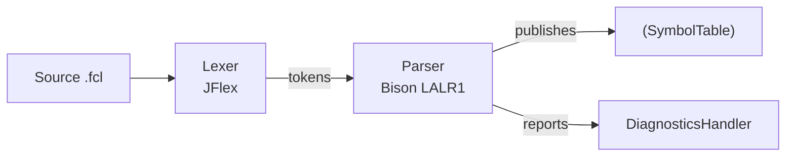

# FLC-IEC61131-7 Compiler

Compiler for the **IEC 61131-7 (Fuzzy Control Language, FCL)** standard. Implements lexical analysis (JFlex), LALR(1) syntactic analysis (GNU Bison, `lalr1.java` skeleton), and semantic type resolution into a symbol table, covering the declarative and initializer subset of the standard: function blocks, user-defined types (structures, enumerations, subranges, arrays), and fuzzification/defuzzification/rule blocks.

## Requirements

- Java 8 (build locked to `source`/`target` 1.8 in `pom.xml`)
- Maven
- JFlex 1.9.1 via `jflex-maven-plugin` (configured in `pom.xml`, no separate installation needed)
- GNU Bison: used offline to regenerate `Parser.java` from `Parser.y` (skeleton `lalr1.java`); generated code is versioned, so Bison is not required for Maven builds

## Dependencies

| Dependency | Version | Scope |
|------------|---------|-------|
| JUnit Jupiter (API + Engine) | 5.11.4 | test |
| Mockito Inline + JUnit Jupiter | 4.11.0 | test |
| JSpecify (nullability annotations) | 1.0.0 | compile |
| SpotBugs Annotations | 4.8.3 | provided |

## Build and Run Tests

Full build with quality gates:

```bash
mvn clean verify
```

This runs, in order: lexer generation (JFlex) from `src/main/java/lexer/Lexer.flex`, compilation, JUnit 5 + Mockito tests, JaCoCo coverage, and Checkstyle/SpotBugs quality gates (`mvn verify` fails if thresholds are exceeded).

Tests only:

```bash
mvn test
```

Integration tests (require explicit selection):

```bash
mvn test -Dtest='*IT'
```

## Quality Gate Plugins

| Plugin | Version | Phase |
|--------|---------|-------|
| maven-checkstyle-plugin | 3.3.1 | verify |
| spotbugs-maven-plugin | 4.8.3.1 | verify |
| jacoco-maven-plugin | 0.8.12 | test |
| sonar-maven-plugin | 4.0.0.4121 | manual |

## Architecture



The parser orchestrates compilation: invokes the lexer, executes grammar semantic actions, and publishes results to a shared `SymbolTable` (Repository pattern). The lexer normalizes input text via transformer chains (`lexer/transformers/`, Chain of Responsibility) and validates literals with per-category semantic analyzers (`lexer/semantics/`). Each resolved lexeme becomes a `LexemeInfo` (type, subtype, use, source, limits, parameters, initialization), built incrementally via `LexemeInfoBuilder` and predefined `Director` recipes (`utils/builders/`), and published atomically by `parser.facades.Publisher`. Semantic classification relies on the `Type`, `Subtype`, `Use`, and `Source` enums (`utils/enums/`). Errors and warnings are collected in a central `DiagnosticsHandler`, preserving insertion order.

Key Classes:

| Module | Class | Responsibility |
|--------|-------|----------------|
| `utils` | `SymbolTable` | Stores and retrieves `LexemeInfo` by lexeme name |
| `utils` | `LexemeInfo` | Immutable DTO with complete semantic attributes (type, subtype, use, source, limits, parameters, initialization) |
| `utils` | `DiagnosticsHandler` | Collects and manages diagnostics (errors/warnings) in insertion order |
| `utils.builders` | `LexemeInfoSchema` | Fluent contract with one setter per `LexemeInfo` attribute |
| `utils.builders` | `LexemeInfoBuilder` | Concrete builder implementation with `build()` |
| `utils.builders` | `Director` | Static recipes: `makeLiteral` and default values for REAL, BOOL, STRING, WSTRING |
| `utils.enums` | `Type` | General classification: UNKNOWN, SIMPLE, ENUMERATE, SUBRANGE, ARRAY, STRUCT |
| `utils.enums` | `Subtype` | IEC 61131-7 primitive types (INT, REAL, BOOL, TIME, etc.) + CUSTOM/NONE |
| `utils.enums` | `Use` | Usage context: VARIABLE, FIELD, LITERAL, FUNCTION, RULE, TYPE, MACRO, OPTION, … |
| `utils.enums` | `Source` | Declaration block: IN, OUT, INTERNAL, FUZZIFY, DEFUZZIFY, NONE, UNKNOWN |

Full technical documentation: [`doc/modules/lexer.md`](doc/modules/lexer.md), [`doc/modules/parser.md`](doc/modules/parser.md), [`doc/modules/utils.md`](doc/modules/utils.md).

## Repository Structure

| Folder | Contents |
|--------|----------|
| `src/main/java/lexer/` | `Lexer.flex`/`Lexer.java` (generated), `internals/` (`LexicalAnalyzers`, `LexicalPreprocessors`), `transformers/` (Chain of Responsibility for lexical normalization), `semantics/` (semantic analyzers per literal family: numbers, dates, strings, identifiers, intervals) |
| `src/main/java/parser/` | `Parser.y`/`Parser.java` (generated; `Luca.y` is a legacy grammar not part of the build), `internals/` (parse context: `ContextHandler`, `ParsingContext`, `NameMangler`), `initializations/` (polymorphic initialization hierarchy: `BooleanInitialization`, `RealInitialization`, `StructInitialization`, `RepeatedInitialization`, etc.), `utils/` (`Publisher`, `Factory`, `UnderlyingScopeSearcher`, `DimensionCalculator`) |
| `src/main/java/utils/` | `SymbolTable` (Repository pattern), `LexemeInfo` (immutable DTO), `DiagnosticsHandler`, `builders/` (`LexemeInfoBuilder`, `Director`, `LexemeInfoSchema`), `enums/` (`Type`, `Subtype`, `Use`, `Source`), `diagnostics/` (`Error`/`Warning`/`SyntaxError` hierarchy), `LucaInfo` (@deprecated) |
| `src/main/java/Main.java` | Compiler entry point |
| `src/test/java/` | Unit tests by component (`unit/lexer/`, `unit/parser/`, `unit/utils/`), lexer-parser integration tests (`integration/lexer/`), test doubles (`doubles/`), support classes (`utils/`) |
| `src/test/resources/examples/` | Example FCL programs used by `ParserTest` and integration tests |
| `doc/` | Modular technical docs (`doc/modules/`), thesis chapters (`doc/thesis/`), versioned Mermaid diagrams (`doc/diagrams/`), code-generated charts (`doc/assets/`) |
| `scripts/` | Documentation utilities: `generate_charts.py`, `generate_diagrams.py`, `render_mermaid.py`, `synthesize_thesis_context.py`, `validate_docs.py`, `format_markdown.py`, `extract_stats.py`, `build_thesis.sh` |
| `config/` | Quality config: `config/checkstyle/checkstyle.xml` and `config/spotbugs/excludeFilter.xml` (used by `mvn verify` gates) |
| `requirements.txt` | Python deps for doc scripts (matplotlib); install via `pip install -r requirements.txt` |
| `Dockerfile`, `docker-compose.yml` | Reproducible build/doc environment (Maven 3.9 + JDK 8, pandoc, python3) |
| `.opencode/` | [OpenCode](https://opencode.ai) agents for docs, charts, and thesis (see `doc/HARNESS.md`) |

## Agent-Assisted Documentation

This repo includes an OpenCode agent harness to keep docs, charts, and thesis in sync with actual code (never invented data). See [`doc/HARNESS.md`](doc/HARNESS.md).

## Authors

- Matías Ortiz
- Victoriano Etcheverría

---

*Generated and maintained by OpenCode agents. See [`doc/HARNESS.md`](doc/HARNESS.md) for details.*