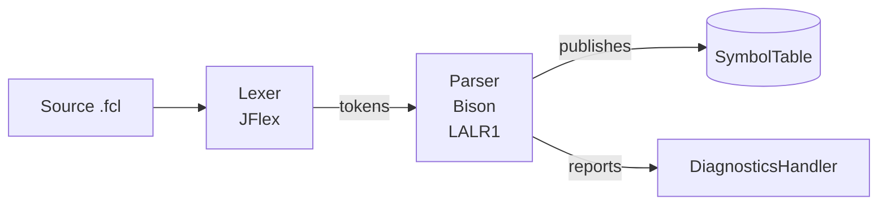

# FLC-IEC61131-7 Compiler

Compilador del lenguaje estándar para controladores difusos **IEC 61131-7 (Fuzzy Control Language, FCL)**. Implementa análisis léxico (JFlex), análisis sintáctico LALR(1) (GNU Bison, esqueleto `lalr1.java`) y resolución semántica de tipos hacia una tabla de símbolos, para el subconjunto declarativo e inicializador del estándar: bloques de función, tipos definidos por el usuario (estructuras, enumerados, subrangos, arreglos) y bloques de fuzzificación/defuzzificación/reglas.

## Requisitos

- Java 8 (el build está fijado a `source`/`target` 1.8 en `pom.xml`)
- Maven
- Los plugins `jflex-maven-plugin` (1.9.1) y el esqueleto Bison ya están configurados en `pom.xml`; no hace falta instalar JFlex ni Bison aparte para compilar con Maven.

## Compilar y correr los tests

```bash
mvn clean verify
```

Esto ejecuta, en orden: generación del lexer (JFlex) a partir de `src/main/java/lexer/Lexer.flex`, compilación, tests con JUnit 5 + Mockito, cobertura con JaCoCo, y los gates de calidad Checkstyle y SpotBugs (`mvn verify` falla si se supera el umbral configurado en cada plugin).

Solo tests:

```bash
mvn test
```

## Arquitectura



El analizador sintáctico orquesta la compilación: invoca al lexer, ejecuta las acciones semánticas de la gramática y publica el resultado en una `SymbolTable` compartida. Cada lexema resuelto queda representado como un `LexemeInfo` (tipo, subtipo, uso, fuente, límites, parámetros e inicialización), construido incrementalmente con `LexemeInfoBuilder` y publicado atómicamente por `parser.utils.Publisher`.

Documentación técnica completa: [`doc/modules/parser.md`](doc/modules/parser.md), [`doc/modules/utils.md`](doc/modules/utils.md).

## Estructura del repositorio

| Carpeta                        | Contenido                                                                                                                                                                                                                                                                                                                                                                             |
|--------------------------------|---------------------------------------------------------------------------------------------------------------------------------------------------------------------------------------------------------------------------------------------------------------------------------------------------------------------------------------------------------------------------------------|
| `src/main/java/lexer/`         | `Lexer.flex`/`Lexer.java` (generado), `transformers/` (Chain of Responsibility de normalización léxica), `semantics/` (analizadores semánticos por familia de literal: números, fechas, strings, identificadores, intervalos)                                                                                                                                                         |
| `src/main/java/parser/`        | `Parser.y`/`Parser.java` (generado), `internals/` (contexto de parseo: `ContextHandler`, `ParsingContext`, `NameMangler`), `initializations/` (jerarquía polimórfica de inicializaciones: `BooleanInitialization`, `RealInitialization`, `StructInitialization`, `RepeatedInitialization`, etc.), `utils/` (`Publisher`, `Factory`, `UnderlyingScopeSearcher`, `DimensionCalculator`) |
| `src/main/java/utils/`         | `SymbolTable` (Repository pattern), `LexemeInfo` (DTO inmutable), `builders/` (`LexemeInfoBuilder`, `Director`), `enums/` (`Type`, `Subtype`, `Use`, `Source`), `diagnostics/` (jerarquía `Error`/`Warning`/`SyntaxError`), `LucaInfo` (@deprecated)                                                                                                                                  |
| `src/test/java/`               | Tests unitarios por componente (`unit/lexer/`, `unit/parser/`, `unit/utils/`) e integración por tipo derivado (`integration/`)                                                                                                                                                                                                                                                        |
| `src/test/resources/examples/` | Programas FCL de ejemplo usados por `ParserTest`                                                                                                                                                                                                                                                                                                                                      |
| `doc/`                         | Documentación técnica modular (`doc/modules/parser.md`, `doc/modules/utils.md`), capítulos de tesis (`doc/thesis/`) y gráficos generados por código (`doc/assets/`)                                                                                                                                                                                                                   |
| `scripts/`                     | `generate_charts.py` (gráficos a partir de datos reales del código) y `build_thesis.sh` (compila `doc/thesis/*.md` a `.docx` con pandoc)                                                                                                                                                                                                                                              |
| `.opencode/`                   | Agentes de [OpenCode](https://opencode.ai) para mantener documentación, gráficos y tesis (ver `doc/HARNESS.md`)                                                                                                                                                                                                                                                                       |

## Documentación asistida por agentes (OpenCode)

Este repo incluye un harness de agentes de OpenCode para mantener la documentación, los gráficos y la tesis actualizados contra el código real (nunca contra datos inventados). Ver [`doc/HARNESS.md`](doc/HARNESS.md).

## Autores

- Matias Ortiz
- Victoriano Etcheverría