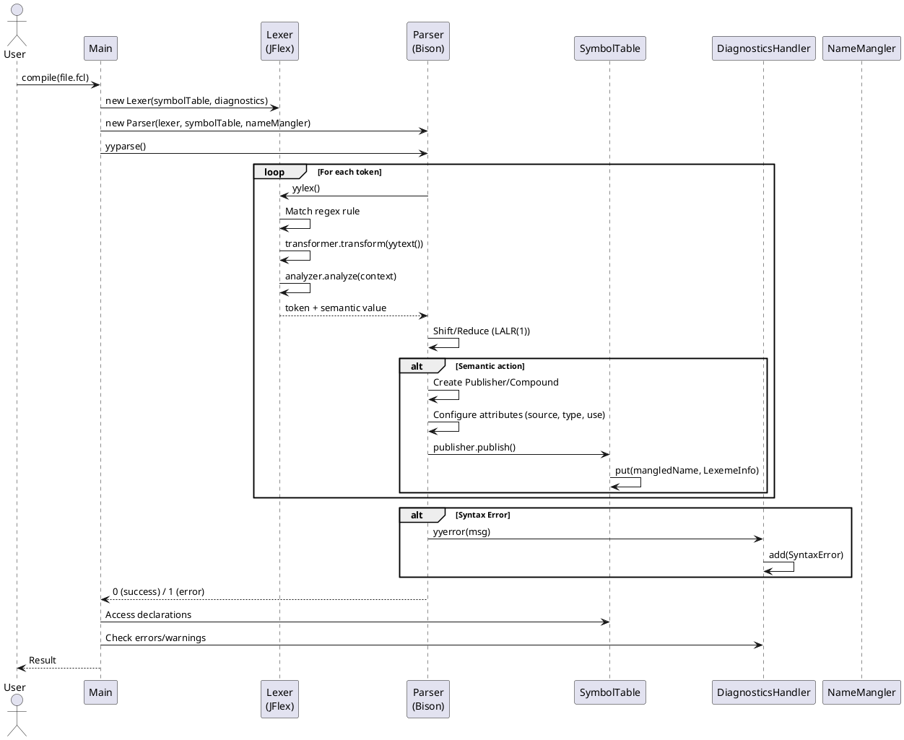
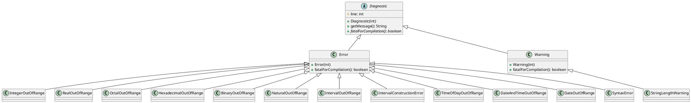
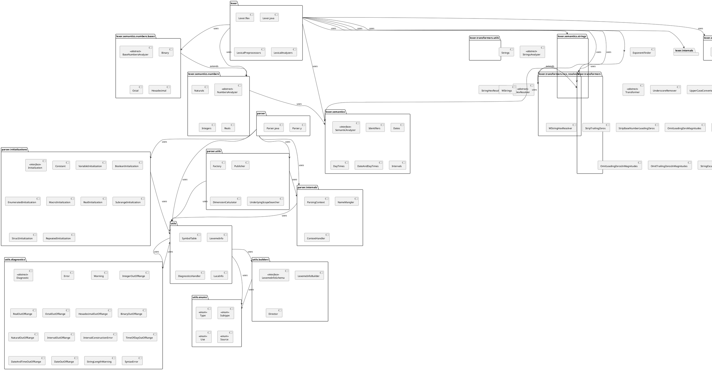
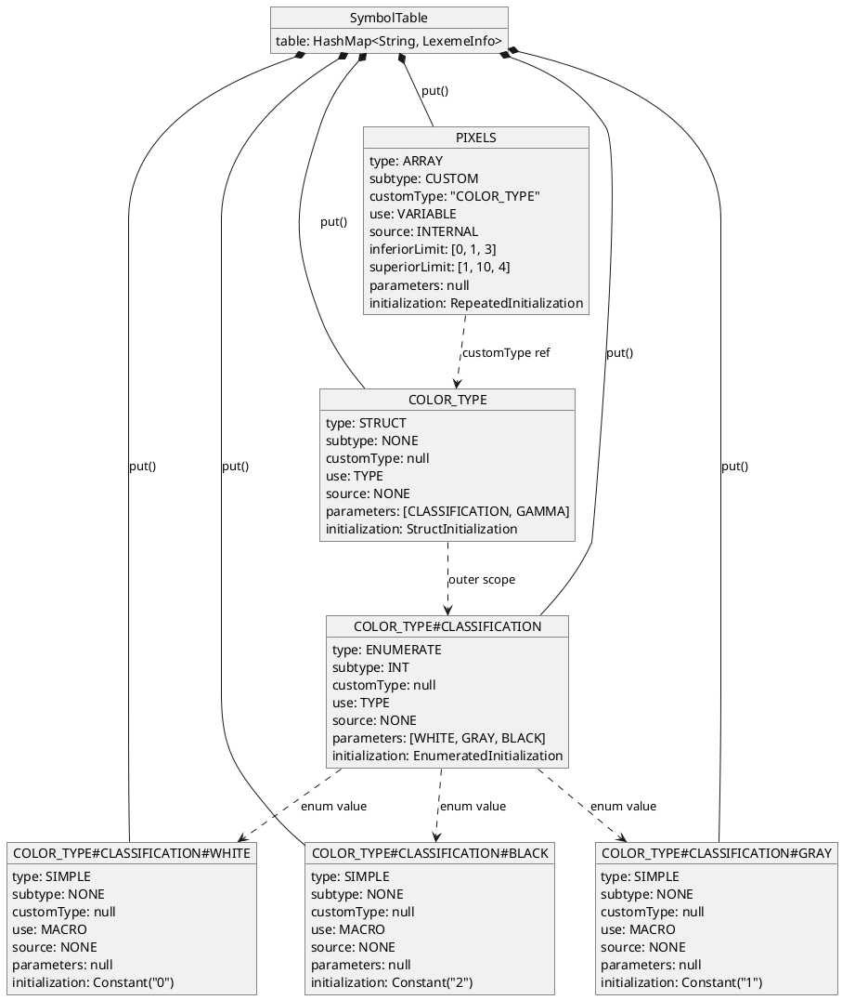
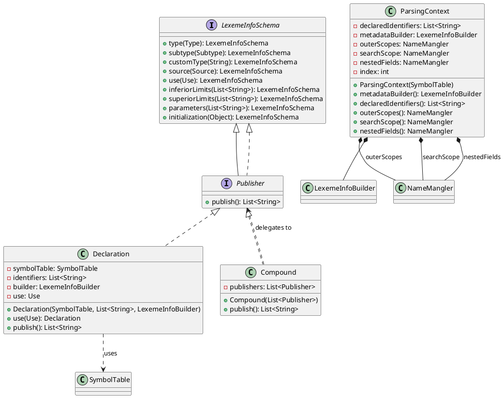
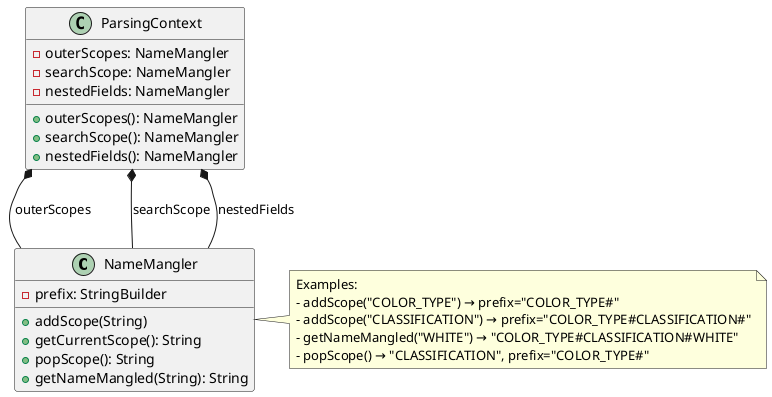
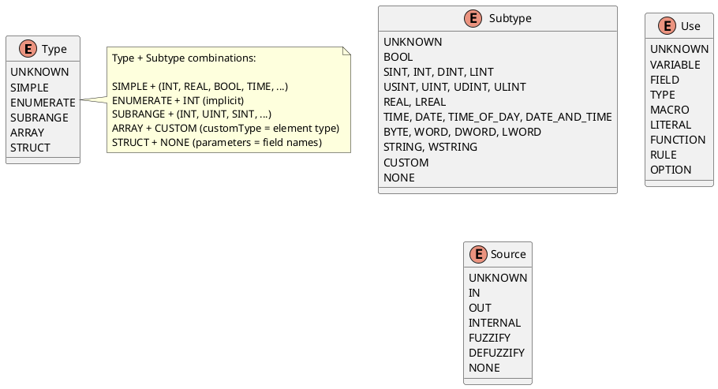
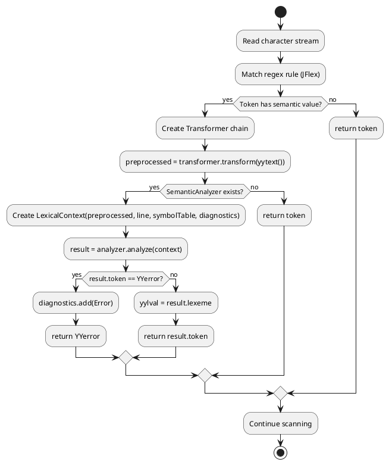

# Architecture Diagrams (PlantUML)

This document contains PlantUML diagrams for the FLC-IEC61131-7 compiler architecture. Render with any PlantUML viewer (VS Code extension, IntelliJ plugin, or online at plantuml.com).

---

## 1. Compiler Pipeline (Sequence Diagram)



---

## 2. Initialization Class Hierarchy (Class Diagram)

```plantuml
@startuml
interface Initialization {
    + selectVariable(String): Initialization
    + getVariableValue(): String
    + copy(): Initialization
}

class Constant {
    - value: String
    + Constant(String)
    + selectVariable(String): Initialization
    + getVariableValue(): String
    + copy(): Initialization
    + set(String): Constant
    + get(): String
}

class VariableInitialization {
    - value: String
    + VariableInitialization(String)
    + selectVariable(String): Initialization
    + getVariableValue(): String
    + copy(): Initialization
}

class BooleanInitialization {
    - DEFAULT: String (static)
    - symbolTable: SymbolTable
    + BooleanInitialization(SymbolTable)
    + selectVariable(String): Initialization
    + getVariableValue(): String
    + copy(): Initialization
}

class EnumeratedInitialization {
    - values: List<String>
    + EnumeratedInitialization(List<String>)
    + selectVariable(String): Initialization
    + getVariableValue(): String
    + copy(): Initialization
}

class MacroInitialization {
    - ordinal: String
    + MacroInitialization(SymbolTable, String)
    + selectVariable(String): Initialization
    + getVariableValue(): String
    + copy(): Initialization
}

class RealInitialization {
    - DEFAULT: String (static)
    - symbolTable: SymbolTable
    + RealInitialization(SymbolTable)
    + selectVariable(String): Initialization
    + getVariableValue(): String
    + copy(): Initialization
}

class SubrangeInitialization {
    - inferiorLimit: String
    - superiorLimit: String
    + SubrangeInitialization(String, String)
    + selectVariable(String): Initialization
    + getVariableValue(): String
    + copy(): Initialization
}

class StructInitialization {
    - fields: HashMap<String, Initialization>
    + StructInitialization()
    + setFieldInitialization(String, Initialization)
    + selectVariable(String): Initialization
    + getVariableValue(): String
    + copy(): Initialization
}

class RepeatedInitialization {
    - intervals: List<Interval>
    - dimension: int
    + RepeatedInitialization(int, Initialization)
    + addInterval(int, int, Initialization)
    + selectVariable(String): Initialization
    + getVariableValue(): String
    + copy(): Initialization
    + getDimension(): int
    + getRepetitionsList(): List<Integer>
    + getInitializationsList(): List<Initialization>
}

class Interval {
    - start: int
    - end: int
    - initialization: Initialization
    + length(): int
    + overlaps(int, int): boolean
}

Initialization <|-- Constant
Initialization <|-- VariableInitialization
Initialization <|-- BooleanInitialization
Initialization <|-- EnumeratedInitialization
Initialization <|-- MacroInitialization
Initialization <|-- RealInitialization
Initialization <|-- SubrangeInitialization
Initialization <|-- StructInitialization
Initialization <|-- RepeatedInitialization

RepeatedInitialization *-- Interval
StructInitialization *-- Initialization : fields
@enduml
```



---

## 3. Diagnostic Class Hierarchy (Class Diagram)



---

## 4. Package Dependencies (Package Diagram)



---

## 5. Symbol Table Entry Structure (Object Diagram)



---

## 6. Publisher Pattern (Class Diagram)



---

## 7. Transformer Chain (Decorator Pattern)

```plantuml
@startuml
abstract class Transformer {
    # next: Transformer
    + Transformer(Transformer)
    + {abstract} transform(String): String
    # giveToNext(String): String
}

class UnderscoreRemover
class UpperCaseConverter
class StripLeadingZeros
class StripTrailingZeros
class StripBaseNumberLeadingZeros
class OmitLeadingZeroMagnitudes
class OmitTrailingZeroMagnitudes
class OmitLeadingZerosInMagnitudes
class OmitTrailingZerosInMagnitudes
class StringEscapeResolver
class Nothing

abstract class HexResolver extends Transformer {
    # getHexDigits(): int
    + transform(String): String
}

class StringHexResolver
class WStringHexResolver

class ExponentFinder

Transformer <|-- UnderscoreRemover
Transformer <|-- UpperCaseConverter
Transformer <|-- StripLeadingZeros
Transformer <|-- StripTrailingZeros
Transformer <|-- StripBaseNumberLeadingZeros
Transformer <|-- OmitLeadingZeroMagnitudes
Transformer <|-- OmitTrailingZeroMagnitudes
Transformer <|-- OmitLeadingZerosInMagnitudes
Transformer <|-- OmitTrailingZerosInMagnitudes
Transformer <|-- StringEscapeResolver
Transformer <|-- Nothing

HexResolver <|-- StringHexResolver
HexResolver <|-- WStringHexResolver

Transformer <|-- ExponentFinder

' Chain composition (example: INTERVALS)
note right of UnderscoreRemover
INTERVALS chain:
UnderscoreRemover
  → UpperCaseConverter
    → OmitLeadingZeroMagnitudes
      → OmitTrailingZeroMagnitudes
        → OmitLeadingZerosInMagnitudes
          → OmitTrailingZerosInMagnitudes
            → Nothing
end note
@enduml
```



---

## 8. Name Mangling (Component Diagram)



---

## 9. Type System (Enum Diagram)



---

## 10. Lexical Analysis Pipeline (Activity Diagram)



---

## Rendering Instructions

### VS Code
1. Install "PlantUML" extension
2. Open this file
3. Press `Alt+D` to preview

### IntelliJ IDEA
1. Install "PlantUML Integration" plugin
2. Open this file
3. Click the PlantUML icon in toolbar

### Command Line
```bash
# Install plantuml
npm install -g @plantuml/cli

# Render all diagrams to SVG
plantuml -tsvg doc/architecture.md

# Or use Java directly
java -jar plantuml.jar doc/architecture.md
```

### Online
Copy any `@startuml` ... `@enduml` block to:
- https://www.plantuml.com/plantuml/uml/
- https://plantuml-editor.kkeisuke.com/