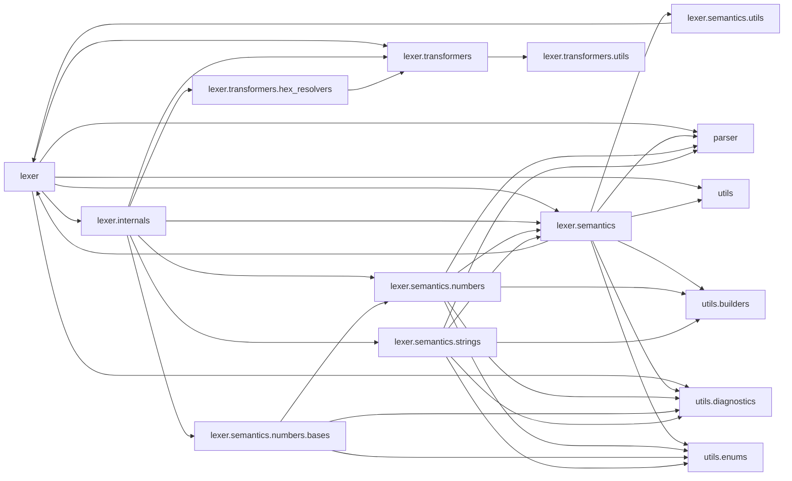
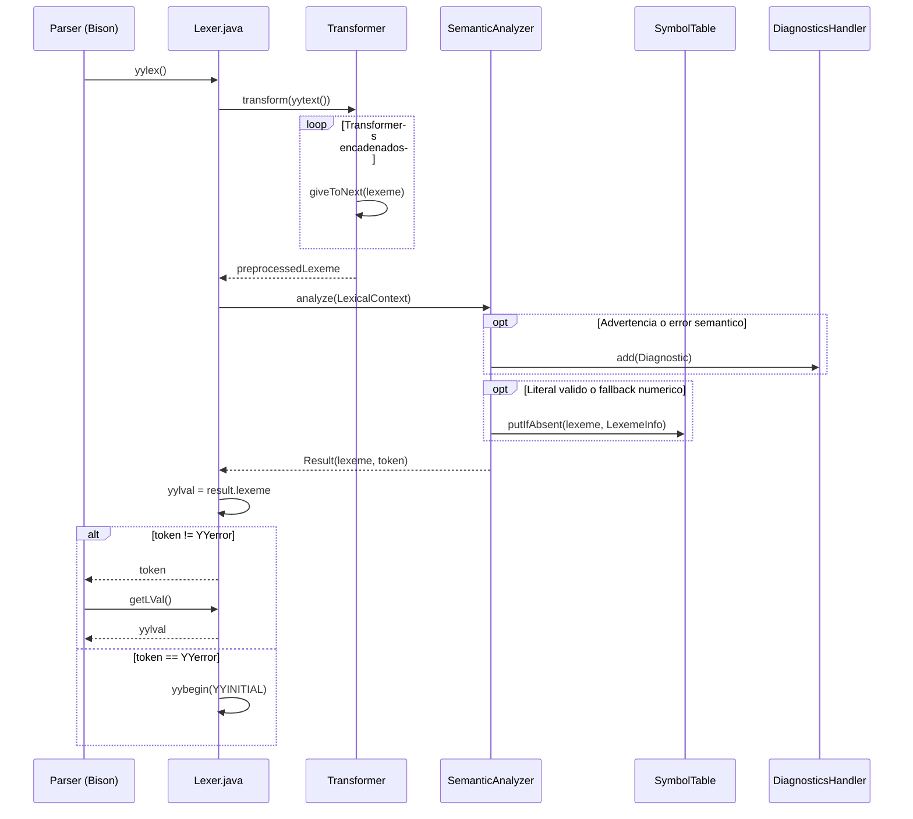

# Analizador léxico

Reconoce lexemas FCL, los normaliza y comunica al analizador sintáctico tokens y valores asociados.

**Fuentes:** `src/main/java/lexer/Lexer.flex`, `src/main/java/lexer/Lexer.java` y `src/main/java/lexer/semantics/SemanticAnalyzer.java`. `Lexer.java` se identifica en su cabecera como código generado por JFlex 1.9.1; la configuración actual del complemento Maven figura en `pom.xml`.

## Dependencias entre paquetes

Aristas dirigidas desde el paquete importador al importado, extraídas de los `import` de `src/main/java/lexer/**/*.java` con `scripts/generate_diagrams.py lexer`. Las importaciones con comodín se atribuyen al paquete importado; el gráfico no representa llamadas en tiempo de ejecución.



## Estructura de clases

Declaraciones, herencia e implementación de interfaz extraídas de los archivos Java de `src/main/java/lexer/`; las dos asociaciones del escáner con los registros proceden de los campos de `src/main/java/lexer/Lexer.flex`.

```mermaid
classDiagram
    namespace lexer {
        class Lexer
    }
    namespace lexer_internals {
        class LexicalPreprocessors
        class LexicalAnalyzers
    }
    namespace lexer_transformers {
        class Transformer
        class UnderscoreRemover
        class UpperCaseConverter
        class StripLeadingZeros
        class StripTrailingZeros
        class StripBaseNumberLeadingZeros
        class OmitLeadingZeroMagnitudes
        class OmitTrailingZeroMagnitudes
        class OmitLeadingZerosInMagnitudes
        class OmitTrailingZerosInMagnitudes
        class StringEscapeResolver
        class Nothing
    }
    namespace lexer_transformers_hex_resolvers {
        class HexResolver
        class StringHexResolver
        class WStringHexResolver
    }
    namespace lexer_transformers_utils {
        class ExponentFinder
    }
    namespace lexer_semantics {
        class SemanticAnalyzer
        class Identifiers
        class Intervals
        class Dates
        class DayTimes
        class DateAndDayTimes
    }
    namespace lexer_semantics_numbers {
        class NumbersAnalyzer
        class Naturals
        class Integers
        class Reals
    }
    namespace lexer_semantics_numbers_bases {
        class BaseNumbersAnalyzer
        class Binary
        class Octal
        class Hexadecimal
    }
    namespace lexer_semantics_strings {
        class StringsAnalyzer
        class Strings
        class WStrings
    }
    namespace lexer_semantics_utils {
        class ReservedWords
    }
    SemanticAnalyzer <|-- DateAndDayTimes
    SemanticAnalyzer <|-- Dates
    SemanticAnalyzer <|-- DayTimes
    SemanticAnalyzer <|-- Identifiers
    SemanticAnalyzer <|-- Intervals
    NumbersAnalyzer <|-- Integers
    NumbersAnalyzer <|-- Naturals
    SemanticAnalyzer <|-- NumbersAnalyzer
    NumbersAnalyzer <|-- Reals
    NumbersAnalyzer <|-- BaseNumbersAnalyzer
    BaseNumbersAnalyzer <|-- Binary
    BaseNumbersAnalyzer <|-- Hexadecimal
    BaseNumbersAnalyzer <|-- Octal
    StringsAnalyzer <|-- Strings
    SemanticAnalyzer <|-- StringsAnalyzer
    StringsAnalyzer <|-- WStrings
    Transformer <|-- Nothing
    Transformer <|-- StringEscapeResolver
    Transformer <|-- StripLeadingZeros
    Transformer <|-- StripTrailingZeros
    Transformer <|-- StripBaseNumberLeadingZeros
    Transformer <|-- UnderscoreRemover
    Transformer <|-- UpperCaseConverter
    Transformer <|-- OmitLeadingZeroMagnitudes
    Transformer <|-- OmitTrailingZeroMagnitudes
    Transformer <|-- OmitLeadingZerosInMagnitudes
    Transformer <|-- OmitTrailingZerosInMagnitudes
    Transformer <|-- HexResolver
    HexResolver <|-- StringHexResolver
    HexResolver <|-- WStringHexResolver
    Lexer --> LexicalPreprocessors : uses
    Lexer --> LexicalAnalyzers : uses
```



| Clase | Responsabilidad | Patrón o función |
|---|---|---|
| `lexer.Lexer` | Ejecuta reglas JFlex, conserva `yylval` y devuelve el token al parser. | Escáner generado |
| `lexer.internals.LexicalPreprocessors` | Declara cadenas estáticas por categoría léxica. | Registro de cadenas |
| `lexer.internals.LexicalAnalyzers` | Declara las instancias de analizador por categoría. | Registro de estrategias |
| `lexer.transformers.Transformer` | Define `transform` y delega con `giveToNext`. | Cadena de responsabilidad |
| `lexer.transformers.UnderscoreRemover` | Elimina separadores de subrayado del lexema. | Transformador |
| `lexer.transformers.UpperCaseConverter` | Convierte el lexema a mayúsculas. | Transformador |
| `lexer.transformers.StripLeadingZeros` | Suprime ceros iniciales en la parte entera decimal. | Transformador |
| `lexer.transformers.StripTrailingZeros` | Suprime ceros finales de reales. | Transformador |
| `lexer.transformers.StripBaseNumberLeadingZeros` | Suprime ceros iniciales tras el prefijo de base. | Transformador |
| `lexer.transformers.OmitLeadingZeroMagnitudes` | Omite magnitudes iniciales nulas de intervalos. | Transformador |
| `lexer.transformers.OmitTrailingZeroMagnitudes` | Omite magnitudes finales nulas de intervalos. | Transformador |
| `lexer.transformers.OmitLeadingZerosInMagnitudes` | Elimina ceros iniciales dentro de magnitudes de intervalos. | Transformador |
| `lexer.transformers.OmitTrailingZerosInMagnitudes` | Elimina ceros finales de la fracción de magnitudes de intervalos. | Transformador |
| `lexer.transformers.Nothing` | Devuelve el lexema sin modificar. | Transformador identidad |
| `lexer.transformers.StringEscapeResolver` | Sustituye escapes de control y de comillas. | Transformador |
| `lexer.transformers.hex_resolvers.HexResolver` | Resuelve escapes hexadecimales según el ancho indicado por sus subclases. | Plantilla de transformación |
| `lexer.transformers.hex_resolvers.StringHexResolver` | Configura escapes hexadecimales de STRING (2 dígitos). | Especialización |
| `lexer.transformers.hex_resolvers.WStringHexResolver` | Configura escapes hexadecimales de WSTRING (4 dígitos). | Especialización |
| `lexer.transformers.utils.ExponentFinder` | Localiza el exponente de un literal real. | Utilidad |
| `lexer.semantics.SemanticAnalyzer` | Define `analyze`, el contexto y el resultado léxicos. | Interfaz de estrategia |
| `lexer.semantics.numbers.NumbersAnalyzer` | Comparte análisis, advertencia, recuperación y publicación de números. | Método plantilla |
| `lexer.semantics.numbers.Naturals` | Determina subtipo y valor de naturales decimales. | Especialización |
| `lexer.semantics.numbers.Integers` | Determina subtipo y valor de enteros decimales con signo. | Especialización |
| `lexer.semantics.numbers.Reals` | Determina subtipo y valor de literales reales. | Especialización |
| `lexer.semantics.numbers.bases.BaseNumbersAnalyzer` | Interpreta números con prefijo de base y asigna subtipo por valor. | Método plantilla |
| `lexer.semantics.numbers.bases.Binary` | Define base, longitud máxima y diagnóstico para números binarios. | Especialización |
| `lexer.semantics.numbers.bases.Octal` | Define base, longitud máxima y diagnóstico para números octales. | Especialización |
| `lexer.semantics.numbers.bases.Hexadecimal` | Define base, longitud máxima y diagnóstico para números hexadecimales. | Especialización |
| `lexer.semantics.Intervals` | Valida duraciones y almacena un `Duration`. | Estrategia |
| `lexer.semantics.Dates` | Valida fechas y almacena un `LocalDate`. | Estrategia |
| `lexer.semantics.DayTimes` | Valida horas y almacena un `LocalTime`. | Estrategia |
| `lexer.semantics.DateAndDayTimes` | Valida fecha-hora y almacena un `LocalDateTime`. | Estrategia |
| `lexer.semantics.strings.StringsAnalyzer` | Recorta cadenas largas, emite advertencia y publica el valor. | Método plantilla |
| `lexer.semantics.strings.Strings` | Selecciona el subtipo STRING. | Especialización |
| `lexer.semantics.strings.WStrings` | Selecciona el subtipo WSTRING. | Especialización |
| `lexer.semantics.Identifiers` | Distingue palabra reservada, booleano e identificador. | Estrategia |
| `lexer.semantics.utils.ReservedWords` | Asocia palabras reservadas con identificadores de token. | Registro |

**Fuentes de la tabla:** `src/main/java/lexer/internals/LexicalPreprocessors.java`, `src/main/java/lexer/internals/LexicalAnalyzers.java`, `src/main/java/lexer/transformers/`, `src/main/java/lexer/semantics/` y `src/main/java/lexer/Lexer.flex`.

## Normalización y validación

| Categoría | Secuencia de transformación | Analizador |
|---|---|---|
| `DATES`, `DAYTIMES`, `DATE_AND_TIMES` | `Nothing` | `Dates`, `DayTimes`, `DateAndDayTimes` |
| `INTERVALS` | `UnderscoreRemover → UpperCaseConverter → OmitLeadingZeroMagnitudes → OmitTrailingZeroMagnitudes → OmitLeadingZerosInMagnitudes → OmitTrailingZerosInMagnitudes` | `Intervals` |
| `NATURALS`, `INTEGERS` | `UnderscoreRemover → StripLeadingZeros` | `Naturals`, `Integers` |
| `BINARY`, `OCTAL`, `HEXADECIMAL` | `UnderscoreRemover → StripBaseNumberLeadingZeros` | `Binary`, `Octal`, `Hexadecimal` |
| `REALS` | `UnderscoreRemover → StripTrailingZeros → StripLeadingZeros` | `Reals` |
| `STRINGS`, `WSTRINGS` | `StringHexResolver` o `WStringHexResolver → StringEscapeResolver` | `Strings`, `WStrings` |
| `IDENTIFIERS` | `UpperCaseConverter` | `Identifiers` |

**Fuente:** `src/main/java/lexer/internals/LexicalPreprocessors.java` y `src/main/java/lexer/internals/LexicalAnalyzers.java`.

Chart: `assets/transformer_chain_lengths.png` — número de instancias `new` en cada cadena estática de `src/main/java/lexer/internals/LexicalPreprocessors.java`, incluida la instancia `Nothing` en categorías temporales; gráfico generado por `scripts/extract_stats.py`.

### Objeto de cadena para intervalos

Instancias y orden extraídos de la declaración `INTERVALS` en `src/main/java/lexer/internals/LexicalPreprocessors.java`:

```mermaid
flowchart LR
    root["LexicalPreprocessors.INTERVALS"] --> node0["UnderscoreRemover"]
    node0 --> node1["UpperCaseConverter"]
    node1 --> node2["OmitLeadingZeroMagnitudes"]
    node2 --> node3["OmitTrailingZeroMagnitudes"]
    node3 --> node4["OmitLeadingZerosInMagnitudes"]
    node4 --> node5["OmitTrailingZerosInMagnitudes"]
    node5 --> endNode["null"]
```



### Resultados y errores

- `SemanticAnalyzer.LexicalContext` transporta `preprocessedLexeme`, línea, `SymbolTable` y `DiagnosticsHandler`; `SemanticAnalyzer.Result` transporta **`lexeme` y `token`**, en ese orden en el constructor. `processAndSaveYylval` guarda `result.lexeme` en `yylval` y devuelve `result.token`. Fuentes: `src/main/java/lexer/semantics/SemanticAnalyzer.java`, `src/main/java/lexer/Lexer.flex`.
- `NumbersAnalyzer` devuelve `NUMERIC_LITERAL`; cuando el subtipo es `UNKNOWN`, registra una advertencia y almacena el `ParsedValue` de recuperación, cuya clave puede diferir del lexema original. `Naturals`, `Integers`, `Reals` y los analizadores de base proporcionan sus respectivas recuperaciones. Fuentes: `src/main/java/lexer/semantics/numbers/NumbersAnalyzer.java`, `src/main/java/lexer/semantics/numbers/Naturals.java`, `src/main/java/lexer/semantics/numbers/Integers.java`, `src/main/java/lexer/semantics/numbers/Reals.java`, `src/main/java/lexer/semantics/numbers/bases/BaseNumbersAnalyzer.java`.
- `Dates`, `DayTimes` y `DateAndDayTimes` almacenan `LocalDate`, `LocalTime` y `LocalDateTime`; `Intervals` almacena `Duration` y verifica límites de magnitudes subordinadas y el acumulado de nanosegundos. En sus rutas de error se agrega un diagnóstico y se devuelve `YYerror`. Las acciones temporales de `Lexer.flex` solo retornan `TIME_LITERAL` si no hay `YYerror`; en caso contrario reinician el estado y continúan el barrido. Fuentes: `src/main/java/lexer/semantics/Dates.java`, `src/main/java/lexer/semantics/DayTimes.java`, `src/main/java/lexer/semantics/DateAndDayTimes.java`, `src/main/java/lexer/semantics/Intervals.java`, `src/main/java/lexer/Lexer.flex`.
- `StringsAnalyzer` aplica **`MAX_STRING_LENGTH = 255` a STRING y WSTRING** por igual, mide `content.length()` de Java después de resolver escapes, trunca contenido y clave, emite `StringLengthWarning` y devuelve `STRING_LITERAL`. Los escapes hexadecimales se interpretan mediante `StringHexResolver` con dos dígitos y `WStringHexResolver` con cuatro. Fuentes: `src/main/java/lexer/semantics/strings/StringsAnalyzer.java`, `src/main/java/lexer/semantics/strings/Strings.java`, `src/main/java/lexer/semantics/strings/WStrings.java`, `src/main/java/lexer/transformers/hex_resolvers/StringHexResolver.java`, `src/main/java/lexer/transformers/hex_resolvers/WStringHexResolver.java`.
- `Identifiers` devuelve el token directo para una reservada distinta de `TRUE` o `FALSE`; para booleanos registra `Subtype.BOOL` y retorna `BOOLEAN_LITERAL`; para identificadores registra metadatos iniciales y retorna `IDENTIFIER`. Fuentes: `src/main/java/lexer/semantics/Identifiers.java`, `src/main/java/lexer/semantics/utils/ReservedWords.java`.

## Secuencia de análisis

Flujo comprobado con `src/main/java/lexer/Lexer.flex`, `src/main/java/lexer/semantics/SemanticAnalyzer.java`, `src/main/java/lexer/semantics/numbers/NumbersAnalyzer.java`, `src/main/java/lexer/semantics/strings/StringsAnalyzer.java` y `src/main/java/parser/Parser.java`:



## Cómo probar

| Clase en `src/test/java` | Verificación |
|---|---|
| `unit/lexer/LexerTokenizationTest.java` | Reconocimiento de identificadores, cadenas, números, fechas e intervalos. |
| `unit/lexer/LexerSymbolTableTest.java` | Subtipos, valores, claves canónicas y truncamiento de cadenas. |
| `unit/lexer/LexerDiagnosticHandlerTest.java` | Advertencias de rango y longitud y errores temporales. |
| `unit/lexer/transformers/StringEscapeResolverTest.java` | Interpretación de escapes estándar. |
| `unit/lexer/transformers/StringHexResolverTest.java`, `unit/lexer/transformers/WStringHexResolverTest.java` | Escapes hexadecimales de cadenas. |
| `unit/lexer/transformers/OmitLeadingZeroMagnitudesTest.java` | Eliminación de magnitudes iniciales nulas en intervalos. |
| `unit/lexer/transformers/OmitTrailingZeroMagnitudesTest.java` | Eliminación de magnitudes finales nulas en intervalos. |
| `unit/lexer/transformers/OmitLeadingZerosInMagnitudesTest.java` | Eliminación de ceros iniciales dentro de magnitudes de intervalos. |
| `unit/lexer/transformers/OmitTrailingZerosInMagnitudesTest.java` | Eliminación de ceros finales de la fracción de magnitudes de intervalos. |

```bash
mvn -q -Dtest=LexerTokenizationTest,LexerSymbolTableTest,LexerDiagnosticHandlerTest,OmitLeadingZeroMagnitudesTest,OmitTrailingZeroMagnitudesTest,OmitLeadingZerosInMagnitudesTest,OmitTrailingZerosInMagnitudesTest test
```

## Árbol de archivos

Archivo de generación y clases fuente versionadas; se omite el respaldo local `Lexer.java~`. Fuente: `src/main/java/lexer/`.

```text
src/main/java/lexer/
    internals/
        LexicalAnalyzers.java
        LexicalPreprocessors.java
        package-info.java
    semantics/
        numbers/
            bases/
                BaseNumbersAnalyzer.java
                Binary.java
                Hexadecimal.java
                Octal.java
                package-info.java
            Integers.java
            Naturals.java
            NumbersAnalyzer.java
            Reals.java
            package-info.java
        strings/
            Strings.java
            StringsAnalyzer.java
            WStrings.java
            package-info.java
        utils/
            ReservedWords.java
            package-info.java
        DateAndDayTimes.java
        Dates.java
        DayTimes.java
        Identifiers.java
        Intervals.java
        SemanticAnalyzer.java
        package-info.java
    transformers/
        hex_resolvers/
            HexResolver.java
            StringHexResolver.java
            WStringHexResolver.java
            package-info.java
        utils/
            ExponentFinder.java
            package-info.java
        Nothing.java
        OmitLeadingZeroMagnitudes.java
        OmitLeadingZerosInMagnitudes.java
        OmitTrailingZeroMagnitudes.java
        OmitTrailingZerosInMagnitudes.java
        StringEscapeResolver.java
        StripBaseNumberLeadingZeros.java
        StripLeadingZeros.java
        StripTrailingZeros.java
        Transformer.java
        UnderscoreRemover.java
        UpperCaseConverter.java
        package-info.java
    Lexer.flex
    Lexer.java
    package-info.java
```

## Uso en la tesis

Según `.opencode/agents/thesis-writer.md`, este módulo aporta transformadores, analizadores y diagnósticos al capítulo `doc/thesis/05-analisis-lexico.md`, y decisiones de mantenibilidad y pruebas al capítulo `doc/thesis/07-mantenibilidad.md`. No se afirma un porcentaje de cobertura: `scripts/extract_stats.py` contiene valores predeterminados que no equivalen a medición JaCoCo del lexer.
