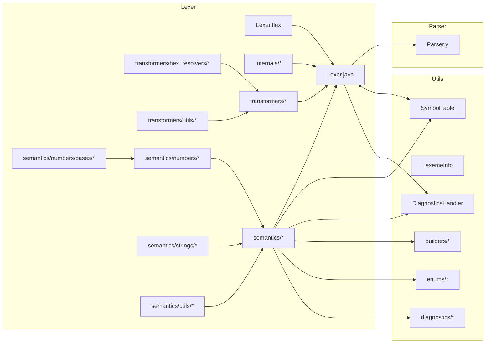
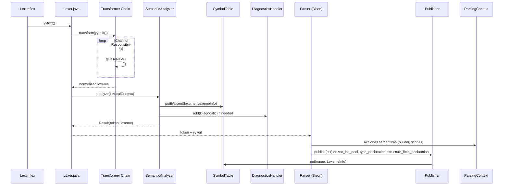

# lexer

Módulo de análisis léxico: generado con **JFlex 1.8.2** a partir de `src/main/java/lexer/Lexer.flex`. Implementa el escáner léxico completo para el estándar **IEC 61131-7** (Function Blocks de Lógica Difusa) y el **Anexo B de IEC 61131-3** (literales numéricos, temporales, cadenas, identificadores y palabras reservadas).

El lexer sigue una arquitectura de dos fases:
1. **Preprocesamiento** — Cadenas de transformadores (Chain of Responsibility) que normalizan el léxico crudo
2. **Análisis semántico** — Validadores por categoría que verifican rangos, construyen metadatos y poblan la tabla de símbolos

## Diagrama de paquetes



## Diagrama de clases

```mermaid
classDiagram
    namespace lexer {
        class Lexer {
            +processAndSaveYylval(Transformer, SemanticAnalyzer) int
            +getLVal() Object
            +yyerror(String)
        }
        class LexicalPreprocessors {
            +DATE_AND_TIMES: Transformer
            +DAYTIMES: Transformer
            +DATES: Transformer
            +INTERVALS: Transformer
            +NATURALS: Transformer
            +INTEGERS: Transformer
            +REALS: Transformer
            +BINARY: Transformer
            +OCTAL: Transformer
            +HEXADECIMAL: Transformer
            +STRINGS: Transformer
            +WSTRINGS: Transformer
            +IDENTIFIERS: Transformer
        }
        class LexicalAnalyzers {
            +DATE_AND_TIMES: SemanticAnalyzer
            +DAYTIMES: SemanticAnalyzer
            +DATES: SemanticAnalyzer
            +INTERVALS: SemanticAnalyzer
            +NATURALS: SemanticAnalyzer
            +INTEGERS: SemanticAnalyzer
            +REALS: SemanticAnalyzer
            +BINARY: SemanticAnalyzer
            +OCTAL: SemanticAnalyzer
            +HEXADECIMAL: SemanticAnalyzer
            +STRINGS: SemanticAnalyzer
            +WSTRINGS: SemanticAnalyzer
            +IDENTIFIERS: SemanticAnalyzer
        }
    }
    namespace lexer_transformers {
        class Transformer {
            <<abstract>>
            +transform(String) String
            #giveToNext(String) String
        }
        class UnderscoreRemover
        class UpperCaseConverter
        class StripLeadingZeros
        class StripTrailingZeros
        class OmitLeadingZeroMagnitudes
        class OmitTrailingZeroMagnitudes
        class OmitLeadingZerosInMagnitudes
        class OmitTrailingZerosInMagnitudes
        class StripBaseNumberLeadingZeros
        class StringEscapeResolver
        class Nothing
    }
    namespace lexer_transformers_hex_resolvers {
        class HexResolver {
            <<abstract>>
        }
        class StringHexResolver
        class WStringHexResolver
    }
    namespace lexer_semantics {
        class SemanticAnalyzer {
            <<interface>>
            +analyze(LexicalContext) Result
        }
        class Result {
            +lexeme: String
            +token: int
        }
        class LexicalContext {
            +preprocessedLexeme: String
            +line: int
            +symbolTable: SymbolTable
            +diagnosticsHandler: DiagnosticsHandler
        }
        class Intervals
        class Identifiers
        class Dates
        class DayTimes
        class DateAndDayTimes
    }
    namespace lexer_semantics_numbers {
        class NumbersAnalyzer {
            <<abstract>>
            +analyze(LexicalContext) Result
            #parse(String) ParsedValue
            #fallback(String) ParsedValue
            #createDiagnostic(int, String) Diagnostic
        }
        class ParsedValue {
            +lexeme: String
            +subtype: Subtype
            +value: Object
        }
        class Naturals
        class Integers
        class Reals
        class BaseNumbersAnalyzer {
            <<abstract>>
        }
        class Binary
        class Octal
        class Hexadecimal
    }
    namespace lexer_semantics_strings {
        class StringsAnalyzer {
            <<abstract>>
            +analyze(LexicalContext) Result
        }
        class Strings
        class WStrings
    }
    Transformer <|-- UnderscoreRemover
    Transformer <|-- UpperCaseConverter
    Transformer <|-- StripLeadingZeros
    Transformer <|-- StripTrailingZeros
    Transformer <|-- OmitLeadingZeroMagnitudes
    Transformer <|-- OmitTrailingZeroMagnitudes
    Transformer <|-- OmitLeadingZerosInMagnitudes
    Transformer <|-- OmitTrailingZerosInMagnitudes
    Transformer <|-- StripBaseNumberLeadingZeros
    Transformer <|-- StringEscapeResolver
    Transformer <|-- Nothing
    HexResolver <|-- StringHexResolver
    HexResolver <|-- WStringHexResolver
    SemanticAnalyzer <|-- Intervals
    SemanticAnalyzer <|-- Identifiers
    SemanticAnalyzer <|-- Dates
    SemanticAnalyzer <|-- DayTimes
    SemanticAnalyzer <|-- DateAndDayTimes
    NumbersAnalyzer <|-- Naturals
    NumbersAnalyzer <|-- Integers
    NumbersAnalyzer <|-- Reals
    NumbersAnalyzer <|-- BaseNumbersAnalyzer
    BaseNumbersAnalyzer <|-- Binary
    BaseNumbersAnalyzer <|-- Octal
    BaseNumbersAnalyzer <|-- Hexadecimal
    SemanticAnalyzer <|-- NumbersAnalyzer
    StringsAnalyzer <|-- Strings
    StringsAnalyzer <|-- WStrings
    SemanticAnalyzer <|-- StringsAnalyzer
    Lexer --> LexicalPreprocessors : uses
    Lexer --> LexicalAnalyzers : uses
    LexicalPreprocessors --> Transformer : manages chains
    LexicalAnalyzers --> SemanticAnalyzer : manages instances
```



## Tabla de clases

| Clase                                                 | Responsabilidad                                                                                | Patrón                             |
|-------------------------------------------------------|------------------------------------------------------------------------------------------------|------------------------------------|
| `lexer.Lexer`                                         | Escáner generado por JFlex; implementa `Parser.Lexer`; coordina preprocesadores y analizadores | Generated Lexer / Facade           |
| `lexer.internals.LexicalPreprocessors`                | Registro de cadenas de transformadores por categoría léxica                                    | Registry / Chain of Responsibility |
| `lexer.internals.LexicalAnalyzers`                    | Registro de analizadores semánticos por categoría léxica                                       | Registry                           |
| `lexer.transformers.Transformer`                      | Base abstracta para transformadores encadenados                                                | Chain of Responsibility            |
| `lexer.transformers.UnderscoreRemover`                | Elimina guiones bajos de literales numéricos y temporales                                      | Transform                          |
| `lexer.transformers.UpperCaseConverter`               | Convierte identificadores a mayúsculas (IEC case-insensitive)                                  | Transform                          |
| `lexer.transformers.StripLeadingZeros`                | Elimina ceros iniciales en números decimales                                                   | Transform                          |
| `lexer.transformers.StripTrailingZeros`               | Elimina ceros finales en parte fraccionaria de reales                                          | Transform                          |
| `lexer.transformers.OmitLeadingZeroMagnitudes`        | Elimina ceros iniciales en cada magnitud de intervalo                                          | Transform                          |
| `lexer.transformers.OmitTrailingZeroMagnitudes`       | Elimina ceros finales en cada magnitud de intervalo                                            | Transform                          |
| `lexer.transformers.OmitLeadingZerosInMagnitudes`     | Elimina ceros iniciales solo en magnitudes internas                                            | Transform                          |
| `lexer.transformers.OmitTrailingZerosInMagnitudes`    | Elimina ceros finales solo en magnitudes internas                                              | Transform                          |
| `lexer.transformers.StripBaseNumberLeadingZeros`      | Elimina ceros iniciales tras prefijo base (2#, 8#, 16#)                                        | Transform                          |
| `lexer.transformers.StringEscapeResolver`             | Resuelve escapes estándar (`$L`, `$N`, `$P`, `$R`, `$T`, `$$`, `$'`, `$"`)                     | Transform                          |
| `lexer.transformers.hex_resolvers.HexResolver`        | Base abstracta para resolución de escapes hex en cadenas                                       | Chain of Responsibility            |
| `lexer.transformers.hex_resolvers.StringHexResolver`  | Resuelve escapes hexadecimales de 2 dígitos (`$XX`) en STRING                                  | Transform                          |
| `lexer.transformers.hex_resolvers.WStringHexResolver` | Resuelve escapes hexadecimales de 4 dígitos (`$XXXX`) en WSTRING                               | Transform                          |
| `lexer.transformers.utils.ExponentFinder`             | Utilidad para localizar exponentes en literales reales                                         | Utility                            |
| `lexer.transformers.Nothing`                          | Transformador identidad (sin preprocesamiento)                                                 | Null Object                        |
| `lexer.semantics.SemanticAnalyzer`                    | Interfaz para análisis semántico con contexto léxico                                           | Strategy                           |
| `lexer.semantics.numbers.NumbersAnalyzer`             | Base para literales numéricos: parseo, validación de rango, fallback, diagnóstico              | Template Method                    |
| `lexer.semantics.numbers.Naturals`                    | Enteros sin signo (0..4294967295, ULINT)                                                       | Template Method                    |
| `lexer.semantics.numbers.Integers`                    | Enteros con signo (-2147483648..2147483647, DINT)                                              | Template Method                    |
| `lexer.semantics.numbers.Reals`                       | Punto flotante IEEE 754 (REAL/LREAL) con notación científica                                   | Template Method                    |
| `lexer.semantics.numbers.bases.Binary`                | Literales binarios (2#...) rango 0..65535 (UINT)                                               | Template Method                    |
| `lexer.semantics.numbers.bases.Octal`                 | Literales octales (8#...) rango 0..65535 (UINT)                                                | Template Method                    |
| `lexer.semantics.numbers.bases.Hexadecimal`           | Literales hexadecimales (16#...) rango 0..65535 (UINT)                                         | Template Method                    |
| `lexer.semantics.Intervals`                           | Literales TIME: validación magnitudes (D,H,M,S,MS) y total ≤ Long.MAX_VALUE                    | Strategy                           |
| `lexer.semantics.Dates`                               | Literales DATE: validación calendario gregoriano                                               | Strategy                           |
| `lexer.semantics.DayTimes`                            | Literales TIME_OF_DAY (TOD): validación 00:00:00.000..23:59:59.999                             | Strategy                           |
| `lexer.semantics.DateAndDayTimes`                     | Literales DATE_AND_TIME (DT): combinación DATE + TOD                                           | Strategy                           |
| `lexer.semantics.strings.StringsAnalyzer`             | Base para cadenas: validación longitud (255/16383), escapes                                    | Template Method                    |
| `lexer.semantics.strings.Strings`                     | STRING (single-byte, máx 255 chars)                                                            | Template Method                    |
| `lexer.semantics.strings.WStrings`                    | WSTRING (double-byte, máx 16383 chars)                                                         | Template Method                    |
| `lexer.semantics.Identifiers`                         | Identificadores y palabras reservadas; case-insensitive via UpperCaseConverter                 | Strategy                           |
| `lexer.semantics.utils.ReservedWords`                 | Conjunto de palabras reservadas IEC; consulta `isReserved`                                     | Registry                           |

## Cadenas de preprocesamiento — Transformer Chains

Cada categoría léxica tiene una cadena dedicada definida en `LexicalPreprocessors`:

| Categoría                             | Cadena de transformadores                                                                                                                                        | Descripción                                                        |
|---------------------------------------|------------------------------------------------------------------------------------------------------------------------------------------------------------------|--------------------------------------------------------------------|
| `DATE_AND_TIMES`, `DAYTIMES`, `DATES` | `Nothing`                                                                                                                                                        | Sin preprocesamiento (formato fijo)                                |
| `INTERVALS`                           | `UnderscoreRemover → UpperCaseConverter → OmitLeadingZeroMagnitudes → OmitTrailingZeroMagnitudes → OmitLeadingZerosInMagnitudes → OmitTrailingZerosInMagnitudes` | Normaliza magnitudes de intervalo TIME                             |
| `NATURALS`, `INTEGERS`                | `UnderscoreRemover → StripLeadingZeros`                                                                                                                          | Limpia guiones bajos y ceros iniciales                             |
| `BINARY`, `OCTAL`, `HEXADECIMAL`      | `UnderscoreRemover → StripBaseNumberLeadingZeros`                                                                                                                | Limpia guiones bajos y ceros tras prefijo base                     |
| `REALS`                               | `UnderscoreRemover → StripTrailingZeros → StripLeadingZeros`                                                                                                     | Limpia guiones bajos, ceros finales fraccionarios, ceros iniciales |
| `STRINGS`                             | `StringHexResolver → StringEscapeResolver`                                                                                                                       | Resuelve escapes hex (2 dígitos) y estándar                        |
| `WSTRINGS`                            | `WStringHexResolver → StringEscapeResolver`                                                                                                                      | Resuelve escapes hex (4 dígitos) y estándar                        |
| `IDENTIFIERS`                         | `UpperCaseConverter`                                                                                                                                             | Convierte a mayúsculas (case-insensitive)                          |

Chart: `assets/transformer_chain_lengths.png` — longitud de cada cadena de transformadores por categoría.

## Análisis semántico por categoría

### Literales numéricos — NumbersAnalyzer

Todos heredan de `lexer.semantics.numbers.NumbersAnalyzer` que implementa el **Template Method**:
1. `parse(lexeme)` → `ParsedValue(lexeme, Subtype, value)` — subclase define parseo y rango
2. Si `subtype == UNKNOWN` → `createDiagnostic()` + `fallback()` para valor corregido
3. Construye `LexemeInfo` via `Director.makeLiteral()` y publica en `SymbolTable`
4. Retorna `Result(lexeme, NUMERIC_LITERAL)`

**Subtipos determinados por rango de valor:**

| Analizador | Rango válido | Subtipos posibles | Fallback |
|------------|--------------|-------------------|----------|
| `Naturals` | 0 .. 4,294,967,295 | `USINT`..`ULINT` | 0 (USINT) |
| `Integers` | -2,147,483,648 .. 2,147,483,647 | `SINT`..`DINT` | 0 (SINT) |
| `Reals` | IEEE 754 binary32/64 | `REAL`, `LREAL` | 0.0 (REAL) |
| `Binary` | 0 .. 65,535 (2#0 .. 2#1111111111111111) | `USINT`..`UINT` | 0 (USINT) |
| `Octal` | 0 .. 65,535 (8#0 .. 8#177777) | `USINT`..`UINT` | 0 (USINT) |
| `Hexadecimal` | 0 .. 65,535 (16#0 .. 16#FFFF) | `USINT`..`UINT` | 0 (USINT) |

### Literales temporales

| Analizador        | Formato IEC                    | Validaciones                                                                                                         | Valor almacenado          |
|-------------------|--------------------------------|----------------------------------------------------------------------------------------------------------------------|---------------------------|
| `Intervals`       | `T#-?d#h#m#s#ms` / `TIME#...`  | Magnitudes: solo la mayor no-cero puede exceder límite natural (H≤23, M≤59, S≤59, MS≤999); total ≤ Long.MAX_VALUE ns | `Duration` (nanosegundos) |
| `Dates`           | `DATE#YYYY-MM-DD`              | Calendario gregoriano válido                                                                                         | `LocalDate`               |
| `DayTimes`        | `TOD#HH:MM:SS[.mmm]`           | 00:00:00.000 .. 23:59:59.999                                                                                         | `LocalTime`               |
| `DateAndDayTimes` | `DT#YYYY-MM-DD-HH:MM:SS[.mmm]` | Combinación DATE + TOD válida                                                                                        | `LocalDateTime`           |

**Diagnósticos de error (fatal):**
- `IntervalConstructionError` — magnitud no-mayor excede límite natural
- `IntervalOutOfRange` — duración total excede Long.MAX_VALUE
- `DateOutOfRange` — fecha inválida
- `TimeOfDayOutOfRange` — hora inválida
- `DateAndTimeOutOfRange` — fecha/hora inválida

### Literales de cadena — StringsAnalyzer

| Analizador | Tipo IEC  | Longitud máx | Escape hex          | Valor almacenado |
|------------|-----------|--------------|---------------------|------------------|
| `Strings`  | `STRING`  | 255 chars    | `$XX` (2 dígitos)   | `String`         |
| `WStrings` | `WSTRING` | 16,383 chars | `$XXXX` (4 dígitos) | `String`         |

**Diagnósticos de warning (no fatal):**
- `StringLengthWarning` — longitud excede máximo permitido

Escapes estándar soportados: `$L` (LF), `$N` (LF), `$P` (FF), `$R` (CR), `$T` (TAB), `$$` ($), `$'` ('), `$"` (").

### Identificadores y palabras reservadas

`Identifiers` delega en `ReservedWords.isReserved(lexeme)`:
- Si es reservada (excepto `TRUE`/`FALSE`) → retorna token directo (ej. `VAR`, `IF`, `THEN`)
- Si es `TRUE`/`FALSE` → publica `LexemeInfo(subtype=BOOL, initialValue=Boolean)` + `BOOLEAN_LITERAL`
- Sino → publica `LexemeInfo` vacía + `IDENTIFIER`

## Flujo Lexer → Parser → SymbolTable



## Expresiones regulares clave — Lexer.flex

```flex
NUM                     = {DIGIT}+
FIXED                   = {NUM}(\.{NUM})?

MS                      = {FIXED}[mM][sS]
SEC                     = ({FIXED}[sS]|{NUM}[sS]_?{MS})
MIN                     = ({FIXED}[mM]|{NUM}[mM]_?{SEC})
HOUR                    = ({FIXED}[hH]|{NUM}[hH]_?{MIN})
DAY                     = ({FIXED}[dD]|{NUM}[dD]_?{HOUR})
INTERVAL                = -?({DAY}|{HOUR}|{MIN}|{SEC}|{MS})

DATE                    = {NUM}-{NUM}-{NUM}
DAYTIME                 = {NUM}:{NUM}:{FIXED}
DATE_AND_TIME           = {DATE}-{DAYTIME}

NATURAL_NUMBER          = {DIGIT}(_?{DIGIT})*
INTEGER_NUMBER          = [\+\-]{NATURAL_NUMBER}
REAL_NUMBER             = [\+\-]?{NATURAL_NUMBER}\.({NATURAL_NUMBER}|({NATURAL_NUMBER}?[eE][\+\-]?{NATURAL_NUMBER}))
BINARY                  = 2#{BIT}(_?{BIT})*
OCTAL                   = 8#{OCT_DIGIT}(_?{OCT_DIGIT})*
HEXADECIMAL             = 16#{HEX_DIGIT}(_?{HEX_DIGIT})*

IDENTIFIER              = ({LETTER}|_({LETTER}|{DIGIT}))(_?[a-zA-Z0-9])*

SINGLE_BYTE_STRING      = \'({COMMON_CHARACTER}|\"|\$\'|\${HEX_DIGIT}{2})*\'
DOUBLE_BYTE_STRING      = \"({COMMON_CHARACTER}|\'|\$\"|\${HEX_DIGIT}{4})*\"
```

## Tabla de tokens principales — desde Parser.y / Lexer.flex

| Token               | Tipo                                        | Categoría semántica                                   |
|---------------------|---------------------------------------------|-------------------------------------------------------|
| `NUMERIC_LITERAL`   | Literal numérico                            | NATURALS, INTEGERS, REALS, BINARY, OCTAL, HEXADECIMAL |
| `TIME_LITERAL`      | Literal temporal                            | INTERVALS, DATES, DAYTIMES, DATE_AND_TIMES            |
| `STRING_LITERAL`    | Cadena                                      | STRINGS, WSTRINGS                                     |
| `BOOLEAN_LITERAL`   | `TRUE` / `FALSE`                            | IDENTIFIERS (reservadas)                              |
| `IDENTIFIER`        | Identificador usuario                       | IDENTIFIERS                                           |
| Palabras reservadas | `VAR`, `FUNCTION_BLOCK`, `IF`, `THEN`, etc. | IDENTIFIERS (reservadas)                              |

## Tests

Tests unitarios en `src/test/java/unit/lexer/`:
- `LexerTokenizationTest.java` — tokenización correcta de todos los tipos de literal
- `LexerSymbolTableTest.java` — población de SymbolTable con LexemeInfo correcto
- `LexerDiagnosticHandlerTest.java` — generación de warnings/errors para valores fuera de rango
- `transformers/OmitLeadingZeroMagnitudesTest.java`, `OmitTrailingZeroMagnitudesTest.java` — normalización de magnitudes internas
- `transformers/OmitLeadingZerosInMagnitudesTest.java`, `OmitTrailingZerosInMagnitudesTest.java` — normalización de magnitudes internas
- `transformers/StringEscapeResolverTest.java`, `StringHexResolverTest.java`, `WStringHexResolverTest.java` — resolución de escapes en cadenas

Ejecución:
```bash
mvn test -Dtest='Lexer*Test,unit.lexer.transformers.**'
```

Chart: `assets/test_coverage.png` — cobertura JaCoCo por módulo; lexer limitado por código generado JFlex.

Cobertura actual: **~90%** (JaCoCo — limitado por código generado JFlex).

## Archivos fuente

```
src/main/java/lexer/
├── package-info.java
├── Lexer.flex              (especificación JFlex)
├── Lexer.java              (generado, no editar a mano)
├── internals/
│   ├── package-info.java
│   ├── LexicalPreprocessors.java
│   └── LexicalAnalyzers.java
├── transformers/
│   ├── package-info.java
│   ├── Transformer.java
│   ├── UnderscoreRemover.java
│   ├── UpperCaseConverter.java
│   ├── StripLeadingZeros.java
│   ├── StripTrailingZeros.java
│   ├── OmitLeadingZeroMagnitudes.java
│   ├── OmitTrailingZeroMagnitudes.java
│   ├── OmitLeadingZerosInMagnitudes.java
│   ├── OmitTrailingZerosInMagnitudes.java
│   ├── StripBaseNumberLeadingZeros.java
│   ├── StringEscapeResolver.java
│   ├── Nothing.java
│   ├── hex_resolvers/
│   │   ├── package-info.java
│   │   ├── HexResolver.java
│   │   ├── StringHexResolver.java
│   │   └── WStringHexResolver.java
│   └── utils/
│       ├── package-info.java
│       └── ExponentFinder.java
├── semantics/
│   ├── package-info.java
│   ├── SemanticAnalyzer.java
│   ├── Intervals.java
│   ├── Identifiers.java
│   ├── Dates.java
│   ├── DayTimes.java
│   ├── DateAndDayTimes.java
│   ├── strings/
│   │   ├── package-info.java
│   │   ├── StringsAnalyzer.java
│   │   ├── Strings.java
│   │   └── WStrings.java
│   ├── numbers/
│   │   ├── package-info.java
│   │   ├── NumbersAnalyzer.java
│   │   ├── Naturals.java
│   │   ├── Integers.java
│   │   ├── Reals.java
│   │   └── bases/
│   │       ├── package-info.java
│   │       ├── BaseNumbersAnalyzer.java
│   │       ├── Binary.java
│   │       ├── Octal.java
│   │       └── Hexadecimal.java
│   └── utils/
│       ├── package-info.java
│       └── ReservedWords.java
```

## Diagramas de apoyo — assets

| Diagrama               | Archivo                                  | Descripción                                        |
|------------------------|------------------------------------------|----------------------------------------------------|
| Clases lexer           | `doc/diagrams/lexer_class_diagram.mmd`   | Estructura completa preprocesadores + analizadores |
| Secuencia Lexer↔Parser | `doc/diagrams/lexer_parser_sequence.mmd` | Flujo de tokens y publicación                      |

## Capítulos de tesis que consumen este módulo

| Capítulo | Enfoque                                                                                     |
|----------|---------------------------------------------------------------------------------------------|
| 04       | Arquitectura implementada — Lexer JFlex, Transformer Chain, Semantic Analyzers, SymbolTable |
| 05       | Validación — Cobertura léxica IEC 61131-7 + Anexo B, tests de literales                     |
| 07       | Mantenibilidad — métricas (CYCLO, LOC, coverage), acoplamiento `lexer → utils` (efferent=1) |

## Regeneración del lexer

```bash
# Requiere JFlex 1.8.2
cd src/main/java/lexer
jflex Lexer.flex
# Genera Lexer.java — no editar a mano, modificar Lexer.flex y regenerar
```

*Nota: `Lexer.java` está versionado; no editar a mano — modificar `Lexer.flex` y regenerar con `jflex`.*