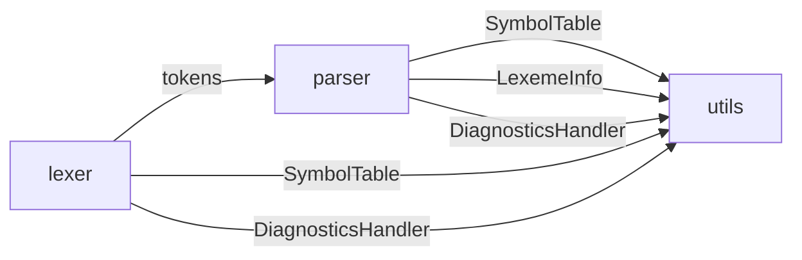
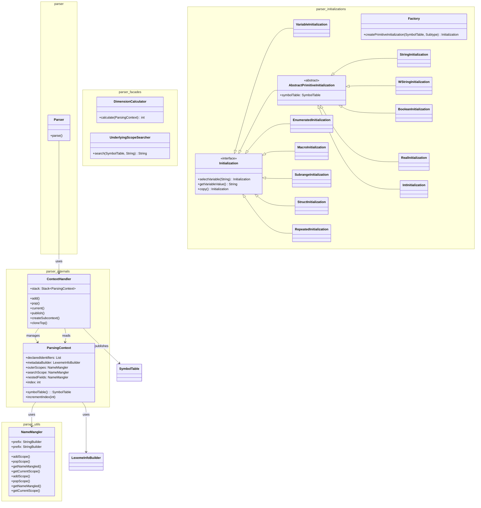
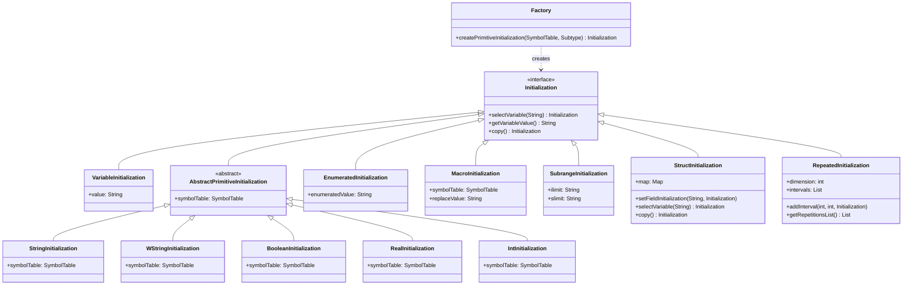
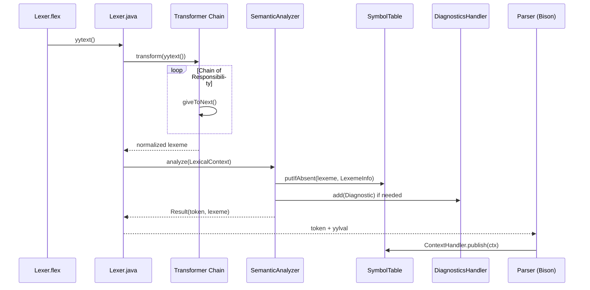
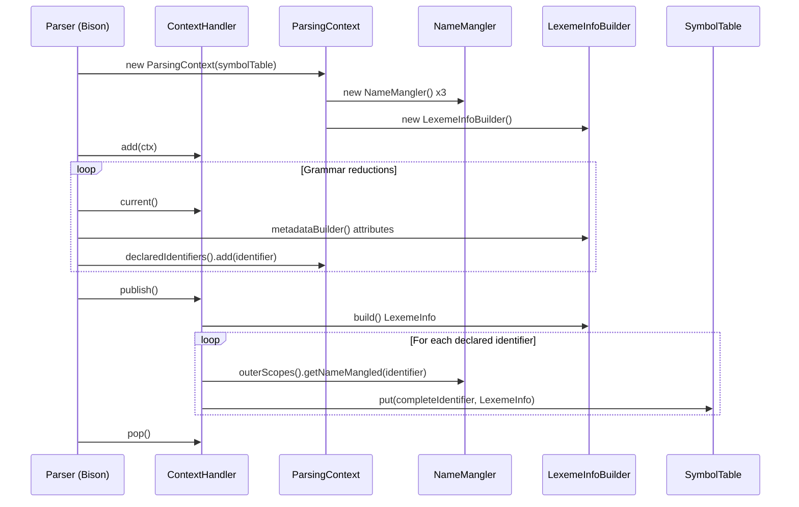
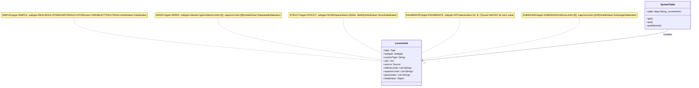

# parser

Módulo de análisis sintáctico generado con **GNU Bison 3.8.2** (LALR(1)) a partir de `src/main/java/parser/Parser.y`; implementa la gramática de **IEC 61131-7** y el **Anexo B de IEC 61131-3**.

*Última actualización: 2026-10-08 (Documentación actualizada: estructura de paquetes corregida, Publisher eliminado, Factory/Facades reubicados)*

## Diagrama de paquetes



## Diagrama de clases



Diagrama de clases: `doc/diagrams/parser_class_diagram.mmd` (generado por `scripts/generate_diagrams.py parser`).

## Tabla de clases

| Clase                                           | Responsabilidad                                                                                       | Patrón                  |
|-------------------------------------------------|-------------------------------------------------------------------------------------------------------|-------------------------|
| `parser.Parser`                                 | Analizador LALR(1) generado por Bison; punto de entrada `parse()`                                     | Generated Parser        |
| `parser.internals.ContextHandler`               | Pila LIFO de contextos de análisis anidados; operaciones `add`, `pop`, `current`, `publish`, `createSubcontext`, `cloneTop` | Stack / Context Manager |
| `parser.internals.ParsingContext`               | Contexto mutable por ámbito: identificadores declarados, builder semántico, tres `NameMangler` e índice de array | Context Object   |
| `parser.utils.NameMangler`                  | Prefijos jerárquicos con separador `#` (`FB#TYPE#FIELD`) para resolución de nombres                    | Name Mangling           |
| `parser.initializations.Factory`                | Crea inicializaciones por defecto de **todos** los tipos primitivos (BOOL, INT, REAL, LREAL, STRING, WSTRING y variantes) | Factory                 |
| `parser.facades.DimensionCalculator`              | Calcula la cardinalidad total de arrays multidimensionales desde `inferiorLimits`/`superiorLimits`     | Calculator              |
| `parser.facades.UnderlyingScopeSearcher`          | Sigue la cadena de tipos custom hasta el ámbito raíz que contiene campos/enums                          | Searcher                |
| `parser.initializations.Initialization`         | Interfaz de valores iniciales polimórficos (`selectVariable`, `getVariableValue`, `copy`)              | Composite / Strategy    |
| `parser.initializations.VariableInitialization` | Envuelve un literal o identificador como valor inicial explícito                                       | Value Object            |
| `parser.initializations.primitives.StringInitialization`   | Valor por defecto de STRING registrado perezosamente en `SymbolTable` vía `Director`                   | Value Object            |
| `parser.initializations.primitives.WStringInitialization`  | Valor por defecto de WSTRING registrado perezosamente en `SymbolTable` vía `Director`                  | Value Object            |
| `parser.initializations.primitives.BooleanInitialization`  | Valor por defecto BOOL `FALSE` registrado perezosamente                                                | Value Object            |
| `parser.initializations.primitives.RealInitialization`     | Valor por defecto REAL/LREAL `0.0` registrado perezosamente                                            | Value Object            |
| `parser.initializations.primitives.IntInitialization`      | Valor por defecto INT/SINT/DINT/LINT/USINT/UINT/UDINT/ULINT `0` registrado perezosamente               | Value Object            |
| `parser.initializations.EnumeratedInitialization` | Primer valor de un enumerado como valor por defecto                                                  | Value Object            |
| `parser.initializations.MacroInitialization`    | Valor ordinal de un literal de enumerado registrado como `Subtype.INT`                                 | Value Object            |
| `parser.initializations.SubrangeInitialization` | Cota inferior como valor por defecto; conserva inferior y superior                                     | Value Object            |
| `parser.initializations.StructInitialization`   | Mapa `field → Initialization` con claves compuestas para structs anidados                              | Composite               |
| `parser.initializations.RepeatedInitialization` | Partición en intervalos `[start, end] → Initialization` para arrays con repetición                     | Interval Map            |

Fuentes por subpaquete:

| Subpaquete                       | Directorio                                         |
|----------------------------------|----------------------------------------------------|
| `parser`                         | `src/main/java/parser/`                            |
| `parser.internals`               | `src/main/java/parser/internals/`                  |
| `parser.utils`                   | `src/main/java/parser/utils/`                      |
| `parser.facades`                 | `src/main/java/parser/facades/`                    |
| `parser.initializations`         | `src/main/java/parser/initializations/`            |
| `parser.initializations.primitives` | `src/main/java/parser/initializations/primitives/` |

`StringInitialization`, `WStringInitialization`, `IntInitialization`, `BooleanInitialization`, `RealInitialization` (`src/main/java/parser/initializations/primitives/`) implementan `AbstractPrimitiveInitialization`. `Factory.createPrimitiveInitialization` en `parser.initializations` crea instancias de todas ellas. `IntInitialization` cubre todos los enteros (SINT..ULINT).

## Gramática soportada — resumen

### Métricas de la gramática

| Métrica              | Valor | Origen                                                  |
|----------------------|-------|---------------------------------------------------------|
| Tokens declarados    | 82    | directivas `%token` de `src/main/java/parser/Parser.y`   |
| No-terminales        | 137   | constantes de `enum SymbolKind` en `src/main/java/parser/Parser.java` con índice ≥ `S_YYACCEPT`; incluye `$accept` |
| Tipos de inicialización | 11  | clases concretas en `src/main/java/parser/initializations/` y `primitives/` (excluye `Initialization.java` interfaz y `AbstractPrimitiveInitialization.java` abstracta) |

Chart: `assets/parser_grammar_stats.png` — tokens declarados, no-terminales y tipos de inicialización de la gramática Bison (generado por `scripts/extract_stats.py`).

El conteo de no-terminales coincide con la sección "Nonterminals" del reporte de Bison. Valores anteriores de 231 contaban todas las constantes de `SymbolKind`, incluidos los terminales.
Los 11 tipos de inicialización son: `VariableInitialization`, `EnumeratedInitialization`, `MacroInitialization`, `RepeatedInitialization`, `StructInitialization`, `SubrangeInitialization`, `StringInitialization`, `WStringInitialization`, `RealInitialization`, `IntInitialization`, `BooleanInitialization`.

### Bloques principales IEC 61131-7

```
program → opt_data_type_declaration function_block_declaration

function_block_declaration → FUNCTION_BLOCK function_block_name
    opt_fb_io_var_declarations_list   (VAR_INPUT / VAR_OUTPUT)
    opt_other_var_declarations_list   (VAR)
    opt_function_block_body
    END_FUNCTION_BLOCK

opt_function_block_body → opt_fuzzify_block_list
    opt_defuzzify_block_list
    opt_rule_block_list
    opt_option_block_list
```

### Fuzzify / Defuzzify

```
fuzzify_block → FUZZIFY IDENTIFIER linguistic_term_list END_FUZZIFY
linguistic_term → TERM IDENTIFIER ASSIGN_OP IDENTIFIER ';'
                | TERM IDENTIFIER ASSIGN_OP membership_function ';'
membership_function → singleton | point_list
point_list → point | point_list point
point → '(' numeric_constant ',' numeric_constant ')'
      | '(' IDENTIFIER ',' numeric_constant ')'

defuzzify_block → DEFUZZIFY IDENTIFIER
    opt_range
    opt_linguistic_term_list
    defuzzification_method
    default_value
    END_DEFUZZIFY
defuzzification_method → METHOD ':' defuzz_method ';'
defuzz_method → COG | COGS | COA | LM | RM
default_value → DEFAULT ASSIGN_OP default_val ';'
default_val → numeric_constant | NC
opt_range → empty | RANGE '(' numeric_constant RANGE_OP numeric_constant ')' ';'
```

### Rule Block

```
rule_block → RULEBLOCK IDENTIFIER
    operator_definition
    activation_method_opt
    accumulation_method
    rule_list
    END_RULEBLOCK

operator_definition → opt_operator_or operator_and_opt ';'
opt_operator_or → empty | OR ':' or_type
operator_and_opt → empty | AND ':' and_type
or_type → MAX | ASUM | BSUM
and_type → MIN | PROD | BDIF
activation_method → ACT ':' act_type ';'
act_type → PROD | MIN
accumulation_method → ACCU ':' accu_type ';'
accu_type → MAX | BSUM | NSUM

rule → RULE numeric_constant ':' IF condition THEN conclusion_list opt_weighting ';'
condition → x condition_tail | IDENTIFIER condition_tail
x → NOT x | NOT IDENTIFIER | subcondition | '(' condition ')'
subcondition → IDENTIFIER IS IDENTIFIER | IDENTIFIER IS NOT IDENTIFIER
conclusion_list → IDENTIFIER IS IDENTIFIER | IDENTIFIER
                | conclusion_list ',' IDENTIFIER IS IDENTIFIER
                | conclusion_list ',' IDENTIFIER
```

### Declaraciones de variables — Anexo B IEC 61131-3

```
var_declarations → var_id_decl var_constant_spec var_init_decl_list ';' END_VAR
var_id_decl → VAR { source=INTERNAL, use=VARIABLE }
io_var_decl → VAR_INPUT { source=IN, use=VARIABLE }
           | VAR_OUTPUT { source=OUT, use=VARIABLE }

var_init_decl → identifier_list ':' var_spec_init { contexts.publish() }
             | identifier_list ':' standard_function_block_spec_init
var_spec_init → custom_spec_init | boolean_spec_init | simple_spec_init
             | subrange_spec_init | enumerated_spec_init | array_spec_init | string_spec_init
```

### Tipos de datos

```
simple_specification → elementary_type_name  { subtype ∈ {SINT..ULINT, REAL, LREAL, TIME, DATE, ...} }
custom_specification → IDENTIFIER  { subtype=CUSTOM, customType=IDENTIFIER }
subrange_specification → subrange_type_decl '(' range ')'
range → numeric_constant RANGE_OP numeric_constant
enumerated_specification → '(' enumerated_values ')'
array_specification → ARRAY '[' range_list ']' OF IDENTIFIER
                    | ARRAY '[' range_list ']' OF non_generic_type_name
structure_specification → STRUCT structure_field_declaration_list END_STRUCT
type_string_specification → STRING { subtype=STRING } | WSTRING { subtype=WSTRING }
string_specification → type_string_specification
                     | type_string_specification '[' numeric_constant ']'
```

### Inicializaciones

```
string_spec_init → string_specification | initialized_string
initialized_string → string_specification ASSIGN_OP string_constant

initialized_simple → simple_specification ASSIGN_OP constant
initialized_custom → custom_type_name ASSIGN_OP constant
                   | custom_type_name ASSIGN_OP identifier_with_opt_mangling
                   | custom_type_name ASSIGN_OP structure_initialization
initialized_boolean → boolean_specification edge
                    | boolean_specification ASSIGN_OP boolean_constant
initialized_subrange → subrange_specification ASSIGN_OP numeric_constant
initialized_enumerated → enumerated_specification ASSIGN_OP identifier_with_opt_mangling
initialized_array → array_specification ASSIGN_OP array_initialization
array_initialization → array_init_open_square_bracket array_initial_elements_list ']'
array_initial_elements → constant | identifier_with_opt_mangling
                       | structure_initialization | array_initialization
repeated_initial_element → numeric_constant '(' array_initial_element ')'
structure_initialization → struct_init_open_parenthesis structure_field_initialization_list ')'
initialized_structure_field → nested_field ASSIGN_OP constant
                            | nested_field ASSIGN_OP identifier_with_opt_mangling
                            | nested_field ASSIGN_OP array_initialization
                            | nested_field ASSIGN_OP structure_initialization
nested_field → IDENTIFIER
identifier_with_opt_mangling → IDENTIFIER | IDENTIFIER '#' IDENTIFIER
```

### Declaración de tipos de datos

```
data_type_declaration → type_id_decl type_declaration_list END_TYPE
type_id_decl → TYPE { use=TYPE, source=NONE }
type_declaration → type_name_declaration ':' type_spec_init
type_spec_init → custom_spec_init | simple_spec_init | enumerated_spec_init
               | subrange_spec_init | array_spec_init | structure_specification | string_spec_init
```

## Acciones semánticas clave

Extracto de `src/main/java/parser/Parser.y`:

| Regla                              | Acción semántica                                                                                                     |
|------------------------------------|----------------------------------------------------------------------------------------------------------------------|
| `function_block_name`              | Crea `ParsingContext`, añade el nombre a `outerScopes`, `contexts.add(ctx)`                                          |
| `function_block_declaration`       | Al reducir `END_FUNCTION_BLOCK`: `contexts.pop()`                                                                    |
| `io_var_decl` (VAR_INPUT)          | `ctx.metadataBuilder().source(Source.IN).use(Use.VARIABLE)`                                                          |
| `io_var_decl` (VAR_OUTPUT)         | `ctx.metadataBuilder().source(Source.OUT).use(Use.VARIABLE)`                                                         |
| `var_id_decl` (VAR)                | `ctx.metadataBuilder().source(Source.INTERNAL).use(Use.VARIABLE)`                                                    |
| `var_init_decl`                    | `contexts.publish(); ctx.declaredIdentifiers().clear()`                                                              |
| `custom_type_name`                 | Busca `LexemeInfo`, fija `type=SIMPLE, subtype=CUSTOM` y añade el ámbito subyacente a `searchScope`                   |
| `custom_specification`             | Fija `type=SIMPLE, subtype=CUSTOM, customType=$1, initialValue` tomado del `SymbolTable`                              |
| `simple_specification`             | `type=SIMPLE, subtype=$1, initialValue=Factory.createPrimitiveInitialization(...)`                                   |
| `range`                            | Acumula límites en `inferiorLimits` / `superiorLimits` del builder                                                   |
| `enumerated_values_list`           | Crea contexto hijo por valor enum, `use=MACRO, source=NONE`, publica cada literal                                    |
| `array_specification`              | `type=ARRAY, initialValue=RepeatedInitialization(dimension, defaultInit)` para elemento custom o primitivo            |
| `array_initial_elements`           | Consolida intervalos con `RepeatedInitialization.addInterval(start, end, init)` y reinicia el índice                  |
| `structure_field_declaration`      | Nuevo contexto por campo, `use=FIELD, source=NONE`, publica y hace `pop` al reducir                                  |
| `structure_specification`          | `type=STRUCT, subtype=NONE, parameters=campos`; construye `StructInitialization` con el `initialValue` de cada campo  |
| `type_string_specification`        | Fija `subtype=STRING` o `subtype=WSTRING` en el builder                                                              |
| `string_specification`             | `type=SIMPLE`, `initialValue=Factory.createPrimitiveInitialization(symbolTable, subtype)`                            |
| `string_specification` con `[n]`   | Igual que la anterior y además `superiorLimits=[n]` con la longitud declarada                                        |
| `initialized_string`               | `initialValue=new VariableInitialization($3)` a partir de `string_constant`                                          |
| `type_declaration`                 | `outerScopes.popScope(); contexts.publish(); declaredIdentifiers().clear()`                                          |

Notas:

* `Factory.createPrimitiveInitialization` (en `parser.initializations`) soporta **todos** los subtipos primitivos: BOOL, STRING, WSTRING, REAL/LREAL, y todos los enteros (SINT..ULINT) vía `IntInitialization`. Lanza `IllegalArgumentException` para subtipos no soportados.
* BOOL usa `BooleanInitialization` directamente en `boolean_specification` (no pasa por `Factory`).
* STRING/WSTRING usan `StringInitialization`/`WStringInitialization` directamente en `string_specification` (no pasan por `Factory` en la regla, aunque `Factory` ahora también los crea).
* La publicación en `SymbolTable` la realiza `ContextHandler.publish()`, no una clase `Publisher` separada.

## Inicializaciones — jerarquía y uso



Comportamiento por defecto de `getVariableValue`:

| Clase                        | Valor por defecto                                | Registro en `SymbolTable`                                |
|------------------------------|--------------------------------------------------|----------------------------------------------------------|
| `VariableInitialization`     | literal o identificador asignado                 | no registra (solo envuelve)                              |
| `StringInitialization`       | literal por defecto STRING `''`                  | `putIfAbsent` vía `Director.makeDefaultString`           |
| `WStringInitialization`      | literal por defecto WSTRING `L''`                | `putIfAbsent` vía `Director.makeDefaultWString`          |
| `BooleanInitialization`      | `FALSE`                                          | `putIfAbsent` vía `Director.makeDefaultBoolean`          |
| `RealInitialization`         | `0.0`                                            | `putIfAbsent` vía `Director.makeDefaultReal`             |
| `IntInitialization`          | `0`                                              | `putIfAbsent` vía `Director.makeDefaultInt`              |
| `EnumeratedInitialization`   | primer valor del enumerado                       | no registra (selecciona el valor)                        |
| `MacroInitialization`        | ordinal del literal de enum                      | `putIfAbsent` con `subtype=INT`                          |
| `SubrangeInitialization`     | cota inferior                                    | no registra                                              |
| `StructInitialization`       | mapa campo → `Initialization`                    | no registra                                              |
| `RepeatedInitialization`     | partición de intervalos `[start, end]`            | no registra                                              |

Todos los valores por defecto perezosos usan un campo `static DEFAULT` y `SymbolTable.putIfAbsent`, de modo que una misma tabla no duplica la entrada del literal.

`StringInitialization` y `WStringInitialization` tienen cada una su propio `static DEFAULT`; `equals` compara solo la clase.

## Flujo Lexer → Parser → SymbolTable



Diagrama de secuencia: `doc/diagrams/lexer_parser_sequence.mmd`.

## Secuencia de contexto de análisis



Diagrama de secuencia: `doc/diagrams/context_handler_sequence.mmd`.

## Tabla de símbolos — población desde el Parser



Diagrama de almacenamiento: `doc/diagrams/symboltable_storage.mmd`.

Las claves quedan en mayúsculas porque el lexer normaliza los identificadores; por ejemplo `MAIN#STRVAR` y `STRINGTYPE` en `StringTypeIT`.

| Tipo                  | Cuándo se publica                      | Clave en SymbolTable | LexemeInfo destacado                                                                         |
|-----------------------|----------------------------------------|----------------------|----------------------------------------------------------------------------------------------|
| Variable simple       | `var_init_decl` (simple_spec_init)     | `FB#varName`         | type=SIMPLE, subtype=REAL o BOOL, initialValue=RealInitialization o BooleanInitialization       |
| Variable string       | `var_init_decl` (string_spec_init)     | `FB#varName`         | type=SIMPLE, subtype=STRING/WSTRING, superiorLimits=[n] si hay longitud, initialValue=StringInitialization |
| String inicializado   | `initialized_string`                   | `FB#varName`         | initialValue=VariableInitialization(string_constant)                                          |
| Tipo string           | `type_declaration` (string_spec_init)  | `TypeName`           | use=TYPE, source=NONE, subtype=STRING/WSTRING, superiorLimits=[n]                              |
| Variable custom       | `var_init_decl` (custom_spec_init)     | `FB#varName`         | type=SIMPLE, subtype=CUSTOM, customType=TypeName, initialValue=Type.initialValue              |
| Variable inicializada | `initialized_simple/custom/boolean/string` | `FB#varName`         | initialValue=VariableInitialization(literal)                                                  |
| Array                 | `var_init_decl` (array_spec_init)      | `FB#arrName`         | type=ARRAY, subtype=elementType, initialValue=RepeatedInitialization(dimension, defaultInit)  |
| Array inicializado    | `initialized_array`                    | `FB#arrName`         | initialValue=RepeatedInitialization con intervalos                                            |
| Struct                | `type_declaration` tras `structure_specification` | `TypeName` | type=STRUCT, subtype=NONE, parameters=[field1..], initialValue=StructInitialization       |
| Campo struct          | `structure_field_declaration`          | `TypeName#fieldName` | use=FIELD, type/subtype del campo                                                             |
| Enum (tipo)           | `enumerated_specification`             | `FB#enumName`        | type=ENUMERATE, subtype=INT, parameters=[A,B,C]                                               |
| Enum valor (macro)    | `enumerated_values_list`               | `TypeName#VALUE`     | use=MACRO, initialValue=MacroInitialization(index)                                            |
| Subrange              | `subrange_specification`               | `FB#varName`         | type=SUBRANGE, inferiorLimits/superiorLimits                                                  |
| Tipo declarado        | `type_declaration`                     | `TypeName`           | use=TYPE, type/subtype/parameters/initialValue según spec                                     |

## Tests

### Tests unitarios

| Clase de test                                                                  | Qué verifica                                                                                                  |
|--------------------------------------------------------------------------------|---------------------------------------------------------------------------------------------------------------|
| `src/test/java/unit/parser/ParserTest.java`                                    | `Parse_ForSyntacticallyValidPrograms_IsTrue`: prueba parametrizada sobre `src/test/resources/examples/program01.txt` … `program04.txt`; exige `parse() == true` y ausencia de errores |
| `src/test/java/unit/parser/initializations/RepeatedInitializationTest.java`    | 8 métodos `@Test`: constructor, inserción de intervalos al medio, al inicio, fuera de rango, recorte, fusión de adyacentes, cobertura múltiple y `copy()` |

### Tests de integración Lexer → Parser → SymbolTable

Ubicados en `src/test/java/integration/lexer/parser/symboltable/`. Todos extienden `ParserTestSupport` y comparan entradas del `SymbolTable` con `LexemeInfoComparator`.

| Clase                                                    | Alcance                                                         |
|----------------------------------------------------------|-----------------------------------------------------------------|
| `PrimitiveTypeIT`                                        | REAL y BOOL en `VAR`, `VAR_INPUT`, `VAR_OUTPUT`, con y sin inicializador |
| `StringTypeIT`                                           | Tipos y variables STRING/WSTRING con longitud `[8]`, con y sin inicializador |
| `ArrayVariableIT`, `ArrayTypeDeclarationIT`, `ArrayStructFieldIT` | Arrays como variable, tipo y campo de struct            |
| `EnumerateVariableIT`, `EnumerateTypeDeclarationIT`      | Enumerados como variable y tipo                                 |
| `StructVariableIT`, `StructTypeDeclarationIT`            | Structs simples                                                 |
| `NestedStructVariableIT`, `NestedStructTypeDeclarationIT`| Structs anidados                                                |
| `SubrangeVariableIT`, `SubrangeTypeDeclarationIT`        | Subrangos como variable y tipo                                  |
| `*TypeErrorIT`                                           | Casos de error por familia de tipos marcados con `@NotYetImplemented` |

`StringTypeIT` contiene 6 métodos: 2 `@ParameterizedTest` sobre `Subtype.STRING` y `Subtype.WSTRING` y 4 `@Test`. Verifica:

* `superiorLimits=["8"]` para `STRING[8]` y `WSTRING[8]`.
* `initialValue=StringInitialization` sin inicializador.
* `initialValue=VariableInitialization` con el literal entre comillas simples o dobles.
* `use=TYPE, source=NONE` en `TYPE` y `use=VARIABLE, source=INTERNAL` en `VAR`.

`StringTypeErrorIT` declara 2 casos pendientes: longitud excedida y literal de tipo incorrecto. Ambos usan `@NotYetImplemented`, una anotación que aplica `@Disabled` y está definida en `NotYetImplemented.java`.

### Soporte

`src/test/java/utils/ParserTestSupport.java`:

* `parse(Reader)` / `parse(String)`: crea `SymbolTable`, `DiagnosticsHandler`, `Lexer` y `Parser`; exige `parse() == true` y `hasErrors() == false`; retorna el `SymbolTable` poblado.

### Ejecución

```bash
mvn test -Dtest=ParserTest
mvn test -Dtest=RepeatedInitializationTest
mvn test -Dtest=StringTypeIT
mvn test -Dtest='*IT'
```

`pom.xml` no configura `maven-failsafe-plugin` ni `<includes>` en surefire. Por eso un `mvn test` sin `-Dtest` solo ejecuta los nombres por defecto de surefire, como `*Test`; las clases `*IT` deben seleccionarse explícitamente.

### Cobertura

Detalle por subpaquete, calculado desde `target/site/jacoco/jacoco.xml` (reporte JaCoCo 2026-10-07):

| Subpaquete                      | Instrucciones cubiertas | Líneas cubiertas | Ramas cubiertas |
|-------------------------------|-------------------------|------------------|-----------------|
| `parser` (Parser.java)        | 97.0%                   | 82.1%            | 46.0%           |
| `parser.internals`            | 98.8%                   | 100.0%           | 75.0%           |
| `parser.utils`                | 80.9%                   | 84.6%            | 71.4%           |
| `parser.initializations`      | 54.0%                   | 61.7%            | 48.4%           |
| `parser.initializations.primitives` | 85.2%             | 89.2%            | 58.3%           |
| **total `parser.*`**          | ~90%                    | ~79%             | ~48%            |

Cobertura de líneas (LINE) por módulo desde JaCoCo:

| Módulo | Cobertura |
|--------|-----------|
| `parser` | 82% |
| `lexer`  | 80% |
| `utils`  | 39% |
| **global** | 66% |

`assets/test_coverage.png` y `doc/stats.json → test_coverage` ahora reflejan datos reales de `jacoco.xml` (actualizado por `scripts/extract_stats.py`).

### Métricas estáticas

Fuente: `doc/stats.json`, generado por `scripts/extract_stats.py` (2026-10-07).

| Métrica | Valor | Nota |
|---------|-------|------|
| LOC | 3919 en 20 archivos | Líneas no vacías ni `//`; incluye `Parser.java` generado (2699 LOC) |
| Complejidad ciclomática | Promedio 6.1; total 442; 72 métodos estimados | Estimación heurística por conteo de palabras clave |
| Acoplamiento | Afferent 1, efferent 1, inestabilidad 0.5 | `parser → utils` (efferent=1) |

Chart: `assets/loc_per_module.png` — líneas de código por módulo.

Chart: `assets/cyclomatic_complexity.png` — complejidad ciclomática promedio por paquete.

Chart: `assets/package_coupling.png` — acoplamiento afferent/efferent por paquete.

## Archivos fuente

```
src/main/java/parser/
├── package-info.java
├── Parser.java            (generado desde Parser.y — 2699 líneas)
├── Parser.y               (gramática Bison — 1553 líneas)
├── internals/
│   ├── package-info.java
│   ├── ContextHandler.java
│   ├── ParsingContext.java
│   └── NameMangler.java
├── utils/
│   ├── package-info.java
│   └── NameMangler.java
├── facades/
│   ├── package-info.java
│   ├── DimensionCalculator.java
│   └── UnderlyingScopeSearcher.java
└── initializations/
    ├── package-info.java
    ├── Factory.java
    ├── Initialization.java
    ├── VariableInitialization.java
    ├── EnumeratedInitialization.java
    ├── MacroInitialization.java
    ├── RepeatedInitialization.java
    ├── StructInitialization.java
    ├── SubrangeInitialization.java
    └── primitives/
        ├── package-info.java
        ├── AbstractPrimitiveInitialization.java
        ├── StringInitialization.java
        ├── WStringInitialization.java
        ├── BooleanInitialization.java
        ├── RealInitialization.java
        └── IntInitialization.java

src/test/java/
├── unit/parser/
│   ├── ParserTest.java
│   └── initializations/RepeatedInitializationTest.java
├── integration/lexer/parser/symboltable/
│   ├── *IT.java
│   ├── *TypeErrorIT.java
│   ├── NotYetImplemented.java
│   └── builders/
│       ├── ExpectedSymbolBuilder.java
│       ├── SourceCodeBuilder.java
│       └── TypeTestData.java
└── utils/
    ├── ParserTestSupport.java
    └── LexemeInfoComparator.java
```

`Parser.output`, el reporte de Bison, y `Luca.y`, una gramática obsoleta, están en `src/main/java/parser/` pero no están versionados. Por eso se excluyen de esta documentación.

## Diagramas de apoyo — assets

| Diagrama                | Archivo                                        | Descripción                                    |
|-------------------------|------------------------------------------------|------------------------------------------------|
| Clases parser           | `doc/diagrams/parser_class_diagram.mmd`        | Estructura interna completa                     |
| Secuencia Lexer↔Parser  | `doc/diagrams/lexer_parser_sequence.mmd`       | Flujo de tokens y publicación                   |
| Contexto de análisis    | `doc/diagrams/context_handler_sequence.mmd`    | `add`/`pop` de `ParsingContext` y publicación   |
| Almacenamiento símbolos | `doc/diagrams/symboltable_storage.mmd`         | `SymbolTable` y `LexemeInfo`                    |
| Dependencias de paquetes| `doc/diagrams/package_dependencies.mmd`        | Aristas lexer → parser → utils                  |

## Capítulos de tesis que consumen este módulo

| Capítulo | Enfoque                                                                                              |
|----------|------------------------------------------------------------------------------------------------------|
| 06       | Análisis sintáctico — gramática, ContextHandler, jerarquía de inicializaciones, almacenamiento       |
| 07       | Mantenibilidad — métricas (CYCLO, LOC, cobertura) y acoplamiento `parser → utils` (efferent=1)        |

## Regeneración del parser

```bash
# Requiere bison 3.8.2 y flex
cd src/main/java/parser
bison -o Parser.java Parser.y
# Lexer.java se genera aparte desde Lexer.flex
```

*Nota: `Parser.java` está versionado; no editar a mano — modificar `Parser.y` y regenerar.*
