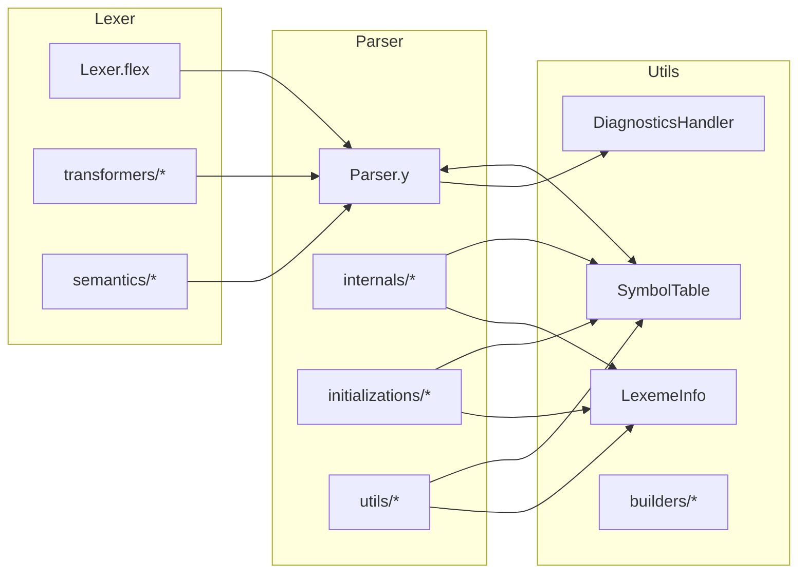
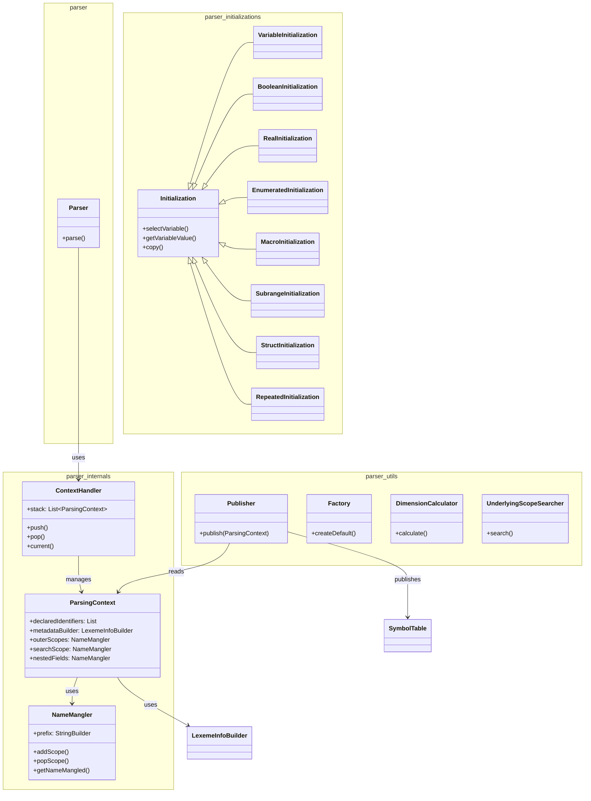
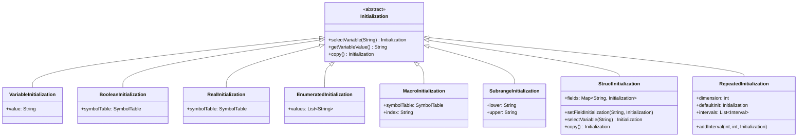
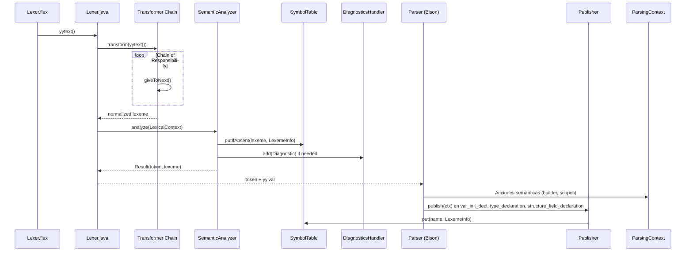
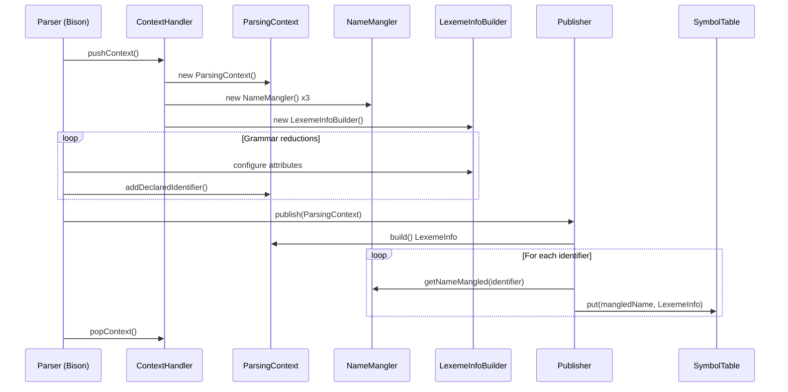

# parser

Módulo de análisis sintáctico: generado con **GNU Bison 3.8.2** (LALR(1)) a partir de `src/main/java/parser/Parser.y`. Implementa la gramática completa del estándar **IEC 61131-7** (Function Blocks de Lógica Difusa) y el **Anexo B de IEC 61131-3** (tipos de datos, declaraciones, inicializaciones).

## Diagrama de paquetes



## Diagrama de clases



## Tabla de clases

| Clase                                           | Responsabilidad                                                                                       | Patrón                  |
|-------------------------------------------------|-------------------------------------------------------------------------------------------------------|-------------------------|
| `parser.Parser`                                 | Analizador LALR(1) generado por Bison; punto de entrada `parse()`                                     | Generated Parser        |
| `parser.internals.ContextHandler`               | Pila de contextos de análisis anidados (function_block, type, struct, array, enum)                    | Stack / Context Manager |
| `parser.internals.ParsingContext`               | Contexto mutable por ámbito: identificadores declarados, builder semántico, mangling de nombres       | Context Object          |
| `parser.internals.NameMangler`                  | Gestión de prefijos jerárquicos (`FB#TYPE#FIELD`) para resolución de nombres                          | Name Mangling           |
| `parser.utils.Publisher`                        | Publica `LexemeInfo` construida en `SymbolTable` desde `ParsingContext`                               | Publisher               |
| `parser.utils.Factory`                          | Crea inicializaciones por defecto para tipos primitivos (INT, REAL, BOOL, TIME, etc.)                 | Factory                 |
| `parser.utils.DimensionCalculator`              | Calcula cardinalidad total de arrays multidimensionales a partir de `range_list`                      | Calculator              |
| `parser.utils.UnderlyingScopeSearcher`          | Busca ámbito subyacente de tipos custom/enum para `searchScope`                                       | Searcher                |
| `parser.initializations.Initialization`         | Jerarquía de valores iniciales polimórficos (variable, literal, struct, array, enum, subrange, macro) | Composite / Strategy    |
| `parser.initializations.VariableInitialization` | Wrapper de literal/identificador para publicación diferida                                            | Value Object            |
| `parser.initializations.StructInitialization`   | Mapa `field → Initialization` con selección y sobrescritura anidada                                   | Composite               |
| `parser.initializations.RepeatedInitialization` | Intervalos `[start, end] → Initialization` para arrays con repetición                                 | Interval Map            |

## Gramática soportada — resumen

### Bloques principales IEC 61131-7
```
program → opt_data_type_declaration function_block_declaration

function_block_declaration → FUNCTION_BLOCK name
    opt_fb_io_var_declarations_list   (VAR_INPUT / VAR_OUTPUT)
    opt_other_var_declarations_list   (VAR)
    opt_function_block_body
    END_FUNCTION_BLOCK

opt_function_block_body → opt_fuzzify_block_list
    opt_defuzzify_block_list
    opt_rule_block_list
    opt_option_block_list
```

### Fuzzify / Defuzzify
```
fuzzify_block → FUZZIFY IDENTIFIER linguistic_term_list END_FUZZIFY
linguistic_term → TERM IDENTIFIER := (IDENTIFIER | membership_function) ';'
membership_function → singleton | point_list
point_list → point (',' point)*
point → '(' numeric_constant ',' numeric_constant ')'
        | '(' IDENTIFIER ',' numeric_constant ')'

defuzzify_block → DEFUZZIFY IDENTIFIER
    opt_range
    opt_linguistic_term_list
    defuzzification_method
    default_value
    END_DEFUZZIFY
defuzz_method → COG | COGS | COA | LM | RM
```

### Rule Block
```
rule_block → RULEBLOCK IDENTIFIER
    operator_definition
    activation_method_opt
    accumulation_method
    rule_list
    END_RULEBLOCK

operator_definition → [OR ':' or_type] [AND ':' and_type] ';'
or_type → MAX | ASUM | BSUM
and_type → MIN | PROD | BDIF
activation_method → ACT ':' (PROD | MIN) ';'
accumulation_method → ACCU ':' (MAX | BSUM | NSUM) ';'

rule → RULE numeric_constant ':' IF condition THEN conclusion_list [WITH weight] ';'
condition → x condition_tail | IDENTIFIER condition_tail
x → NOT x | NOT IDENTIFIER | subcondition | '(' condition ')'
subcondition → IDENTIFIER IS IDENTIFIER | IDENTIFIER IS NOT IDENTIFIER
conclusion_list → IDENTIFIER [IS IDENTIFIER] (',' IDENTIFIER [IS IDENTIFIER])*
```

### Declaraciones de variables — Anexo B IEC 61131-3
```
var_declarations → var_id_decl var_constant_spec var_init_decl_list ';' END_VAR
var_id_decl → VAR { source=INTERNAL, use=VARIABLE }
io_var_decl → VAR_INPUT { source=IN, use=VARIABLE }
           | VAR_OUTPUT { source=OUT, use=VARIABLE }

var_init_decl → identifier_list ':' var_spec_init  { Publisher.publish(ctx) }
var_spec_init → custom_spec_init | boolean_spec_init | simple_spec_init
            | subrange_spec_init | enumerated_spec_init | array_spec_init | string_spec_init
```

### Tipos de datos
```
simple_specification → elementary_type_name  { subtype ∈ {SINT..ULINT, REAL, LREAL, TIME, DATE, ...} }
custom_specification → IDENTIFIER  { subtype=CUSTOM, customType=IDENTIFIER }
subrange_specification → subrange_type_decl '(' range ')'
range → numeric_constant '..' numeric_constant
enumerated_specification → '(' enumerated_values_list ')'
array_specification → ARRAY '[' range_list ']' OF (IDENTIFIER | non_generic_type_name)
structure_specification → STRUCT structure_field_declaration_list END_STRUCT
string_specification → STRING | WSTRING [ '[' numeric_constant ']' ]
```

### Inicializaciones
```
initialized_simple → simple_specification ':=' constant
initialized_custom → custom_type_name ':=' (constant | identifier_with_opt_mangling | structure_initialization)
initialized_boolean → boolean_specification ':=' boolean_constant
initialized_subrange → subrange_specification ':=' numeric_constant
initialized_enumerated → enumerated_specification ':=' identifier_with_opt_mangling
initialized_array → array_specification ':=' array_initialization
initialized_string → string_specification ':=' string_constant
array_initialization → '[' array_initial_elements_list ']'
array_initial_elements → constant | identifier_with_opt_mangling | structure_initialization | array_initialization
repeated_initial_element → numeric_constant '(' array_initial_element ')'
structure_initialization → '(' structure_field_initialization_list ')'
initialized_structure_field → nested_field ':=' (constant | identifier_with_opt_mangling | array_initialization | structure_initialization)
nested_field → IDENTIFIER ('.' IDENTIFIER)*
```

### Declaración de tipos de datos
```
data_type_declaration → type_id_decl type_declaration_list END_TYPE
type_id_decl → TYPE { use=TYPE }
type_declaration → type_name_declaration ':' type_spec_init { Publisher.publish(ctx); outerScopes.popScope() }
type_spec_init → custom_spec_init | simple_spec_init | enumerated_spec_init | subrange_spec_init | array_spec_init | structure_specification | string_spec_init
```

## Acciones semánticas clave — extracto de Parser.y

| Regla                              | Acción semántica                                                                                                     |
|------------------------------------|----------------------------------------------------------------------------------------------------------------------|
| `function_block_name`              | Crea `ParsingContext`, añade nombre a `outerScopes`, `contexts.add(ctx)`                                             |
| `function_block_declaration` (END) | `contexts.pop()`                                                                                                     |
| `io_var_decl` (VAR_INPUT)          | `ctx.metadataBuilder().source(Source.IN).use(Use.VARIABLE)`                                                          |
| `io_var_decl` (VAR_OUTPUT)         | `ctx.metadataBuilder().source(Source.OUT).use(Use.VARIABLE)`                                                         |
| `var_id_decl` (VAR)                | `ctx.metadataBuilder().source(Source.INTERNAL).use(Use.VARIABLE)`                                                    |
| `var_init_decl`                    | `Publisher.publish(ctx); ctx.declaredIdentifiers().clear()`                                                          |
| `custom_type_name`                 | Busca `LexemeInfo` en `SymbolTable`, setea `type=SIMPLE, subtype=CUSTOM`, añade ámbito subyacente a `searchScope`    |
| `simple_specification`             | `type=SIMPLE, subtype=$1, initialValue=Factory.createPrimitiveInitialization(...)`                                   |
| `range`                            | Acumula límites en `inferiorLimits` / `superiorLimits` del builder                                                   |
| `enumerated_values_list`           | Crea contexto hijo por valor enum, `use=MACRO, source=NONE`, publica cada literal                                    |
| `array_specification`              | `type=ARRAY, subtype=elementType, dimension=DimensionCalculator.calculate(ctx), initialValue=RepeatedInitialization` |
| `structure_field_declaration`      | Nuevo contexto por campo, `use=FIELD`, publica al reducir                                                            |
| `structure_specification`          | Recorre campos, construye `StructInitialization` con `initialValue` de cada campo                                    |
| `type_declaration`                 | `Publisher.publish(ctx); outerScopes.popScope()`                                                                     |

## Inicializaciones — jerarquía y uso



## Flujo Lexer → Parser → SymbolTable



## Secuencia de contexto de análisis



## Tabla de símbolos — población desde el Parser

| Tipo                  | Cuándo se publica                      | Clave en SymbolTable | LexemeInfo destacado                                                                         |
|-----------------------|----------------------------------------|----------------------|----------------------------------------------------------------------------------------------|
| Variable simple       | `var_init_decl` (simple_spec_init)     | `FB#varName`         | type=SIMPLE, subtype=INT/REAL/BOOL..., initialValue=PrimitiveInitialization                  |
| Variable custom       | `var_init_decl` (custom_spec_init)     | `FB#varName`         | type=SIMPLE, subtype=CUSTOM, customType=TypeName, initialValue=Type.initialValue             |
| Variable inicializada | `initialized_simple/custom/boolean`    | `FB#varName`         | initialValue=VariableInitialization(literal)                                                 |
| Array                 | `var_init_decl` (array_spec_init)      | `FB#arrName`         | type=ARRAY, subtype=elementType, initialValue=RepeatedInitialization(dimension, defaultInit) |
| Array inicializado    | `initialized_array`                    | `FB#arrName`         | initialValue=RepeatedInitialization con intervalos                                           |
| Struct                | `structure_specification` (END_STRUCT) | `TypeName`           | type=STRUCT, parameters=[field1..], initialValue=StructInitialization                        |
| Campo struct          | `structure_field_declaration`          | `TypeName#fieldName` | use=FIELD, type/subtype del campo                                                            |
| Enum (tipo)           | `enumerated_specification`             | `FB#enumName`        | type=ENUMERATE, subtype=INT, parameters=[A,B,C]                                              |
| Enum valor (macro)    | `enumerated_values_list`               | `TypeName#VALUE`     | use=MACRO, initialValue=MacroInitialization(index)                                           |
| Subrange              | `subrange_specification`               | `FB#varName`         | type=SUBRANGE, inferiorLimits/superiorLimits                                                 |
| Tipo declarado        | `type_declaration`                     | `TypeName`           | use=TYPE, type/subtype/parameters/initialValue según spec                                    |

## Tests

Tests de integración en `src/test/java/unit/parser/ParserTest.java`:

- **Parse_ForSyntacticallyValidPrograms_IsTrue** — parameterized test que recorre `src/test/resources/examples/*.fcl` y verifica `parse() == true` sin errores de diagnóstico

Base de soporte en `src/test/java/utils/ParserTestSupport.java`:
- `parse(Reader)` / `parse(String)` — crea `SymbolTable`, `DiagnosticsHandler`, `Lexer`, `Parser`; aserta éxito y ausencia de errores; retorna `SymbolTable` poblado para aserciones posteriores

Ejecución:
```bash
mvn test -Dtest=ParserTest
```

Cobertura actual: **~85%** (JaCoCo — limitado por código generado Bison).

## Archivos fuente

```
src/main/java/parser/
├── package-info.java
├── Parser.java            (generado desde Parser.y — 3000+ líneas)
├── Parser.y               (gramática Bison — 1445 líneas)
├── internals/
│   ├── package-info.java
│   ├── ContextHandler.java
│   ├── ParsingContext.java
│   └── NameMangler.java
├── utils/
│   ├── package-info.java
│   ├── Publisher.java
│   ├── Factory.java
│   ├── DimensionCalculator.java
│   └── UnderlyingScopeSearcher.java
└── initializations/
    ├── package-info.java
    ├── Initialization.java
    ├── VariableInitialization.java
    ├── BooleanInitialization.java
    ├── RealInitialization.java
    ├── EnumeratedInitialization.java
    ├── MacroInitialization.java
    ├── SubrangeInitialization.java
    ├── StructInitialization.java
    └── RepeatedInitialization.java
```

## Diagramas de apoyo — assets

| Diagrama               | Archivo                                  | Descripción                               |
|------------------------|------------------------------------------|-------------------------------------------|
| Clases parser          | `doc/diagrams/parser_class_diagram.mmd`  | Estructura interna completa               |
| Secuencia Lexer↔Parser | `doc/diagrams/lexer_parser_sequence.mmd` | Flujo de tokens y publicación             |
| Estadísticas gramática | `doc/assets/parser_grammar_stats.png`    | Reglas, tokens, no-terminales, conflictos |

## Capítulos de tesis que consumen este módulo

| Capítulo | Enfoque                                                                                              |
|----------|------------------------------------------------------------------------------------------------------|
| 04       | Arquitectura implementada — Parser LALR(1), ContextHandler, NameMangling, Publisher, Initializations |
| 05       | Validación — Cobertura gramatical IEC 61131-7 + Anexo B, tests de programas ejemplo                  |
| 07       | Mantenibilidad — métricas (CYCLO, LOC, coverage), acoplamiento `parser → utils` (efferent=1)         |

## Regeneración del parser

```bash
# Requiere bison 3.8.2 y flex
cd src/main/java/parser
bison -o Parser.java Parser.y
# El Lexer.java se genera aparte desde Lexer.flex
```

*Nota: `Parser.java` está versionado; no editar a mano — modificar `Parser.y` y regenerar.*