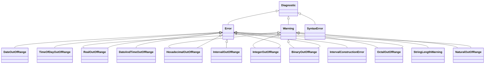

# Módulo `utils`

Utilidades centrales del compilador IEC 61131-7. Implementa el **patrón Repository** como única fuente de verdad para todas las fases de compilación (léxico, sintáctico, semántico).

---

## Arquitectura

```mermaid
flowchart TD
    A[Lexer] -->|Tokens + Diagnósticos| B[SymbolTable]
    C[Parser] -->|Publica LexemeInfo| B
    C -->|Reporta errores| D[DiagnosticsHandler]
    B --> E[LexemeInfo\n(DTO inmutable)]
    F[LexemeInfoBuilder] -->|Construye| E
    G[Director] -->|Recetas| F
    H[Type/Subtype/Use/Source] -->|Clasifican| E
```

---

## Clases principales

| Clase | Responsabilidad | Patrón |
|-------|-----------------|--------|
| `SymbolTable` | Almacén `HashMap<String, LexemeInfo>` para tabla de símbolos | Repository |
| `LexemeInfo` | DTO inmutable con atributos semánticos completos | Value Object |
| `DiagnosticsHandler` | Recolecta y gestiona errores/warnings ordenados | Collector |
| `LexemeInfoBuilder` | API fluida para construir `LexemeInfo` | Builder |
| `Director` | Recetas predefinidas (literales, defaults) | Director (Builder) |
| `Type` / `Subtype` / `Use` / `Source` | Enums de clasificación semántica | — |
| `LucaInfo` | Metadatos legacy para variables difusas (@deprecated) | — |

---

## Tabla de símbolos (`SymbolTable`)

Almacén centralizado `Map<String, LexemeInfo>` compartido por **lexer**, **parser** y **fases semánticas**.

```java
public final class SymbolTable {
    private final Map<String, LexemeInfo> table = new HashMap<>();

    public LexemeInfo get(String lexeme) { return table.get(lexeme); }
    public LexemeInfo put(String lexeme, LexemeInfo info) { return table.put(lexeme, info); }
    public LexemeInfo putIfAbsent(String lexeme, LexemeInfo info) { return table.putIfAbsent(lexeme, info); }
    public int size() { return table.size(); }
}
```

- **Clave**: nombre mangled del identificador (ej. `VAR#IN#temperature`)
- **Valor**: `LexemeInfo` completo con tipo, subtipo, uso, fuente, límites, parámetros e inicialización
- **Thread-safety**: no es thread-safe; acceso secuencial durante compilación

---

## LexemeInfo (DTO semántico)

Representación completa de un símbolo en la tabla. **Inmutable** con `equals`/`hashCode`/`toString` explícitos.

```java
public final class LexemeInfo {
    public Type type;                 // SIMPLE, ENUMERATE, SUBRANGE, ARRAY, STRUCT
    public Subtype subtype;           // INT, REAL, BOOL, CUSTOM, DATE, TIME, STRING, etc.
    public String customType;         // Nombre si subtype == CUSTOM
    public Use use;                   // VARIABLE, LITERAL, FUNCTION, RULE, TYPE, FIELD, MACRO, OPTION
    public Source source;             // IN, OUT, INTERNAL, FUZZIFY, DEFUZZIFY, NONE
    public List<String> inferiorLimits;   // Límite inferior (subrange/array)
    public List<String> superiorLimits;   // Límite superior (subrange/array)
    public List<String> parameters;       // Parámetros de function block
    public Object initialValue;           // Valor inicial (Literal, Initialization, etc.)
}
```

**Diseño intencional**:
- Campos públicos por diseño (DTO ligero, sin getters/setters)
- `equals`/`hashCode` manuales (no reflexión) → consistencia garantizada al añadir/quitar campos
- `SuppressFBWarnings` para `EI_EXPOSE_REP2` (colecciones expuestas) — aceptado por simplicidad

---

## Builder Pattern (`LexemeInfoBuilder` + `Director`)

### LexemeInfoBuilder
API fluida implementando `LexemeInfoSchema`:

```java
LexemeInfo info = new LexemeInfoBuilder()
    .type(Type.SIMPLE)
    .subtype(Subtype.REAL)
    .use(Use.VARIABLE)
    .source(Source.IN)
    .initialValue(0.0)
    .build();
```

### Director
Recetas estáticas para consistencia en acciones semánticas del parser:

```java
// Literal genérico: type=SIMPLE, use=LITERAL, source=NONE
Director.makeLiteral(builder);

// REAL por defecto: + subtype=REAL, initialValue=0.0 → retorna "0.0"
Director.makeDefaultReal(builder);

// BOOL por defecto: + subtype=BOOL, initialValue=false → retorna "FALSE"
Director.makeDefaultBoolean(builder);
```

> **Integración con parser**: `parser.utils.Publisher` (y sus subclases `Declaration`, `Compound`) implementan `LexemeInfoSchema`, permitiendo encadenar configuración antes de `publish()`.

---

## Enums de clasificación

| Enum | Valores | Uso |
|------|---------|-----|
| **Type** | `UNKNOWN`, `SIMPLE`, `ENUMERATE`, `SUBRANGE`, `ARRAY`, `STRUCT` | Clasificación general del símbolo |
| **Subtype** | `BOOL`, `INT`, `REAL`, `LREAL`, `SINT`..`ULINT`, `BYTE`..`LWORD`, `DATE`, `TIME`, `DATE_AND_TIME`, `TIME_OF_DAY`, `STRING`, `WSTRING`, `CUSTOM`, `UNKNOWN` | Tipo elemental IEC 61131-7 |
| **Use** | `VARIABLE`, `LITERAL`, `FUNCTION`, `RULE`, `TYPE`, `FIELD`, `MACRO`, `OPTION`, `UNKNOWN` | Contexto de uso del identificador |
| **Source** | `IN`, `OUT`, `INTERNAL`, `FUZZIFY`, `DEFUZZIFY`, `NONE`, `UNKNOWN` | Bloque de declaración en Function Block |

---

## Sistema de diagnósticos (`DiagnosticsHandler` + jerarquía)



### Flujo
1. **Lexer/Parser/Semánticas** crean instancias concretas (`IntegerOutOfRange(line)`, `StringLengthWarning(line)`, etc.)
2. `DiagnosticsHandler.add(diagnostic)` → acumula en orden de inserción
3. `hasErrors()` indica si hay errores fatales (`fatalForCompilation() == true`)
4. `getDiagnostics()` → lista inmodificable para reporte final

### Clases base
```java
abstract class Diagnostic {          // línea + getMessage() → "Line N"
    abstract boolean fatalForCompilation();
}
abstract class Error extends Diagnostic {        // fatal = true, prefijo "ERROR: "
}
abstract class Warning extends Diagnostic {      // fatal = false, prefijo "WARNING: "
}
class SyntaxError extends Diagnostic {           // errores léxicos, fatal = true
}
```

---

## LucaInfo (@deprecated)

Clase legada para metadatos de variables difusas (token number, role, fuzz type, etc.). **No usada en la tabla de símbolos actual**; mantener solo por compatibilidad histórica.

---

## Archivos fuente

```
src/main/java/utils/
├── package-info.java              # Documentación del módulo (Repository pattern)
├── SymbolTable.java               # Repositorio central HashMap
├── LexemeInfo.java                # DTO semántico inmutable
├── DiagnosticsHandler.java        # Recolector de errores/warnings
├── LucaInfo.java                  # @deprecated Metadatos legacy
├── builders/
│   ├── package-info.java          # Builder + Director pattern
│   ├── LexemeInfoSchema.java      # Interfaz fluida (contract)
│   ├── LexemeInfoBuilder.java     # Implementación concreta
│   └── Director.java              # Recetas: makeLiteral, makeDefaultReal, makeDefaultBoolean
├── enums/
│   ├── package-info.java
│   ├── Type.java                  // SIMPLE, ENUMERATE, SUBRANGE, ARRAY, STRUCT
│   ├── Subtype.java               // 24 subtipos IEC 61131-7
│   ├── Use.java                   // 9 contextos de uso
│   └── Source.java                // 7 bloques de origen
└── diagnostics/
    ├── package-info.java          # Jerarquía Error/Warning
    ├── Diagnostic.java            // Base abstracta (línea + mensaje)
    ├── Error.java                 // Base errores (fatal)
    ├── Warning.java               // Base warnings (no fatal)
    ├── SyntaxError.java           // Errores léxicos
    ├── IntegerOutOfRange.java
    ├── RealOutOfRange.java
    ├── BinaryOutOfRange.java
    ├── OctalOutOfRange.java
    ├── HexadecimalOutOfRange.java
    ├── DateOutOfRange.java
    ├── TimeOfDayOutOfRange.java
    ├── DateAndTimeOutOfRange.java
    ├── IntervalOutOfRange.java
    ├── IntervalConstructionError.java
    ├── NaturalOutOfRange.java
    └── StringLengthWarning.java   // Warning (no fatal)
```

---

## Cómo probarlo

```bash
# Tests unitarios de SymbolTable
./gradlew test --tests unit.utils.SymbolTableTest

# Tests de diagnósticos (ver src/test/java/unit/utils/)
./gradlew test --tests unit.utils.*
```

Clase de soporte: `utils.ParserTestSupport` (configura lexer + parser + symbol table + diagnostics handler).

---

## Referencias

- **Patrón Repository**: `utils/package-info.java:4-17`
- **Value Object semantics**: `LexemeInfo.java:18-32`
- **Builder + Director**: `builders/package-info.java`, `Director.java`
- **Diagnósticos jerárquicos**: `diagnostics/package-info.java`