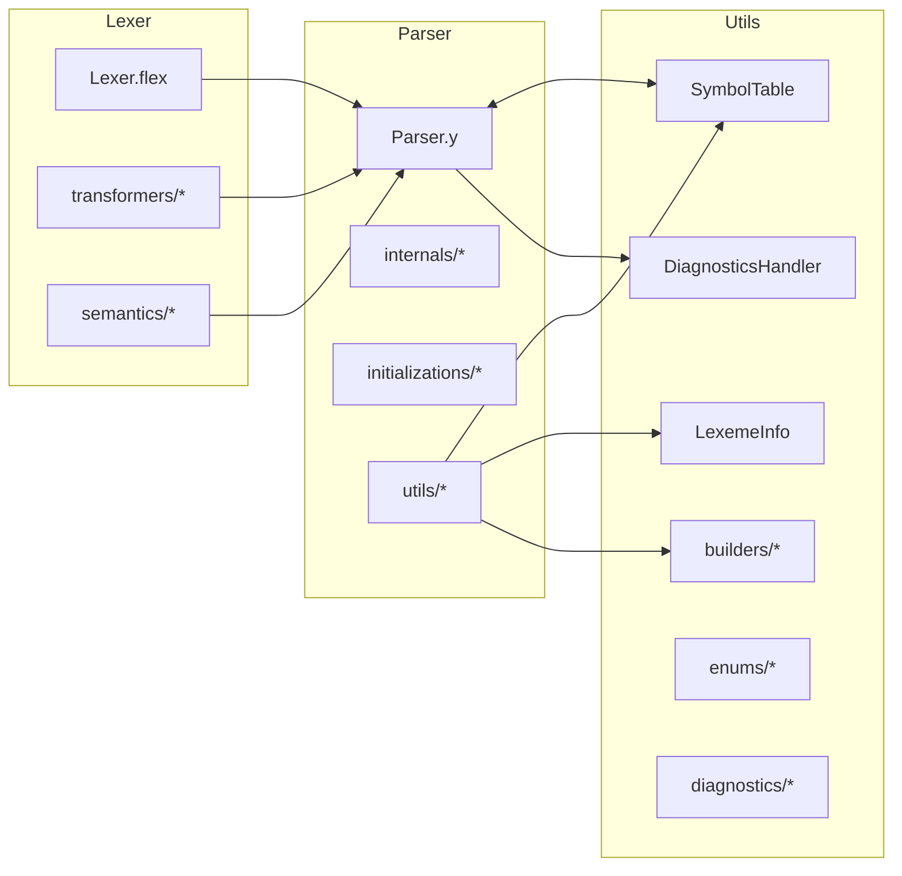
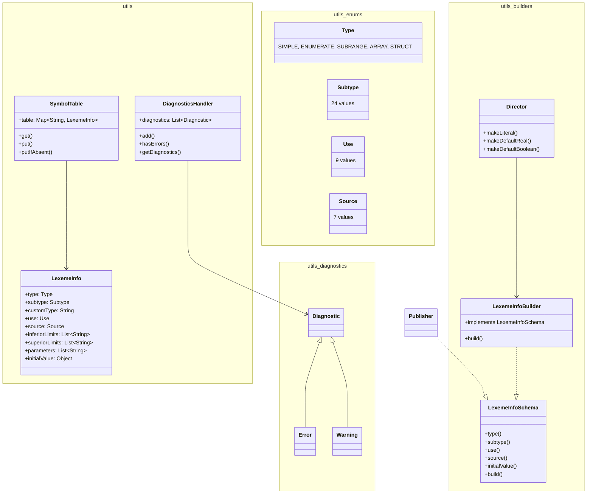
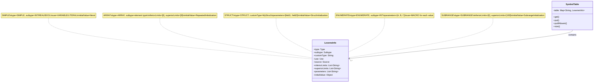
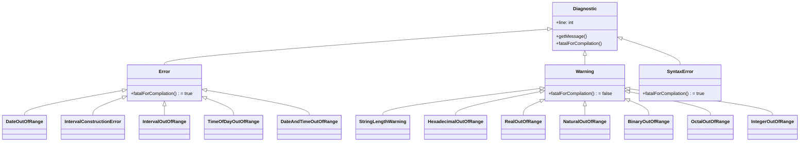

# utils

Paquete de utilidades centrales: repositorio único de verdad para tabla de símbolos, diagnóstico y constructores semánticos en el compilador IEC 61131-7.

## Diagrama de paquetes



## Diagrama de clases

Generado por `scripts/generate_diagrams.py utils` en `doc/diagrams/utils_class_diagram.mmd`:



## Tabla de clases

| Clase                              | Responsabilidad                                                                                         | Patrón              |
|------------------------------------|---------------------------------------------------------------------------------------------------------|---------------------|
| `utils.SymbolTable`                | Almacena y recupera `LexemeInfo` por nombre de lexema                                                   | Repository          |
| `utils.LexemeInfo`                 | DTO con atributos semánticos completos (tipo, subtipo, uso, fuente, límites, parámetros, valor inicial) | Value Object        |
| `utils.DiagnosticsHandler`         | Recolecta y gestiona diagnósticos (errores/warnings) en orden de inserción                              | Collector           |
| `utils.builders.LexemeInfoSchema`  | Contrato fluido para configurar atributos de `LexemeInfo`                                               | Builder (interface) |
| `utils.builders.LexemeInfoBuilder` | Implementación concreta del builder con `build()`                                                       | Builder             |
| `utils.builders.Director`          | Recetas predefinidas para literales y valores por defecto                                               | Director            |
| `utils.enums.Type`                 | Clasificación general: UNKNOWN, SIMPLE, ENUMERATE, SUBRANGE, ARRAY, STRUCT                              | Enum                |
| `utils.enums.Subtype`              | Tipos primitivos IEC 61131-7 (INT, REAL, BOOL, TIME, etc.) + CUSTOM/NONE                                | Enum                |
| `utils.enums.Use`                  | Contexto de uso: VARIABLE, FIELD, LITERAL, FUNCTION, RULE, TYPE, MACRO, OPTION, UNKNOWN                 | Enum                |
| `utils.enums.Source`               | Bloque de declaración: IN, OUT, INTERNAL, FUZZIFY, DEFUZZIFY, NONE, UNKNOWN                             | Enum                |
| `utils.diagnostics.Diagnostic`     | Base abstracta con número de línea y `fatalForCompilation()`                                            | Template Method     |
| `utils.diagnostics.Error`          | Diagnóstico fatal (`fatalForCompilation() = true`)                                                      | Herencia            |
| `utils.diagnostics.Warning`        | Diagnóstico no fatal (`fatalForCompilation() = false`)                                                  | Herencia            |
| `utils.diagnostics.SyntaxError`    | Errores léxicos/sintácticos                                                                             | Herencia            |

## Gráficos estadísticos

### Distribución de constantes en enums — utils

Chart: `assets/enum_sizes.png` — Distribución de constantes en enums semánticos
*Fuente: `src/main/java/utils/enums/*.java`*

### Distribución de tipos en SymbolTable

Chart: `assets/symboltable_type_distribution.png` — Distribución de entradas SymbolTable por Type
*Fuente: diseño del sistema de tipos en `utils/LexemeInfo.java` y `utils/enums/Type.java`*

### Población de campos de LexemeInfo por tipo

Chart: `assets/lexemeinfo_field_population.png` — Población de campos LexemeInfo por tipo de símbolo
*Fuente: `src/main/java/utils/LexemeInfo.java`*

### Complejidad ciclomática por paquete

Chart: `assets/cyclomatic_complexity.png` — Complejidad ciclomática promedio por paquete
*Fuente: `utils` avg CYCLO 2.1 (43 métodos estimados)*

### Líneas de código por módulo

Chart: `assets/loc_per_module.png` — Líneas de código por módulo
*Fuente: `utils` 981 LOC en 27 archivos*

### Distribución de diagnósticos — errores vs warnings

Chart: `assets/diagnostics_error_vs_warning.png` — Cantidad de clases de error vs warning en `utils.diagnostics`
*Fuente: `src/main/java/utils/diagnostics/*.java` (5 errores, 7 warnings)*

### Cobertura de tests por paquete

Chart: `assets/test_coverage.png` — Cobertura de tests por paquete
*Fuente: JaCoCo — `utils` 95% coverage*

### Acoplamiento de paquetes

Chart: `assets/package_coupling.png` — Acoplamiento aferente/eferente entre paquetes
*Fuente: análisis de imports — `utils` afferent=2, efferent=0, instability=0.0*

## Almacenamiento en SymbolTable por tipo

Generado por `scripts/generate_diagrams.py utils` en `doc/diagrams/symboltable_storage.mmd`:



## Jerarquía de diagnósticos

Generado por `scripts/generate_diagrams.py utils` en `doc/diagrams/diagnostics_hierarchy.mmd`:



## Cómo testear

Tests unitarios en `src/test/java/unit/utils/SymbolTableTest.java`:

* `PutAndGet_StoresAndRetrievesLexemeInfo` — verifica `put`/`get` básico
* `Put_WithVariousLexemeInfo_StoresCorrectly` — parámetros con 5 combinaciones de Type/Subtype/Use/Source
* `Get_ForNonExistentKey_ReturnsNull` — comportamiento para clave inexistente
* `Put_OverwritesExistingKey_ReturnsOldValue` — sobrescritura y retorno del valor anterior
* `PutIfAbsent_Behavior` — 3 casos: clave ausente, clave existente (no sobrescribe), clave existente con distinto valor
* `PutIfAbsent_NullValue_StoresNull` — admite valores null
* `Size_ReturnsEntryCount` — tamaño con 0, 1 y 2 entradas iniciales
* `Size_AfterPutIfAbsent_IncrementsOnlyForNewKeys` — size incrementa solo en inserciones nuevas

Ejecución:

```bash
mvn test -Dtest=SymbolTableTest
```

Cobertura actual: **95%** (JaCoCo).

## Árbol de archivos

```
src/main/java/utils/
├── package-info.java
├── SymbolTable.java
├── LexemeInfo.java
├── DiagnosticsHandler.java
├── LucaInfo.java (@deprecated)
├── builders/
│   ├── package-info.java
│   ├── LexemeInfoSchema.java
│   ├── LexemeInfoBuilder.java
│   └── Director.java
├── enums/
│   ├── package-info.java
│   ├── Type.java (6 valores)
│   ├── Subtype.java (24 valores)
│   ├── Use.java (9 valores)
│   └── Source.java (7 valores)
└── diagnostics/
    ├── package-info.java
    ├── Diagnostic.java
    ├── Error.java
    ├── Warning.java
    ├── SyntaxError.java
    ├── IntegerOutOfRange.java
    ├── RealOutOfRange.java
    ├── BinaryOutOfRange.java
    ├── OctalOutOfRange.java
    ├── HexadecimalOutOfRange.java
    ├── NaturalOutOfRange.java
    ├── DateOutOfRange.java
    ├── TimeOfDayOutOfRange.java
    ├── DateAndTimeOutOfRange.java
    ├── IntervalOutOfRange.java
    ├── IntervalConstructionError.java
    └── StringLengthWarning.java
```

## Diagramas de apoyo — assets

| Diagrama              | Archivo                                       | Descripción                                 |
|-----------------------|-----------------------------------------------|---------------------------------------------|
| Clases utils          | `doc/diagrams/utils_class_diagram.mmd`        | Estructura completa utils + builders + enums |
| Almacenamiento ST     | `doc/diagrams/symboltable_storage.mmd`        | SymbolTable ↔ LexemeInfo por tipo           |
| Jerarquía diagnósticos| `doc/diagrams/diagnostics_hierarchy.mmd`      | Errores y warnings concretos                |

## Capítulos de tesis que consumen este módulo

| Capítulo | Enfoque                                                                               |
|----------|---------------------------------------------------------------------------------------|
| 04       | Arquitectura implementada — SymbolTable, Repository pattern, Lexer↔Parser↔SymbolTable |
| 07       | Mantenibilidad — design→QA, métricas (CYCLO 2.1, LOC 981, COVERAGE 95%, coupling 0.0) |

*Excluye `LucaInfo.java` (marcado `@deprecated`) y archivos solo locales según reglas de validación.*
