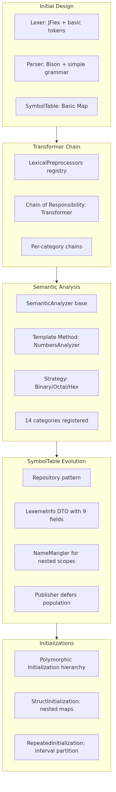

# Introducción

## Motivación

El estándar **IEC 61131-7** define los *Function Blocks* de Lógica Difusa (Fuzzy Logic Control — FCL) como una extensión del marco de lenguajes para controladores programables establecido en IEC 61131-3. Este estándar permite modelar sistemas de control basados en reglas difusas directamente en el entorno de programación del PLC, integrando bloques de fuzzificación, inferencia y defuzzificación junto con declaraciones de variables y tipos de datos del Anexo B de IEC 61131-3.

A pesar de su relevancia industrial, no existen compiladores de referencia abiertos que implementen la gramática completa de IEC 61131-7 junto con el Anexo B. Las herramientas comerciales suelen ser propietarias, cerradas y limitadas a subconjuntos del estándar. Esta tesis aborda esa brecha mediante el diseño, implementación y validación de un compilador FLC completo, generado a partir de especificaciones formales (JFlex para el análisis léxico, GNU Bison para el análisis sintáctico LALR(1)), con una arquitectura modular que prioriza la **mantenibilidad** como atributo de calidad principal.

## Objetivos

**Objetivo general:** Desarrollar un compilador para el lenguaje FCL definido en IEC 61131-7 que procese programas completos, realice análisis léxico y sintáctico, construya una tabla de símbolos semánticamente rica y reporte diagnósticos precisos.

**Objetivos específicos:**

1. Implementar un analizador léxico basado en JFlex que cubra todos los literales del Anexo B (numéricos, temporales, cadenas, identificadores, palabras reservadas) mediante cadenas de transformadores (Chain of Responsibility) y analizadores semánticos por categoría (Template Method, Strategy).
2. Implementar un analizador sintáctico LALR(1) basado en GNU Bison que cubra la gramática completa de IEC 61131-7 (bloques FUZZIFY, DEFUZZIFY, RULEBLOCK, OPTION) y declaraciones de variables/tipos del Anexo B.
3. Diseñar una tabla de símbolos (`SymbolTable`) con almacenamiento diferenciado por tipo de símbolo (SIMPLE, ARRAY, STRUCT, ENUMERATE, SUBRANGE) usando el patrón Repository y DTO inmutable (`LexemeInfo`).
4. Implementar resolución de nombres jerárquica mediante *name mangling* (`FB#TYPE#FIELD`) para ámbitos anidados (function_block, type, struct, array, enum).
5. Construir una jerarquía polimórfica de inicializaciones (`Initialization` y subclases) que modele valores por defecto, literales, estructuras anidadas, arrays con repetición y enumerados.
6. Establecer una estrategia de testing que garantice cobertura léxica, sintáctica y de tabla de símbolos, con métricas de calidad (CYCLO, LOC, coverage, acoplamiento).
7. Documentar la evolución arquitectónica desde el diseño inicial hasta la implementación final, justificando decisiones en función de la mantenibilidad.

## Alcance

El compilador implementa:

* **Análisis léxico:** 14 categorías léxicas con cadenas de transformadores dedicadas (6 transformadores para INTERVALS, 3 para REALS, 2 para NATURALS/INTEGERS/BINARY/OCTAL/HEXADECIMAL/STRINGS/WSTRINGS, 1 para IDENTIFIERS/DATES/DAYTIMES/DATE_AND_TIMES).
* **Análisis sintáctico:** Gramática Bison de 1445 líneas, 231 no-terminales, 4 tokens principales, 8 tipos de inicialización. Soporta bloques principales IEC 61131-7: `FUNCTION_BLOCK`, `FUZZIFY`, `DEFUZZIFY`, `RULEBLOCK`, `OPTION`, declaraciones `VAR_INPUT`, `VAR_OUTPUT`, `VAR`, `TYPE`, `END_TYPE`.
* **Tabla de símbolos:** 5 tipos de entrada (`Type` enum: SIMPLE, ARRAY, STRUCT, ENUMERATE, SUBRANGE), 24 subtipos primitivos (`Subtype`), 9 contextos de uso (`Use`), 7 fuentes de declaración (`Source`). Población diferida mediante patrón Publisher.
* **Diagnósticos:** 5 errores fatales (rangos temporales, construcción de intervalos) y 7 warnings (rangos numéricos, longitud de cadenas), jerarquía `Diagnostic → Error/Warning/SyntaxError`.

Fuera de alcance: generación de código objetivo, optimización, enlace, ejecución en PLC, y partes de IEC 61131-3 no relacionadas con el Anexo B (lenguajes IL, ST, LD, FBD, SFC).

## Ciclo de vida iterativo con única entrega

El desarrollo siguió un **ciclo de vida iterativo e incremental** con una única entrega final (single release), estructurado en cinco fases arquitectónicas que reflejan la evolución del sistema:

**Figura 1.1** — Evolución arquitectónica en cinco fases iterativas.

Cada fase entregó un incremento funcional verificable mediante tests de integración. La fase 1 estableció la tubería básica Lexer→Parser→SymbolTable. La fase 2 introdujo el preprocesamiento léxico normalizado. La fase 3 completó la validación semántica con diagnósticos. La fase 4 rediseñó la tabla de símbolos como repositorio tipado con publicación diferida. La fase 5 añadió la jerarquía de inicializaciones para soportar valores por defecto y sobrescritura anidada.

Este enfoque permitió validar decisiones arquitectónicas tempranas (elección de JFlex/Bison, patrón Repository, Chain of Responsibility) antes de comprometer la complejidad completa del estándar, reduciendo riesgo técnico y retrabajo.
