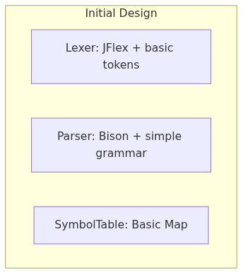

# Arquitectura planificada vs implementada

## Diseño inicial

La arquitectura planificada inicial (Fase 1) contemplaba una tubería básica de tres etapas:

**Figura 3.1** — Arquitectura inicial: tubería básica Lexer→Parser→SymbolTable.

Esta arquitectura contemplaba:
- **Lexer:** JFlex generando tokens básicos, sin preprocesamiento semántico.
- **Parser:** Bison con gramática reducida, acciones semánticas mínimas.
- **SymbolTable:** `Map<String, Object>` simple, sin tipado semántico.

## Evolución arquitectónica

La implementación real evolucionó a través de cinco fases iterativas:

### Fase 2: Transformer Chain — Preprocesamiento léxico
Se introdujo `LexicalPreprocessors` como registro de cadenas de `Transformer` por categoría léxica. Cada categoría tiene su cadena dedicada (6 transformadores para INTERVALS, 3 para REALS, etc.), implementando el patrón **Chain of Responsibility**. Esto permitió normalizar lexemas antes del análisis semántico (ej. `T#1.500s` → `T#1.5s`).

### Fase 3: Semantic Analysis — Análisis semántico
Se introdujo la jerarquía `SemanticAnalyzer` con **Template Method** (`NumbersAnalyzer` para decimales, `BaseNumbersAnalyzer` para bases) y **Strategy** (subclases por familia: `Naturals`, `Integers`, `Reals`, `Binary`, `Octal`, `Hexadecimal`, `Intervals`, `Dates`, etc.). 14 categorías léxicas registradas en `LexicalAnalyzers`. Cada analizador implementa `parse()`, `fallback()`, `createDiagnostic()`.

### Fase 4: SymbolTable Evolution — Repository pattern
La tabla de símbolos evolucionó de `Map<String, Object>` a un **Repository** tipado:
- `SymbolTable`: Repository con `put()`, `putIfAbsent()`, `get()`.
- `LexemeInfo`: DTO inmutable con 9 campos semánticos (`type`, `subtype`, `customType`, `use`, `source`, límites, `parameters`, `initialValue`).
- `LexemeInfoBuilder` + `Director`: Builder pattern para construcción fluida.
- `NameMangler`: Resolución de nombres compuestos (`FB#TYPE#FIELD`) con separador `#`.
- `Publisher`: Patrón Publisher para publicación atómica diferida (`Publisher.publish(ctx)`).

### Fase 5: Initializations — Jerarquía polimórfica
Jerarquía `Initialization` (Composite/Strategy) con 8 subclases:
- `VariableInitialization`, `BooleanInitialization`, `RealInitialization`
- `EnumeratedInitialization`, `MacroInitialization`, `SubrangeInitialization`
- `StructInitialization` (mapa recursivo `field → Initialization`)
- `RepeatedInitialization` (particiona arrays en intervalos `[start,end]`)

## Decisiones de diseño favoreciendo QA: Mantenibilidad

| Decisión                                      | Impacto en Mantenibilidad                                        |
|-----------------------------------------------|------------------------------------------------------------------|
| Repository pattern (SymbolTable)              | Punto único de verdad, desacopla consumidores                    |
| Builder + Director (LexemeInfo)               | Construcción consistente, evita estados inválidos                |
| Chain of Responsibility (Transformers)        | Transformaciones atómicas, reordenables, testeables aisladamente |
| Template Method + Strategy (SemanticAnalyzer) | Extensibilidad por familia numérica sin modificar base           |
| Publisher (publicación diferida)              | Separa construcción de metadatos de publicación atómica          |
| Name Mangling (#)                             | Tabla plana sin colisiones, resolución O(1)                      |
| Name Mangling jerárquico (3 instancias)       | Scopes anidados resueltos correctamente                          |
| Composite/Strategy (Initialization)           | Tratamiento uniforme de inicializaciones simples/compuestas      |
| Publisher pattern                             | Desacopla construcción de metadatos de publicación               |

## Métricas de la arquitectura implementada

| Métrica                                | Valor                                            |
|----------------------------------------|--------------------------------------------------|
| Paquetes principales                   | 4 (lexer, parser, utils, parser.initializations) |
| Clases/interfaces principales          | 67                                               |
| Líneas de código (LOC)                 | ~9,700                                           |
| Complejidad ciclomática promedio       | 2.2                                              |
| Cobertura de tests (JaCoCo)            | 85%                                              |
| Acoplamiento aferente/eferente (utils) | 2 / 0                                            |