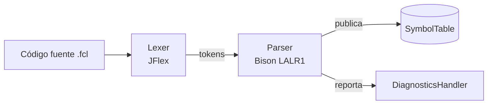

# Arquitectura del compilador

## Vista general

El compilador sigue una arquitectura monolítica de dos fases (léxica y
sintáctica) orquestada por el analizador sintáctico, con una tabla de
símbolos compartida como repositorio central de estado.

*Figura 3.1 — Pipeline de compilación (generado directamente a partir
del flujo implementado en `Lexer.processAndSaveYylval` y las acciones
semánticas de `Parser.y`).*

## Repositorio centralizado

El paquete `utils` concentra el estado compartido entre fases:

| Componente | Responsabilidad |
|---|---|
| `SymbolTable` | Mapa lexema → `LexemeInfo`, con `putIfAbsent` para no pisar literales ya registrados y `put` para variables (que sí pueden redeclararse en un nuevo scope mangled) |
| `LexemeInfo` | DTO inmutable con los 9 atributos semánticos de un lexema: `type`, `subtype`, `customType`, `use`, `source`, límites, `parameters`, `initialValue` |
| `LexemeInfoBuilder` / `LexemeInfoSchema` | Builder fluido que las acciones de la gramática usan para ir completando un `LexemeInfo` a medida que se reducen reglas |
| `DiagnosticsHandler` | Colector de `Diagnostic` (errores y warnings) con un flag `hasErrors()` que decide si la compilación es válida |

## Resolución de nombres compuestos

`parser.internals.NameMangler` concatena scopes con el separador `#`
(por ejemplo `COLOR_TYPE#BROWN` para el campo `brown` de una estructura
`color_type`, o `MAIN#DEFUZZ_METHOD` para una variable dentro del bloque
`main`). Esto permite mantener una única tabla `HashMap<String,
LexemeInfo>` plana sin colisiones entre identificadores homónimos en
distintos contextos.

`parser.internals.ContextHandler` mantiene una pila de `ParsingContext`
(uno por scope activo: bloque de tipo, campo de estructura, elemento de
arreglo, etc.), cada uno con su propio `LexemeInfoBuilder`, su lista de
identificadores declarados pendientes de publicar y sus tres
`NameMangler` independientes (`outerScopes`, `searchScope`,
`nestedFields`), según el rol que cumplan en la resolución.
