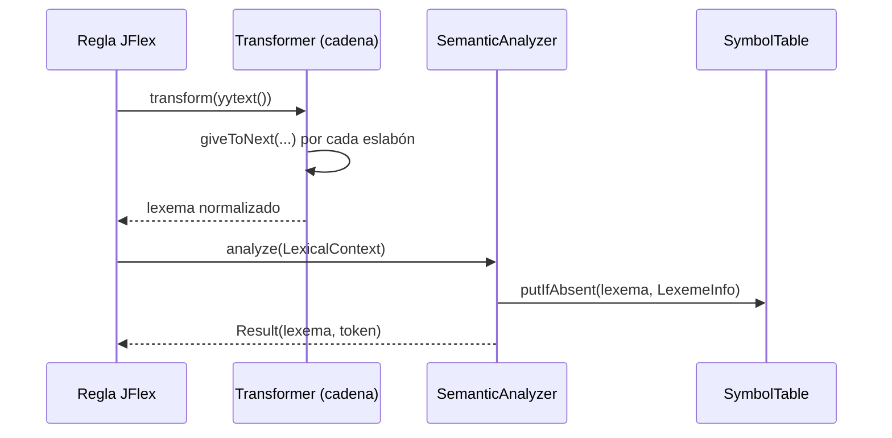

# Análisis léxico

## Pipeline por lexema

`Lexer.processAndSaveYylval(Transformer, SemanticAnalyzer)` es el punto
único por el que pasa todo lexema no trivial (números, cadenas,
identificadores, literales temporales). Primero lo transforma, después
lo analiza semánticamente:

## Cadena de transformadores por familia de lexema

Cada familia de literal tiene su propia cadena de `Transformer`
(`lexer.internals.LexicalPreprocessors`), con largo variable según
cuántas normalizaciones necesita:

*Figura 4.1.* Los literales de intervalo (`INTERVALS`) son los que más
normalización requieren: remoción de guiones bajos, conversión a
mayúsculas, y cuatro pasos de eliminación de ceros no significativos
(líderes y finales, en la parte entera y en la decimal) para que, por
ejemplo, `T#1.500s` y `T#1.5s` se registren como el mismo lexema en la
tabla de símbolos.

### Detalle de las cadenas de transformadores

| Categoría | Transformadores (en orden) |
|-----------|----------------------------|
| `INTERVALS` | `UnderscoreRemover` → `UpperCaseConverter` → `OmitLeadingZeroMagnitudes` → `OmitTrailingZeroMagnitudes` → `OmitLeadingZerosInMagnitudes` → `OmitTrailingZerosInMagnitudes` |
| `REALS` | `UnderscoreRemover` → `StripTrailingZeros` → `StripLeadingZeros` |
| `NATURALS`, `INTEGERS` | `UnderscoreRemover` → `StripLeadingZeros` |
| `BINARY`, `OCTAL`, `HEXADECIMAL` | `UnderscoreRemover` → `StripBaseNumberLeadingZeros` |
| `STRINGS` | `StringHexResolver` → `StringEscapeResolver` |
| `WSTRINGS` | `WStringHexResolver` (4 dígitos) → `StringEscapeResolver` |
| `IDENTIFIERS` | `UpperCaseConverter` |
| `DATES`, `DAYTIMES`, `DATE_AND_TIMES` | *(ninguno - `Nothing`)* |

El patrón **Chain of Responsibility** permite componer transformaciones
atómicas y reutilizables. Cada `Transformer` decide si modifica el
lexema y si delega al siguiente eslabón vía `giveToNext()`.

## Analizadores semánticos numéricos

`lexer.semantics.numbers.NumbersAnalyzer` es la clase base abstracta
(patrón *Template Method* + *Strategy*) para `Naturals`, `Integers` y
`Reals`, y para los literales con base (`Binary`, `Octal`,
`Hexadecimal`, vía `BaseNumbersAnalyzer`). Cada subclase implementa:

- `parse(lexeme)`: intenta interpretar el lexema y determinar el
  subtipo más chico que lo puede representar (por ejemplo, `255` es
  `USINT`, pero `256` ya es `UINT`).
- `fallback(lexeme)`: valor de reemplazo cuando el lexema excede el
  rango representable (por ejemplo, un literal más grande que
  `ULINT_MAX` se trunca a `18446744073709551615` con un
  `NaturalOutOfRange`).
- `createDiagnostic(line, lexeme)`: el diagnóstico concreto a reportar.

Los analizadores se registran en `lexer.internals.LexicalAnalyzers` y
cubren 14 categorías léxicas: 3 de fecha/hora, 1 de intervalos, 7
numéricas (3 decimales + 4 con base), 2 de cadenas, y 1 de
identificadores.

## Diagnósticos: error vs. warning

El compilador distingue diagnósticos fatales (`Error`, detienen la
compilación) de no fatales (`Warning`, se reporta y se sigue con un
valor de reemplazo):

*Figura 4.2.* Los desbordamientos numéricos (natural, entero, real,
binario, octal, hexadecimal) son `Warning`: el lexer siempre puede
seguir con un valor de reemplazo bien definido. Los literales
temporales inválidos (fecha, hora, intervalo mal formado) son `Error`,
porque no existe un valor de reemplazo semánticamente razonable.

### Clasificación actual

| Severidad | Diagnósticos |
|-----------|--------------|
| **Error** (6) | `DateOutOfRange`, `IntervalConstructionError`, `IntervalOutOfRange`, `TimeOfDayOutOfRange`, `DateAndTimeOutOfRange`, `SyntaxError` |
| **Warning** (7) | `StringLengthWarning`, `HexadecimalOutOfRange`, `RealOutOfRange`, `NaturalOutOfRange`, `BinaryOutOfRange`, `OctalOutOfRange`, `IntegerOutOfRange` |
