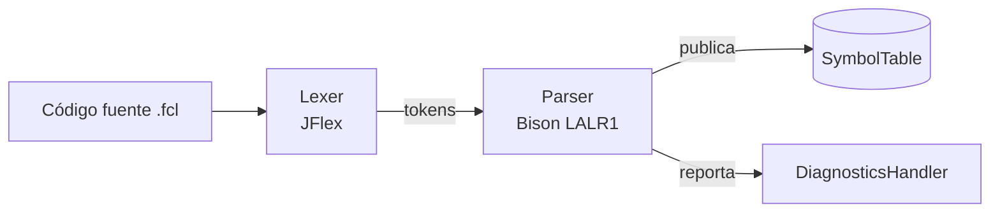
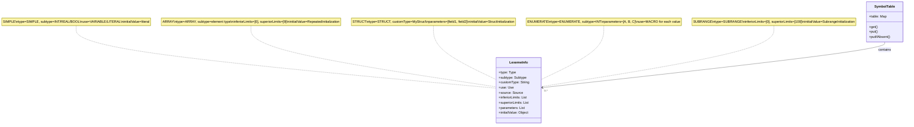

# Arquitectura implementada

## Vista general

El compilador sigue una arquitectura monolítica de dos fases (léxica y sintáctica) orquestada por el analizador sintáctico, con una tabla de símbolos compartida como repositorio central de estado.



**Figura 4.1** — Pipeline de compilación (generado directamente a partir del flujo implementado en `Lexer.processAndSaveYylval` y las acciones semánticas de `Parser.y`).

## Repositorio centralizado

El paquete `utils` concentra el estado compartido entre fases:

| Componente                               | Responsabilidad                                                                                                                                                    |
|------------------------------------------|--------------------------------------------------------------------------------------------------------------------------------------------------------------------|
| `SymbolTable`                            | Mapa lexema → `LexemeInfo`, con `putIfAbsent` para no pisar literales ya registrados y `put` para variables (que sí pueden redeclararse en un nuevo scope mangled) |
| `LexemeInfo`                             | DTO inmutable con los 9 atributos semánticos de un lexema: `type`, `subtype`, `customType`, `use`, `source`, límites, `parameters`, `initialValue`                 |
| `LexemeInfoBuilder` / `LexemeInfoSchema` | Builder fluido que las acciones de la gramática usan para ir completando un `LexemeInfo` a medida que se reducen reglas                                            |
| `DiagnosticsHandler`                     | Colector de `Diagnostic` (errores y warnings) con un flag `hasErrors()` que decide si la compilación es válida                                                     |

```mermaid
flowchart TD
    A[Lexer] -->|Tokens + Diagnósticos| B[SymbolTable]
    C[Parser] -->|Publica LexemeInfo| B
    C -->|Reporta errores| D[DiagnosticsHandler]
    B --> E[LexemeInfo\n(DTO inmutable)]
    F[LexemeInfoBuilder] -->|Construye| E
    G[Director] -->|Recetas| F
    H[Type/Subtype/Use/Source] -->|Clasifican| E
```

**Figura 4.2** — Arquitectura del módulo `utils` (Repository pattern).

## Resolución de nombres compuestos

`parser.internals.NameMangler` concatena scopes con el separador `#` (por ejemplo `COLOR_TYPE#BROWN` para el campo `brown` de una estructura `color_type`, o `MAIN#DEFUZZ_METHOD` para una variable dentro del bloque `main`). Esto permite mantener una única tabla `HashMap<String, LexemeInfo>` plana sin colisiones entre identificadores homónimos en distintos contextos.

`parser.internals.ContextHandler` mantiene una pila de `ParsingContext` (uno por scope activo: bloque de tipo, campo de estructura, elemento de arreglo, etc.), cada uno con su propio `LexemeInfoBuilder`, su lista de identificadores declarados pendientes de publicar y sus tres `NameMangler` independientes (`outerScopes`, `searchScope`, `nestedFields`), según el rol que cumplan en la resolución.

## Almacenamiento en SymbolTable por tipo

Cada entrada en la `SymbolTable` es un `LexemeInfo` completo. Los campos relevantes varían según el `Type`:

| Type      | Subtype                     | Campos relevantes                                                                          | Ejemplo `initialValue`              |
|-----------|-----------------------------|--------------------------------------------------------------------------------------------|-------------------------------------|
| SIMPLE    | INT, REAL, BOOL, TIME, etc. | subtype, initialValue                                                                      | `10`, `0.0`, `FALSE`                |
| ENUMERATE | INT                         | parameters=[A,B,C], use=MACRO para cada valor                                              | Cada valor publicado por separado   |
| SUBRANGE  | INT, etc.                   | inferiorLimits, superiorLimits                                                             | `0..100`                            |
| ARRAY     | element type                | inferiorLimits, superiorLimits, initialValue=RepeatedInitialization                        | `ARRAY[0..9] OF INT := 5(0), 3(10)` |
| STRUCT    | CUSTOM                      | parameters=nombres de campo, initialValue=StructInitialization (mapa campo→Initialization) | `STRUCT(a:=10, b:=20)`              |



**Figura 4.3** — Estructura de almacenamiento en SymbolTable por tipo de símbolo.

## Flujo de publicación — Patrón Publisher

`parser.utils.Publisher.publish(ParsingContext)` es el único punto que efectivamente escribe en la tabla de símbolos: toma el `LexemeInfo` construido en el contexto activo y lo asocia, para cada identificador declarado en `ctx.declaredIdentifiers()`, a su nombre mangled (`ctx.outerScopes().getNameMangled(identifier)`). Esto separa completamente la *construcción* incremental de metadatos (que ocurre a lo largo de muchas reglas reducidas) de su *publicación* atómica.

## Diagnósticos: error vs. warning

El compilador distingue diagnósticos fatales (`Error`, detienen la compilación) de no fatales (`Warning`, se reporta y se sigue con un valor de reemplazo):

| Severidad       | Diagnósticos                                                                                                                                      |
|-----------------|---------------------------------------------------------------------------------------------------------------------------------------------------|
| **Error** (6)   | `DateOutOfRange`, `IntervalConstructionError`, `IntervalOutOfRange`, `TimeOfDayOutOfRange`, `DateAndTimeOutOfRange`, `SyntaxError`                |
| **Warning** (7) | `StringLengthWarning`, `HexadecimalOutOfRange`, `RealOutOfRange`, `NaturalOutOfRange`, `BinaryOutOfRange`, `OctalOutOfRange`, `IntegerOutOfRange` |

Los desbordamientos numéricos son `Warning`: el lexer siempre puede seguir con un valor de reemplazo bien definido. Los literales temporales inválidos son `Error`: no existe un valor de reemplazo semánticamente razonable.