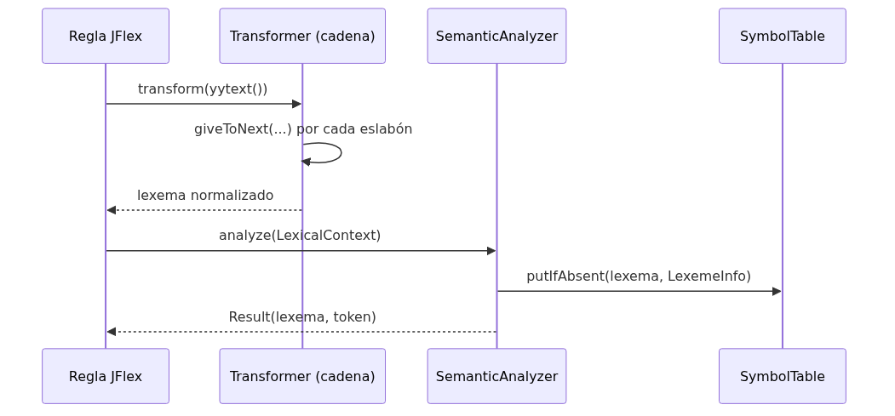
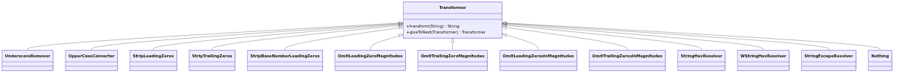
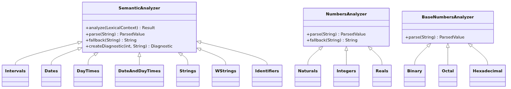
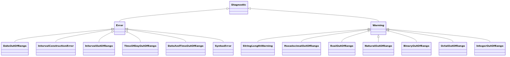

# Análisis léxico

## Pipeline por lexema

`Lexer.processAndSaveYylval(Transformer, SemanticAnalyzer)` es el punto único por el que pasa todo lexema no trivial (números, cadenas, identificadores, literales temporales). Primero lo transforma, después lo analiza semánticamente:



## Cadena de transformadores por familia de lexema

Cada categoría de literal tiene su propia cadena de `Transformer` (`lexer.internals.LexicalPreprocessors`), con largo variable según cuántas normalizaciones necesita:

| Categoría                             | Transformadores (en orden)                                                                                                                                                 |
|---------------------------------------|----------------------------------------------------------------------------------------------------------------------------------------------------------------------------|
| `INTERVALS`                           | `UnderscoreRemover` → `UpperCaseConverter` → `OmitLeadingZeroMagnitudes` → `OmitTrailingZeroMagnitudes` → `OmitLeadingZerosInMagnitudes` → `OmitTrailingZerosInMagnitudes` |
| `REALS`                               | `UnderscoreRemover` → `StripTrailingZeros` → `StripLeadingZeros`                                                                                                           |
| `NATURALS`, `INTEGERS`                | `UnderscoreRemover` → `StripLeadingZeros`                                                                                                                                  |
| `BINARY`, `OCTAL`, `HEXADECIMAL`      | `UnderscoreRemover` → `StripBaseNumberLeadingZeros`                                                                                                                        |
| `STRINGS`                             | `StringHexResolver` → `StringEscapeResolver`                                                                                                                               |
| `WSTRINGS`                            | `WStringHexResolver` (4 dígitos) → `StringEscapeResolver`                                                                                                                  |
| `IDENTIFIERS`                         | `UpperCaseConverter`                                                                                                                                                       |
| `DATES`, `DAYTIMES`, `DATE_AND_TIMES` | *(ninguno — `Nothing`)*                                                                                                                                                    |

El patrón **Chain of Responsibility** permite componer transformaciones atómicas y reutilizables. Cada `Transformer` decide si modifica el lexema y si delega al siguiente eslabón vía `giveToNext()`.



**Figura 5.1** — Jerarquía de transformadores (Chain of Responsibility).

## Analizadores semánticos numéricos

`lexer.semantics.numbers.NumbersAnalyzer` es la clase base abstracta (patrón *Template Method* + *Strategy*) para `Naturals`, `Integers` y `Reals`, y para los literales con base (`Binary`, `Octal`, `Hexadecimal`, vía `BaseNumbersAnalyzer`). Cada subclase implementa:

* `parse(lexeme)`: intenta interpretar el lexema y determinar el subtipo más chico que lo puede representar (por ejemplo, `255` es `USINT`, pero `256` ya es `UINT`).
* `fallback(lexeme)`: valor de reemplazo cuando el lexema excede el rango representable (por ejemplo, un literal más grande que `ULINT_MAX` se trunca a `18446744073709551615` con un `NaturalOutOfRange`).
* `createDiagnostic(line, lexeme)`: el diagnóstico concreto a reportar.

Los analizadores se registran en `lexer.internals.LexicalAnalyzers` y cubren 14 categorías léxicas: 3 de fecha/hora, 1 de intervalos, 7 numéricas (3 decimales + 4 con base), 2 de cadenas, y 1 de identificadores.



## Diagnósticos: error vs. warning

El compilador distingue diagnósticos fatales (`Error`, detienen la compilación) de no fatales (`Warning`, se reporta y se sigue con un valor de reemplazo):

| Severidad       | Diagnósticos                                                                                                                                      |
|-----------------|---------------------------------------------------------------------------------------------------------------------------------------------------|
| **Error** (6)   | `DateOutOfRange`, `IntervalConstructionError`, `IntervalOutOfRange`, `TimeOfDayOutOfRange`, `DateAndTimeOutOfRange`, `SyntaxError`                |
| **Warning** (7) | `StringLengthWarning`, `HexadecimalOutOfRange`, `RealOutOfRange`, `NaturalOutOfRange`, `BinaryOutOfRange`, `OctalOutOfRange`, `IntegerOutOfRange` |

* **Error (fatal)**: detiene la compilación. No hay valor de reemplazo semánticamente razonable (literales temporales mal formados).
* **Warning (no fatal)**: se reporta y se sigue con valor de reemplazo bien definido (desbordamientos numéricos).



## Punto de integración único

`Lexer.processAndSaveYylval(Transformer, SemanticAnalyzer)` es el punto único por el que pasa todo lexema no trivial:

```java
public int processAndSaveYylval(@NonNull Transformer transformer, @NonNull SemanticAnalyzer analyzer) {
    String preprocessedLexeme = transformer.transform(yytext());
    SemanticAnalyzer.LexicalContext lexicalContext = new SemanticAnalyzer.LexicalContext(
            preprocessedLexeme, yyline + 1, this.symbolTable, this.diagnosticsHandler);
    SemanticAnalyzer.Result result = analyzer.analyze(lexicalContext);
    this.yylval = result.lexeme;
    return result.token;
}
```

1. **Transforma** el lexema crudo (`yytext()`) con la cadena de `Transformer` correspondiente
2. **Analiza semánticamente** con el `SemanticAnalyzer` registrado
3. **Registra** `LexemeInfo` en `SymbolTable` (vía `putIfAbsent`)
4. **Retorna** token al parser; guarda lexema normalizado en `yylval`

## Tokens y palabras clave

El analizador léxico reconoce 22 palabras clave FCL, 25 palabras clave Anexo B, 20 tipos elementales, 4 literales, y 8 operadores/símbolos (116 no-terminales en la gramática).

## Cómo probarlo

```bash
# Tests unitarios del lexer — ejemplos FCL en src/test/resources/examples
./gradlew test --tests unit.lexer.LexerTest

# Tests de transformadores
./gradlew test --tests unit.lexer.transformers.*

# Tests de analizadores semánticos
./gradlew test --tests unit.lexer.semantics.*
```

Clase de soporte: `utils.ParserTestSupport` (configura lexer + parser + symbol table + diagnostics handler).
