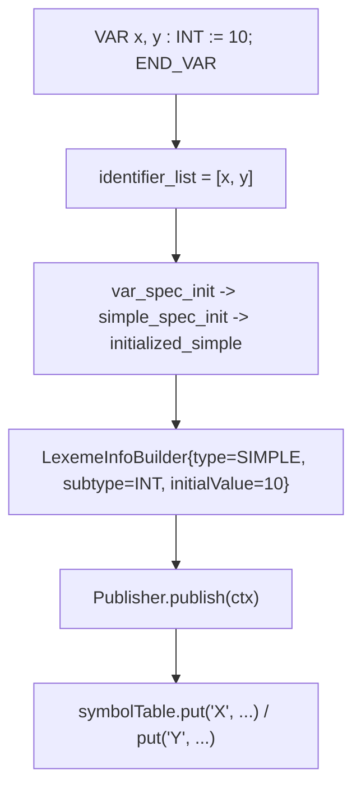

# Análisis sintáctico y resolución semántica

## Gramática

La gramática (`src/main/java/parser/Parser.y`) reconoce dos grandes
bloques: la declaración de tipos (`TYPE ... END_TYPE`, no terminal
`data_type_declaration`) y la declaración de un `FUNCTION_BLOCK`
completo, con sus variables, bloques de fuzzificación/defuzzificación y
bloque de reglas.

## Flujo de declaración de variables

*Figura 5.1 — Flujo de una declaración simple, tal como lo ejecutan las
reglas `var_init_decl` y `Publisher.publish`.*

## El patrón Publisher

`parser.utils.Publisher.publish(ParsingContext)` es el único punto que
efectivamente escribe en la tabla de símbolos: toma el `LexemeInfo`
construido en el contexto activo y lo asocia, para cada identificador
declarado en `ctx.declaredIdentifiers()`, a su nombre mangled
(`ctx.outerScopes().getNameMangled(identifier)`). Esto separa
completamente la *construcción* incremental de metadatos (que ocurre a
lo largo de muchas reglas reducidas) de su *publicación* atómica.

## Tipos derivados

| Construcción FCL | No terminal principal | Resultado en `LexemeInfo` |
|---|---|---|
| `(A, B, C)` | `enumerated_specification` | `type=ENUMERATE`, `subtype=INT`, `parameters=[A,B,C]`, cada valor publicado aparte con `use=MACRO` |
| `INT (0..100)` | `subrange_specification` | `type=SUBRANGE`, límites en `inferiorLimits`/`superiorLimits` |
| `STRUCT ... END_STRUCT` | `structure_specification` | `type=STRUCT`, `parameters` = nombres de campo, `initialValue` un `StructInitialization` (mapa campo → inicialización) |
| `ARRAY [0..9] OF T` | `array_specification` | `type=ARRAY`, `initialValue` un `RepeatedInitialization` particionado en intervalos disjuntos |

## Inicializaciones como jerarquía polimórfica

Todas las formas de inicializar un valor implementan la interfaz
`parser.initializations.Initialization` (`selectVariable`,
`getVariableValue`, `copy`): `VariableInitialization` (un literal
concreto), `MacroInitialization` (valor ordinal de un enumerado),
`SubrangeInitialization`, `StructInitialization` (mapa recursivo,
soporta structs anidados vía claves compuestas `RGB#GAMMA_R`) y
`RepeatedInitialization` (particiona un arreglo en intervalos
`[start,end]` disjuntos, cada uno con su propia `Initialization`, y los
compacta automáticamente cuando dos intervalos adyacentes terminan con
el mismo valor).

## Clasificación semántica final

El sistema de tipos completo (`Type`, `Subtype`, `Use`, `Source`) tiene
el siguiente tamaño, contado directamente sobre los archivos de enum:

*Figura 5.2.* `Subtype` concentra la mayor variedad porque incluye,
además de los tipos elementales de IEC 61131-3 Anexo B, los valores de
control internos (`CUSTOM`, `NONE`, `UNKNOWN`) usados para tipos
definidos por el usuario y literales sin clasificar.
