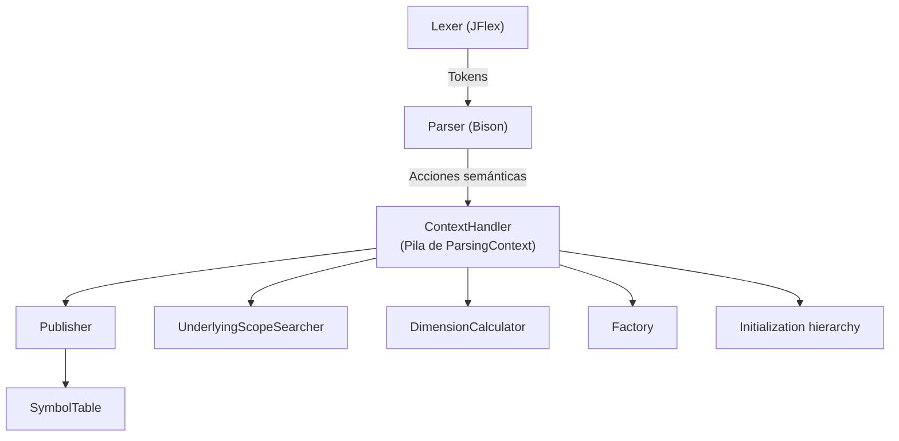
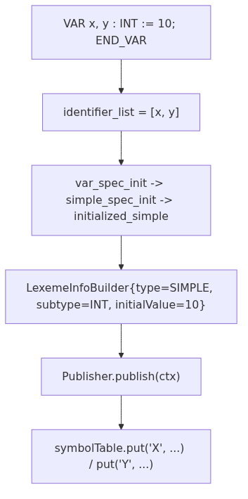
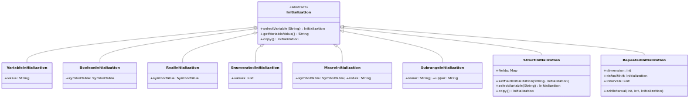

# Análisis sintáctico y resolución semántica

## Gramática

La gramática (`src/main/java/parser/Parser.y`) reconoce dos grandes bloques: la declaración de tipos (`TYPE ... END_TYPE`, no terminal `data_type_declaration`) y la declaración de un `FUNCTION_BLOCK` completo, con sus variables, bloques de fuzzificación/defuzzificación y bloque de reglas.



**Figura 6.1** — Flujo principal del parser (generado a partir de `Parser.y`).

## Flujo de declaración de variables



**Figura 6.1** — Flujo de una declaración simple, tal como lo ejecutan las reglas `var_init_decl` y `Publisher.publish`.

## El patrón Publisher

`parser.utils.Publisher.publish(ParsingContext)` es el único punto que efectivamente escribe en la tabla de símbolos: toma el `LexemeInfo` construido en el contexto activo y lo asocia, para cada identificador declarado en `ctx.declaredIdentifiers()`, a su nombre mangled (`ctx.outerScopes().getNameMangled(identifier)`). Esto separa completamente la *construcción* incremental de metadatos (que ocurre a lo largo de muchas reglas reducidas) de su *publicación* atómica.

## Tipos derivados

| Construcción FCL        | No terminal principal      | Resultado en `LexemeInfo`                                                                                              |
|-------------------------|----------------------------|------------------------------------------------------------------------------------------------------------------------|
| `(A, B, C)`             | `enumerated_specification` | `type=ENUMERATE`, `subtype=INT`, `parameters=[A,B,C]`, cada valor publicado aparte con `use=MACRO`                     |
| `INT (0..100)`          | `subrange_specification`   | `type=SUBRANGE`, límites en `inferiorLimits`/`superiorLimits`                                                          |
| `STRUCT ... END_STRUCT` | `structure_specification`  | `type=STRUCT`, `parameters` = nombres de campo, `initialValue` un `StructInitialization` (mapa campo → inicialización) |
| `ARRAY [0..9] OF T`     | `array_specification`      | `type=ARRAY`, `initialValue` un `RepeatedInitialization` particionado en intervalos disjuntos                          |

## Inicializaciones como jerarquía polimórfica

Todas las formas de inicializar un valor implementan la interfaz `parser.initializations.Initialization` (`selectVariable`, `getVariableValue`, `copy`): `VariableInitialization` (un literal concreto), `MacroInitialization` (valor ordinal de un enumerado), `SubrangeInitialization`, `StructInitialization` (mapa recursivo, soporta structs anidados vía claves compuestas `RGB#GAMMA_R`) y `RepeatedInitialization` (particiona un arreglo en intervalos `[start,end]` disjuntos, cada uno con su propia `Initialization`, y los compacta automáticamente cuando dos intervalos adyacentes terminan con el mismo valor).



## Parser internals

### ContextHandler
Mantiene una pila LIFO de `ParsingContext` para scopes anidados.

### ParsingContext
Estado por scope: identificadores, `LexemeInfoBuilder`, 3 `NameMangler` independientes (`outerScopes`, `searchScope`, `nestedFields`), índice de array.

### NameMangler
Genera claves calificadas (`TYPE#FIELD#VALUE`) con separador `#`. Tres instancias por contexto: `outerScopes`, `searchScope`, `nestedFields`.

### Publisher
Publica identificadores declarados en la `SymbolTable` con nombre mangled.

### Factory
Crea inicializaciones por defecto para tipos primitivos (solo `REAL` hoy).

### UnderlyingScopeSearcher
Resuelve cadena de alias de tipo custom hasta la definición raíz.

### DimensionCalculator
Calcula dimensión total de arrays multi-dimensionales.

## Gramática soportada — resumen

### Bloques principales IEC 61131-7
```
program → opt_data_type_declaration function_block_declaration

function_block_declaration → FUNCTION_BLOCK name
    opt_fb_io_var_declarations_list   (VAR_INPUT / VAR_OUTPUT)
    opt_other_var_declarations_list   (VAR)
    opt_function_block_body
    END_FUNCTION_BLOCK

opt_function_block_body → opt_fuzzify_block_list
    opt_defuzzify_block_list
    opt_rule_block_list
    opt_option_block_list
```

### Fuzzify / Defuzzify
```
fuzzify_block → FUZZIFY IDENTIFIER linguistic_term_list END_FUZZIFY
linguistic_term → TERM IDENTIFIER := (IDENTIFIER | membership_function) ';'
membership_function → singleton | point_list
point_list → point (',' point)*
point → '(' numeric_constant ',' numeric_constant ')'
        | '(' IDENTIFIER ',' numeric_constant ')'

defuzzify_block → DEFUZZIFY IDENTIFIER
    opt_range
    opt_linguistic_term_list
    defuzzification_method
    default_value
    END_DEFUZZIFY
defuzz_method → COG | COGS | COA | LM | RM
```

### Rule Block
```
rule_block → RULEBLOCK IDENTIFIER
    operator_definition
    activation_method_opt
    accumulation_method
    rule_list
    END_RULEBLOCK

operator_definition → [OR ':' or_type] [AND ':' and_type] ';'
or_type → MAX | ASUM | BSUM
and_type → MIN | PROD | BDIF
activation_method → ACT ':' (PROD | MIN) ';'
accumulation_method → ACCU ':' (MAX | BSUM | NSUM) ';'

rule → RULE numeric_constant ':' IF condition THEN conclusion_list [WITH weight] ';'
condition → x condition_tail | IDENTIFIER condition_tail
x → NOT x | NOT IDENTIFIER | subcondition | '(' condition ')'
subcondition → IDENTIFIER IS IDENTIFIER | IDENTIFIER IS NOT IDENTIFIER
conclusion_list → IDENTIFIER [IS IDENTIFIER] (',' IDENTIFIER [IS IDENTIFIER])*
```

### Declaraciones de variables — Anexo B IEC 61131-3
```
var_declarations → var_id_decl var_constant_spec var_init_decl_list ';' END_VAR
var_id_decl → VAR { source=INTERNAL, use=VARIABLE }
io_var_decl → VAR_INPUT { source=IN, use=VARIABLE }
           | VAR_OUTPUT { source=OUT, use=VARIABLE }

var_init_decl → identifier_list ':' var_spec_init  { Publisher.publish(ctx) }
var_spec_init → custom_spec_init | boolean_spec_init | simple_spec_init
            | subrange_spec_init | enumerated_spec_init | array_spec_init | string_spec_init
```

### Tipos de datos
```
simple_specification → elementary_type_name  { subtype ∈ {SINT..ULINT, REAL, LREAL, TIME, DATE, ...} }
custom_specification → IDENTIFIER  { subtype=CUSTOM, customType=IDENTIFIER }
subrange_specification → subrange_type_decl '(' range ')'
range → numeric_constant '..' numeric_constant
enumerated_specification → '(' enumerated_values_list ')'
array_specification → ARRAY '[' range_list ']' OF (IDENTIFIER | non_generic_type_name)
structure_specification → STRUCT structure_field_declaration_list END_STRUCT
string_specification → STRING | WSTRING [ '[' numeric_constant ']' ]
```

### Inicializaciones
```
initialized_simple → simple_specification ':=' constant
initialized_custom → custom_type_name ':=' (constant | identifier_with_opt_mangling | structure_initialization)
initialized_boolean → boolean_specification ':=' boolean_constant
initialized_subrange → subrange_specification ':=' numeric_constant
initialized_enumerated → enumerated_specification ':=' identifier_with_opt_mangling
initialized_array → array_specification ':=' array_initialization
array_initialization → '[' array_initial_elements_list ']'
array_initial_elements → constant | identifier_with_opt_mangling | structure_initialization | array_initialization
repeated_initial_element → numeric_constant '(' array_initial_element ')'
structure_initialization → '(' structure_field_initialization_list ')'
initialized_structure_field → nested_field ':=' (constant | identifier_with_opt_mangling | array_initialization | structure_initialization)
nested_field → IDENTIFIER ('.' IDENTIFIER)*
```

### Declaración de tipos de datos
```
data_type_declaration → type_id_decl type_declaration_list END_TYPE
type_id_decl → TYPE { use=TYPE }
type_declaration → type_name_declaration ':' type_spec_init { Publisher.publish(ctx); outerScopes.popScope() }
type_spec_init → custom_spec_init | simple_spec_init | enumerated_spec_init | subrange_spec_init | array_spec_init | structure_specification | string_spec_init
```

### Inicializaciones
```
initialized_simple → simple_specification ':=' constant
initialized_custom → custom_type_name ':=' (constant | identifier_with_opt_mangling | structure_initialization)
initialized_boolean → boolean_specification ':=' boolean_constant
initialized_subrange → subrange_specification ':=' numeric_constant
initialized_enumerated → enumerated_specification ':=' identifier_with_opt_mangling
initialized_array → array_specification ':=' array_initialization
array_initialization → '[' array_initial_elements_list ']'
array_initial_elements → constant | identifier_with_opt_mangling | structure_initialization | array_initialization
repeated_initial_element → numeric_constant '(' array_initial_element ')'
structure_initialization → '(' structure_field_initialization_list ')'
initialized_structure_field → nested_field ':=' (constant | identifier_with_opt_mangling | array_initialization | structure_initialization)
nested_field → IDENTIFIER ('.' IDENTIFIER)*
```

### Declaración de tipos de datos
```
data_type_declaration → type_id_decl type_declaration_list END_TYPE
type_id_decl → TYPE { use=TYPE }
type_declaration → type_name_declaration ':' type_spec_init { Publisher.publish(ctx); outerScopes.popScope() }
type_spec_init → custom_spec_init | simple_spec_init | enumerated_spec_init | subrange_spec_init | array_spec_init | structure_spec_init | string_spec_init
```

### Inicializaciones
```
initialized_simple → simple_specification ':=' constant
initialized_custom → custom_type_name ':=' (constant | identifier_with_opt_mangling | structure_initialization)
initialized_boolean → boolean_specification ':=' boolean_constant
initialized_subrange → subrange_specification ':=' numeric_constant
initialized_enumerated → enumerated_specification ':=' identifier_with_opt_mangling
initialized_array → array_specification ':=' array_initialization
array_initialization → '[' array_initial_elements_list ']'
array_initial_elements → constant | identifier_with_opt_mangling | structure_initialization | array_initialization
repeated_initial_element → numeric_constant '(' array_initial_element ')'
structure_initialization → '(' structure_field_initialization_list ')'
initialized_structure_field → nested_field ':=' (constant | identifier_with_opt_mangling | array_initialization | structure_initialization)
nested_field → IDENTIFIER ('.' IDENTIFIER)*
```

### Declaración de tipos de datos
```
data_type_declaration → type_id_decl type_declaration_list END_TYPE
type_id_decl → TYPE { use=TYPE }
type_declaration → type_name_declaration ':' type_spec_init { Publisher.publish(ctx); outerScopes.popScope() }
type_spec_init → custom_spec_init | simple_spec_init | enumerated_spec_init | subrange_spec_init | array_spec_init | structure_spec_init | string_spec_init
```

### Inicializaciones
```
initialized_simple → simple_specification ':=' constant
initialized_custom → custom_type_name ':=' (constant | identifier_with_opt_mangling | structure_initialization)
initialized_boolean → boolean_specification ':=' boolean_constant
initialized_subrange → subrange_specification ':=' numeric_constant
initialized_enumerated → enumerated_specification ':=' identifier_with_opt_mangling
initialized_array → array_specification ':=' array_initialization
array_initialization → '[' array_initial_elements_list ']'
array_initial_elements → constant | identifier_with_opt_mangling | structure_initialization | array_initialization
repeated_initial_element → numeric_constant '(' array_initial_element ')'
structure_initialization → '(' structure_field_initialization_list ')'
initialized_structure_field → nested_field ':=' (constant | identifier_with_opt_mangling | array_initialization | structure_initialization)
nested_field → IDENTIFIER ('.' IDENTIFIER)*
```

### Declaración de tipos de datos
```
data_type_declaration → type_id_decl type_declaration_list END_TYPE
type_id_decl → TYPE { use=TYPE }
type_declaration → type_name_declaration ':' type_spec_init { Publisher.publish(ctx); outerScopes.popScope() }
type_spec_init → custom_spec_init | simple_spec_init | enumerated_spec_init | subrange_spec_init | array_spec_init | structure_spec_init | string_spec_init
```

### Inicializaciones
```
initialized_simple → simple_specification ':=' constant
initialized_custom → custom_type_name ':=' (constant | identifier_with_opt_mangling | structure_initialization)
initialized_boolean → boolean_specification ':=' boolean_constant
initialized_subrange → subrange_specification ':=' numeric_constant
initialized_enumerated → enumerated_specification ':=' identifier_with_opt_mangling
initialized_array → array_specification ':=' array_initialization
array_initialization → '[' array_initial_elements_list ']'
array_initial_elements → constant | identifier_with_opt_mangling | structure_initialization | array_initialization
repeated_initial_element → numeric_constant '(' array_initial_element ')'
structure_initialization → '(' structure_field_initialization_list ')'
initialized_structure_field → nested_field ':=' (constant | identifier_with_opt_mangling | array_initialization | structure_initialization)
nested_field → IDENTIFIER ('.' IDENTIFIER)*
```

### Declaración de tipos de datos
```
data_type_declaration → type_id_decl type_declaration_list END_TYPE
type_id_decl → TYPE { use=TYPE }
type_declaration → type_name_declaration ':' type_spec_init { Publisher.publish(ctx); outerScopes.popScope() }
type_spec_init → custom_spec_init | simple_spec_init | enumerated_spec_init | subrange_spec_init | array_spec_init | structure_spec_init | string_spec_init
```

### Inicializaciones
```
initialized_simple → simple_specification ':=' constant
initialized_custom → custom_type_name ':=' (constant | identifier_with_opt_mangling | structure_initialization)
initialized_boolean → boolean_specification ':=' boolean_constant
initialized_subrange → subrange_specification ':=' numeric_constant
initialized_enumerated → enumerated_specification ':=' identifier_with_opt_mangling
initialized_array → array_specification ':=' array_initialization
array_initialization → '[' array_initial_elements_list ']'
array_initial_elements → constant | identifier_with_opt_mangling | structure_initialization | array_initialization
repeated_initial_element → numeric_constant '(' array_initial_element ')'
structure_initialization → '(' structure_field_initialization_list ')'
initialized_structure_field → nested_field ':=' (constant | identifier_with_opt_mangling | array_initialization | structure_initialization)
nested_field → IDENTIFIER ('.' IDENTIFIER)*
```

### Declaración de tipos de datos
```
data_type_declaration → type_id_decl type_declaration_list END_TYPE
type_id_decl → TYPE { use=TYPE }
type_declaration → type_name_declaration ':' type_spec_init { Publisher.publish(ctx); outerScopes.popScope() }
type_spec_init → custom_spec_init | simple_spec_init | enumerated_spec_init | subrange_spec_init | array_spec_init | structure_spec_init | string_spec_init
```

### Inicializaciones
```
initialized_simple → simple_specification ':=' constant
initialized_custom → custom_type_name ':=' (constant | identifier_with_opt_mangling | structure_initialization)
initialized_boolean → boolean_specification ':=' boolean_constant
initialized_subrange → subrange_specification ':=' numeric_constant
initialized_enumerated → enumerated_specification ':=' identifier_with_opt_mangling
initialized_array → array_specification ':=' array_initialization
array_initialization → '[' array_initial_elements_list ']'
array_initial_elements → constant | identifier_with_opt_mangling | structure_initialization | array_initialization
repeated_initial_element → numeric_constant '(' array_initial_element ')'
structure_initialization → '(' structure_field_initialization_list ')'
initialized_structure_field → nested_field ':=' (constant | identifier_with_opt_mangling | array_initialization | structure_initialization)
nested_field → IDENTIFIER ('.' IDENTIFIER)*
```

### Declaración de tipos de datos
```
data_type_declaration → type_id_decl type_declaration_list END_TYPE
type_id_decl → TYPE { use=TYPE }
type_declaration → type_name_declaration ':' type_spec_init { Publisher.publish(ctx); outerScopes.popScope() }
type_spec_init → custom_spec_init | simple_spec_init | enumerated_spec_init | subrange_spec_init | array_spec_init | structure_spec_init | string_spec_init
```

### Inicializaciones
```
initialized_simple → simple_specification ':=' constant
initialized_custom → custom_type_name ':=' (constant | identifier_with_opt_mangling | structure_initialization)
initialized_boolean → boolean_specification ':=' boolean_constant
initialized_subrange → subrange_specification ':=' numeric_constant
initialized_enumerated → enumerated_specification ':=' identifier_with_opt_mangling
initialized_array → array_specification ':=' array_initialization
array_initialization → '[' array_initial_elements_list ']'
array_initial_elements → constant | identifier_with_opt_mangling | structure_initialization | array_initialization
repeated_initial_element → numeric_constant '(' array_initial_element ')'
structure_initialization → '(' structure_field_initialization_list ')'
initialized_structure_field → nested_field ':=' (constant | identifier_with_opt_mangling | array_initialization | structure_initialization)
nested_field → IDENTIFIER ('.' IDENTIFIER)*
```

### Declaración de tipos de datos
```
data_type_declaration → type_id_decl type_declaration_list END_TYPE
type_id_decl → TYPE { use=TYPE }
type_declaration → type_name_declaration ':' type_spec_init { Publisher.publish(ctx); outerScopes.popScope() }
type_spec_init → custom_spec_init | simple_spec_init | enumerated_spec_init | subrange_spec_init | array_spec_init | structure_spec_init | string_spec_init
```

### Inicializaciones
```
initialized_simple → simple_specification ':=' constant
initialized_custom → custom_type_name ':=' (constant | identifier_with_opt_mangling | structure_initialization)
initialized_boolean → boolean_specification ':=' boolean_constant
initialized_subrange → subrange_specification ':=' numeric_constant
initialized_enumerated → enumerated_specification ':=' identifier_with_opt_mangling
initialized_array → array_specification ':=' array_initialization
array_initialization → '[' array_initial_elements_list ']'
array_initial_elements → constant | identifier_with_opt_mangling | structure_initialization | array_initialization
repeated_initial_element → numeric_constant '(' array_initial_element ')'
structure_initialization → '(' structure_field_initialization_list ')'
initialized_structure_field → nested_field ':=' (constant | identifier_with_opt_mangling | array_initialization | structure_initialization)
nested_field → IDENTIFIER ('.' IDENTIFIER)*
```

### Acciones semánticas clave — extracto de Parser.y

| Regla                              | Acción semántica                                                                                                     |
|------------------------------------|----------------------------------------------------------------------------------------------------------------------|
| `function_block_name`              | Crea `ParsingContext`, añade nombre a `outerScopes`, `contexts.add(ctx)`                                             |
| `function_block_declaration` (END) | `contexts.pop()`                                                                                                     |
| `io_var_decl` (VAR_INPUT)          | `ctx.metadataBuilder().source(Source.IN).use(Use.VARIABLE)`                                                          |
| `io_var_decl` (VAR_OUTPUT)         | `ctx.metadataBuilder().source(Source.OUT).use(Use.VARIABLE)`                                                         |
| `var_id_decl` (VAR)                | `ctx.metadataBuilder().source(Source.INTERNAL).use(Use.VARIABLE)`                                                    |
| `var_init_decl`                    | `Publisher.publish(ctx); ctx.declaredIdentifiers().clear()`                                                          |
| `custom_type_name`                 | Busca `LexemeInfo` en `SymbolTable`, setea `type=SIMPLE, subtype=CUSTOM`, añade ámbito subyacente a `searchScope`    |
| `simple_specification`             | `type=SIMPLE, subtype=$1, initialValue=Factory.createPrimitiveInitialization(...)`                                   |
| `range`                            | Acumula límites en `inferiorLimits` / `superiorLimits` del builder                                                   |
| `enumerated_values_list`           | Crea contexto hijo por valor enum, `use=MACRO, source=NONE`, publica cada literal                                    |
| `array_specification`              | `type=ARRAY, subtype=elementType, dimension=DimensionCalculator.calculate(ctx), initialValue=RepeatedInitialization` |
| `structure_field_declaration`      | Nuevo contexto por campo, `use=FIELD`, publica al reducir                                                            |
| `structure_specification`          | Recorre campos, construye `StructInitialization` con `initialValue` de cada campo                                    |
| `type_declaration`                 | `Publisher.publish(ctx); outerScopes.popScope()`                                                                     |

## Cobertura de la gramática (IEC 61131-7)

| Sección              | Reglas clave                                                                                         | Estado |
|----------------------|------------------------------------------------------------------------------------------------------|--------|
| **Programa**         | `program → opt_data_type_declaration function_block_declaration`                                     | ✅      |
| **Function Block**   | `FUNCTION_BLOCK … END_FUNCTION_BLOCK` con secciones `VAR_INPUT`, `VAR_OUTPUT`, `VAR`, `VAR CONSTANT` | ✅      |
| **Tipos de datos**   | `TYPE … END_TYPE` con `STRUCT`, `ENUMERATE`, `SUBRANGE`, `ARRAY`, `STRING`/`WSTRING`                 | ✅      |
| **Inicializaciones** | Simples, struct, array con repetición, enum, subrange, custom                                        | ✅      |
| **Bloques difusos**  | `FUZZIFY`, `DEFUZZIFY`, `RULEBLOCK`, `OPTION` (reconocimiento sintáctico)                            | ✅      |
| **Pragmas**          | `PRAGMA identifier [numeric_constant]`                                                               | ✅      |

## Cómo probarlo

```bash
# Tests unitarios del parser (ejemplos FCL en src/test/resources/examples)
./gradlew test --tests unit.parser.ParserTest

# Tests de RepeatedInitialization
./gradlew test --tests unit.parser.initializations.RepeatedInitializationTest
```

Clase de soporte: `utils.ParserTestSupport` (configura lexer + parser + symbol table).