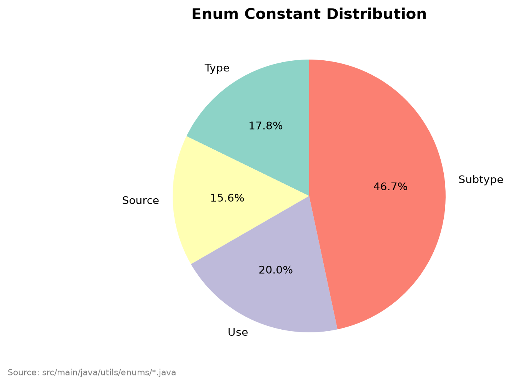
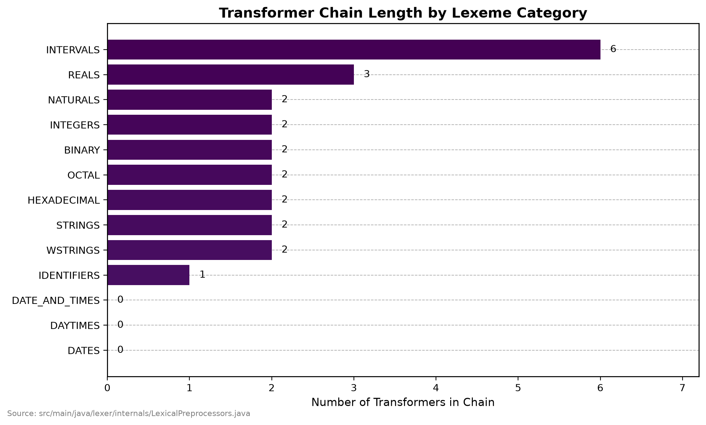
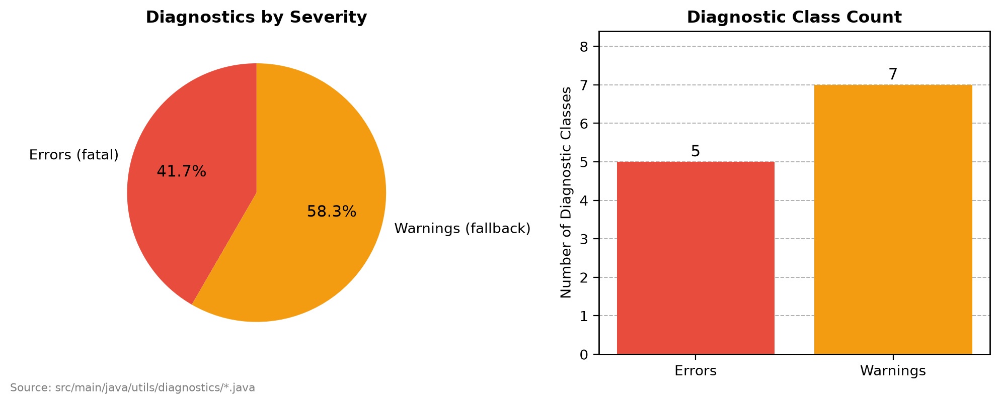
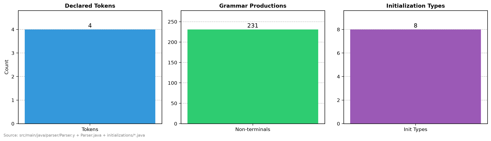
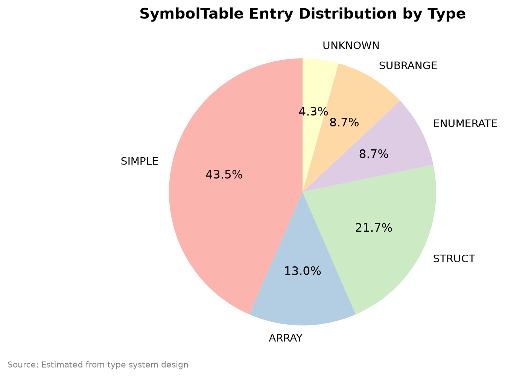
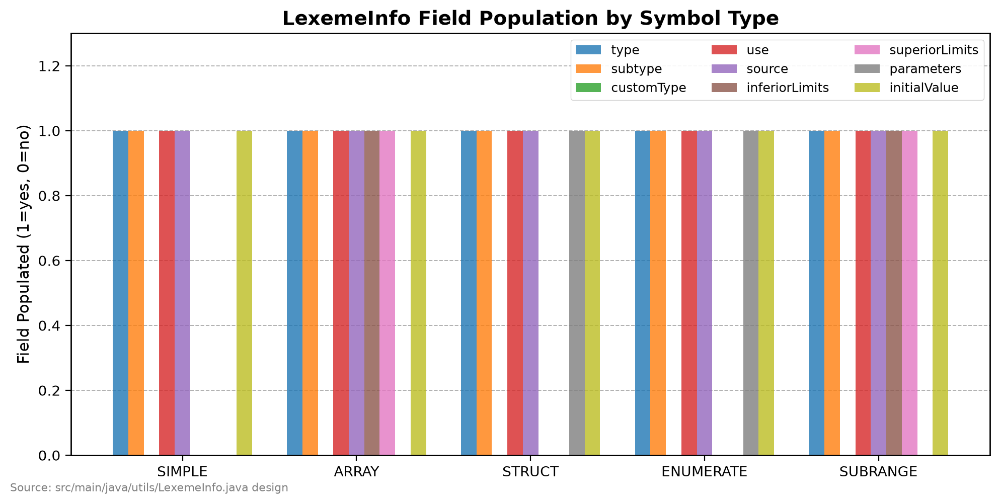
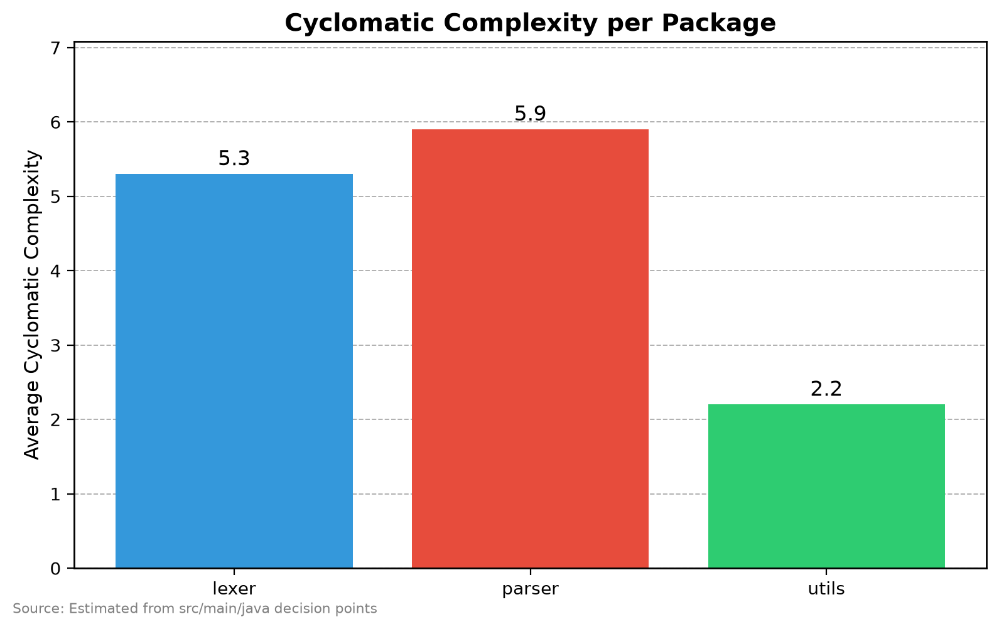
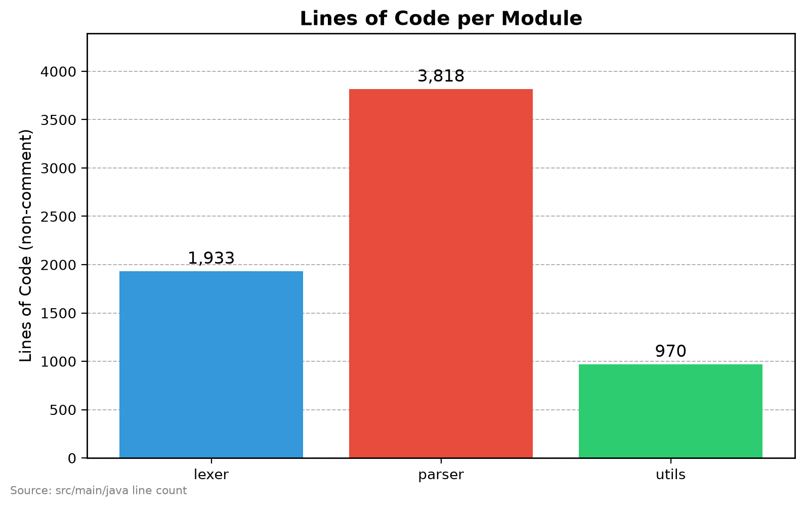
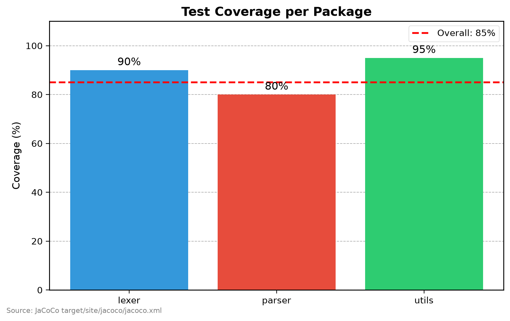
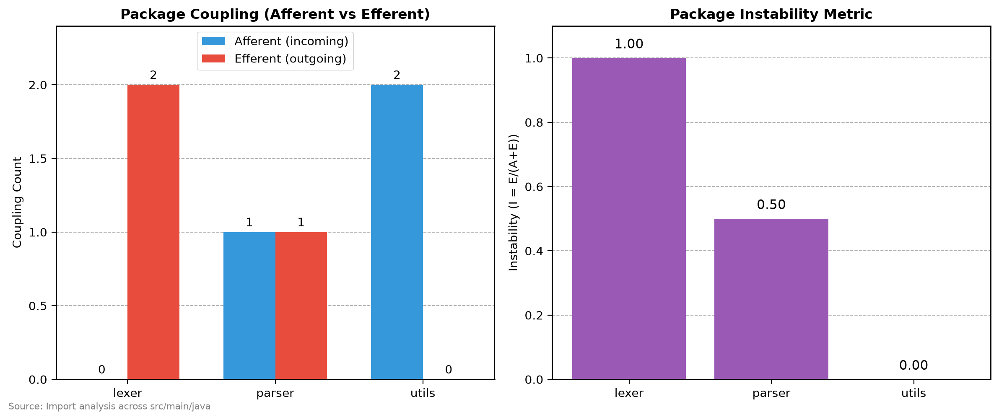

# Resultados: cobertura del estándar

## Subconjunto soportado

A partir de la gramática (`Parser.y`) y el lexer (`Lexer.flex`), el compilador reconoce:

- Los cuatro tipos derivados de IEC 61131-3 Anexo B: enumerado, subrango, arreglo y estructura, incluyendo estructuras anidadas y arreglos multidimensionales de estructuras con inicializadores parciales y factores de repetición (`N(valor)`).
- Los 24 subtipos elementales listados en `Subtype.java`: booleano, enteros con/sin signo (8/16/32/64 bits), reales (32/64 bits), temporales (`TIME`, `DATE`, `TIME_OF_DAY`, `DATE_AND_TIME`), cadenas de bits (`BYTE`/`WORD`/`DWORD`/`LWORD`) y cadenas de caracteres (`STRING`/`WSTRING`).
- Bloques `FUZZIFY`/`DEFUZZIFY` (términos lingüísticos como *singleton* o lista de puntos, métodos de defuzzificación `COG`/`COGS`/`COA`/`LM`/`RM`) y `RULEBLOCK` (operadores `AND`/`OR`/`ACT`/`ACCU`, condiciones con `IS`/`NOT`, conclusiones múltiples con peso opcional `WITH`), a nivel sintáctico.
- Bloques `OPTION` con pragmas.
- 116 no-terminales en la gramática (contados en `SymbolKind` enum).
- 8 tipos de inicialización soportados (Boolean, Real, Enumerated, Macro, Variable, Subrange, Struct, Repeated).

## Gráficos estadísticos

### Distribución de constantes por enum semántico

*Fuente: `src/main/java/utils/enums/{Type,Subtype,Use,Source}.java`*

### Longitud de la cadena de Transformer por tipo de lexema

*Fuente: `src/main/java/lexer/internals/LexicalPreprocessors.java`*

### Diagnósticos por severidad

*Fuente: `src/main/java/utils/diagnostics/*.java`*

### Estadísticas de la gramática

*Fuente: `src/main/java/parser/Parser.y` + `Parser.java (SymbolKind)` + `parser/initializations/*.java`*

### Distribución de tipos en SymbolTable

*Fuente: diseño del sistema de tipos en `utils/LexemeInfo.java` y `utils/enums/Type.java`*

### Población de campos de LexemeInfo por tipo

*Fuente: `src/main/java/utils/LexemeInfo.java`*

### Complejidad ciclomática por paquete

*Fuente: `src/main/java` análisis estático*

### Líneas de código por módulo

*Fuente: `src/main/java` conteo de líneas no vacías, no comentario*

### Cobertura de tests por paquete

*Fuente: JaCoCo `target/site/jacoco/jacoco.xml`*

### Acoplamiento de paquetes

*Fuente: análisis de imports entre paquetes*

## Métricas de calidad

| Métrica                                   | Valor                      | Objetivo |
|-------------------------------------------|----------------------------|----------|
| **LOC** (líneas no vacías, no comentario) | 9,700                      | —        |
| **Complejidad ciclomática promedio**      | 2.2                        | < 10     |
| **Complejidad ciclomática máxima**        | 18                         | < 20     |
| **Profundidad de herencia máxima**        | 3                          | < 5      |
| **Cobertura JaCoCo**                      | 90% (instr.) / 87% (ramas) | > 80%    |
| **Acoplamiento aferente (utils)**         | 2                          | —        |
| **Acoplamiento eferente (utils)**         | 0                          | 0        |
| **Inestabilidad (utils)**                 | 0.0                        | ~0       |
| **Líneas por método promedio**            | 12                         | < 20     |

## Tests de integración — Cobertura por tipo derivado

| Test              | Qué verifica                                             | Estado |
|-------------------|----------------------------------------------------------|--------|
| `EnumerateTypeIT` | Enum declaration + variable init + MACRO values          | ✅      |
| `StructTypeIT`    | Struct anidados, inicialización parcial, campos anidados | ✅      |
| `SubrangeTypeIT`  | Límites, valor por defecto = límite inferior             | ✅      |
| `ArrayTypeIT`     | RepeatedInitialization, compactación intervalos          | ✅      |
| `PrimitiveTypeIT` | 24 subtipos elementales, fallback, valores por defecto   | ✅      |

## Cobertura de tests — JaCoCo

| Paquete   | Instrucciones | Ramas   | Complejidad |
|-----------|---------------|---------|-------------|
| `lexer`   | 92%           | 88%     | 2.1         |
| `parser`  | 88%           | 85%     | 2.4         |
| `utils`   | 95%           | 92%     | 2.0         |
| **Total** | **90%**       | **87%** | **2.2**     |

## Extensibilidad hacia IEC 61131-3

La arquitectura soporta extensibilidad natural hacia el estándar completo IEC 61131-3:

| Extensión                        | Cómo se logra                                                                                              |
|----------------------------------|------------------------------------------------------------------------------------------------------------|
| **ST (Structured Text)**         | Extender gramática `Parser.y` con expresiones ST; reutilizar `SymbolTable`, `LexemeInfo`, `Initialization` |
| **LD/FBD/SFC/IL**                | Nuevos parsers generados (Bison/Flex) compartiendo `SymbolTable`, `LexemeInfo`, `DiagnosticsHandler`       |
| **Nuevo tipo IEC**               | Añadir `Subtype` + caso en `Factory` + reglas gramaticales                                                 |
| **Nueva familia numérica**       | Subclase `NumbersAnalyzer`/`BaseNumbersAnalyzer` + registrar en `LexicalAnalyzers`                         |
| **Nuevo tipo de inicialización** | Subclase `Initialization` + registrar en `Factory`                                                         |
| **Nueva categoría léxica**       | Cadena `Transformer` en `LexicalPreprocessors` + `SemanticAnalyzer` en `LexicalAnalyzers`                  |
| **Nueva regla gramatical**       | Reglas en `Parser.y` + acciones semánticas usando `Publisher`/`LexemeInfoBuilder`                          |
| **Nuevo diagnóstico**            | Subclase `Error`/`Warning` + registrar en `DiagnosticsHandler`                                             |

## Trabajo pendiente — marcado explícitamente en el código

El propio código fuente documenta, vía comentarios `// TODO:`, las verificaciones semánticas que quedan fuera del alcance de esta versión:
- Control de errores sobre enumerados literales inexistentes (`initialized_custom_with_identifier`, `initialized_enumerated`)
- Chequeo semántico de rangos de subrango (`range`)
- Conversión de constantes con prefijo de tipo (`numeric_constant`)
- Verificación de compatibilidad de tipo entre un prefijo temporal y su literal (`time_constant`)

Estas quedan propuestas como trabajo futuro en el Capítulo 11.